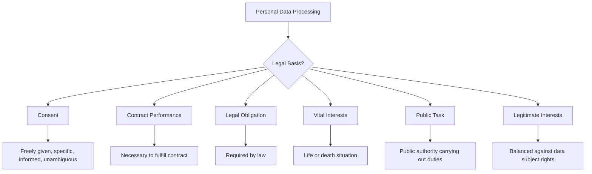
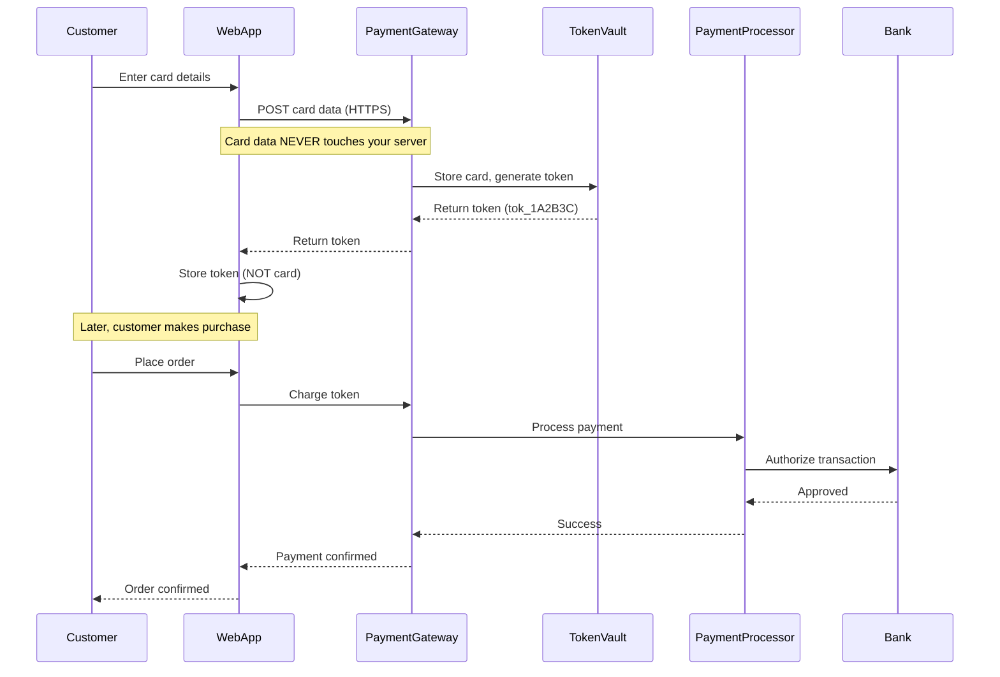
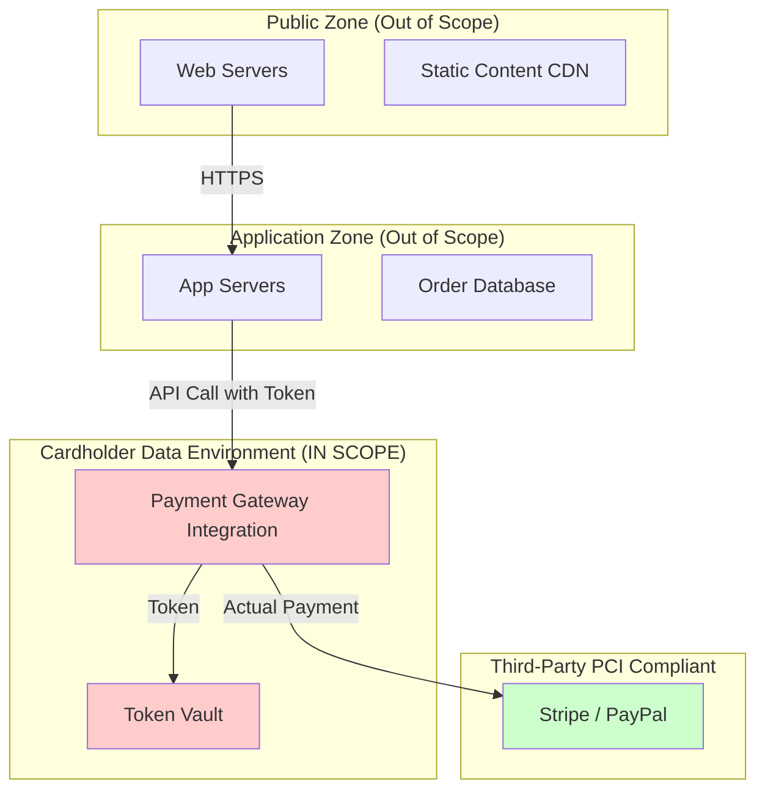
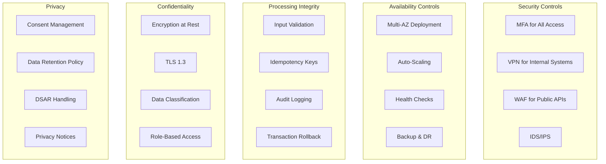
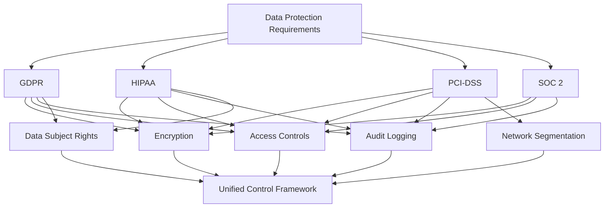

# Regulatory Compliance Architectures

<Callout variant="info" type="info">
**CPD Hours:** 6.0 hours  
**Prerequisites:** Security architecture foundations, data architecture  
**Learning Outcomes:** Design compliant architectures for major regulations, implement data protection patterns, manage cross-border data transfers
</Callout>

## Introduction

Here's the uncomfortable truth about compliance: it's not optional, it's not just paperwork, and getting it wrong can literally bankrupt your organisation. A single GDPR fine can be up to 4% of global annual revenue or €20 million (whichever is higher). One PCI-DSS breach can cost millions in fines plus the

 cost of every affected card being reissued.

But here's the good news: compliance-by-design is actually good architecture. When you build systems that respect data privacy, protect sensitive information, and maintain audit trails, you're building better systems full stop. Compliance requirements force you to think about things that make systems more secure and maintainable anyway.

Think of compliance architecture like building codes for houses. You can't just build whatever you want and hope the inspector doesn't notice the missing fire exits. You need to design with the requirements in mind from the start.

## GDPR: General Data Protection Regulation

The <GlossaryTip term="GDPR">GDPR</GlossaryTip> is the EU's comprehensive data protection law affecting any organization processing EU residents' data, regardless of where the organization is located.

### Core Principles

**1. Lawfulness, Fairness, Transparency**
- Must have a legal basis for processing
- Communicate clearly about data use
- No hidden processing

**2. Purpose Limitation**
- Collect data for specific, explicit purposes
- Don't repurpose data without new consent

**3. Data Minimisation**
- Only collect what you need
- "Nice to have" data = compliance risk

**4. Accuracy**
- Keep data up to date
- Allow corrections

**5. Storage Limitation**
- Don't keep data longer than necessary
- Implement retention policies

**6. Integrity and Confidentiality**
- Protect against unauthorized access
- Ensure availability and resilience

**7. Accountability**
- Demonstrate compliance
- Maintain records of processing activities

### Legal Bases for Processing

You need at least one of these to process personal data:



### Data Subject Rights

GDPR grants individuals eight key rights:

1. **Right to be Informed**: Transparent privacy notices
2. **Right of Access**: Provide copy of their data
3. **Right to Rectification**: Correct inaccurate data
4. **Right to Erasure** ("Right to be Forgotten"): Delete data in certain circumstances
5. **Right to Restrict Processing**: Temporarily halt processing
6. **Right to Data Portability**: Provide data in machine-readable format
7. **Right to Object**: Stop processing for direct marketing or legitimate interests
8. **Rights Related to Automated Decision-Making**: Opt out of profiling

### GDPR-Compliant Architecture Pattern

```javascript
// Consent management
class ConsentManager {
  async recordConsent(userId, purposes, timestamp) {
    // Store with cryptographic proof
    const consent = {
      userId,
      purposes: ['marketing', 'analytics', 'personalization'],
      granted: timestamp,
      ip: '192.0.2.1',
      userAgent: 'Mozilla/5.0...',
      consentString: 'I agree to...',
      version: '2.1', // Privacy policy version
    };
    
    await db.consents.insert(consent);
    await auditLog.record('CONSENT_GRANTED', consent);
  }
  
  async checkConsent(userId, purpose) {
    const consent = await db.consents.findActive(userId);
    return consent?.purposes.includes(purpose);
  }
  
  async revokeConsent(userId) {
    await db.consents.update(userId, { revokedAt: new Date() });
    await this.triggerDataDeletion(userId);
  }
}

// Data Subject Access Request (DSAR) handler
class DSARHandler {
  async exportUserData(userId) {
    // Gather all data across systems
    const userData = {
      profile: await userService.getProfile(userId),
      orders: await orderService.getUserOrders(userId),
      interactions: await analyticsService.getUserEvents(userId),
      consents: await consentManager.getConsents(userId),
    };
    
    // Pseudonymize or remove data about others
    userData.orders = userData.orders.map(order => ({
      ...order,
      deliveryDriver: '[REDACTED]' // Don't expose other people's data
    }));
    
    // Return in structured, machine-readable format
    return {
      format: 'JSON',
      requested: new Date(),
      data: userData,
    };
  }
  
  async deleteUserData(userId) {
    // Cascade deletion with audit trail
    const deletionId = generateId();
    
    await Promise.all([
      userService.deleteUser(userId, deletionId),
      orderService.anonymizeOrders(userId, deletionId),
      analyticsService.deleteEvents(userId, deletionId),
      consentManager.deleteConsents(userId, deletionId),
    ]);
    
    await auditLog.record('DATA_DELETED', {
      deletionId,
      userId,
      timestamp: new Date(),
      reason: 'DSAR',
    });
    
    // Keep audit log itself (legal requirement)
    return deletionId;
  }
}

// Data retention policy enforcement
class RetentionPolicy {
  policies = {
    'user_profiles': { retention: '7 years', after: 'account_closure' },
    'marketing_data': { retention: '2 years', after: 'consent_withdrawal' },
    'analytics_events': { retention: '25 months' }, // Google Analytics standard
    'audit_logs': { retention: '7 years' }, // Cannot be deleted
  };
  
  async enforceRetention() {
    for (const [dataType, policy] of Object.entries(this.policies)) {
      const expiredRecords = await this.findExpired(dataType, policy);
      
      for (const record of expiredRecords) {
        if (policy.archive) {
          await this.archiveToSecureStorage(record);
        }
        await this.deleteRecord(dataType, record.id);
        await auditLog.record('RETENTION_DELETE', {
          dataType,
          recordId: record.id,
          policy: policy,
        });
      }
    }
  }
}
```

### Cross-Border Data Transfers

GDPR restricts data transfers outside the EU/EEA. You need one of these mechanisms:

1. **Adequacy Decision**: EU Commission deems the country has adequate protection (UK post-Brexit, Japan, etc.)
2. **Standard Contractual Clauses (SCCs)**: Standardized contracts approved by EU
3. **Binding Corporate Rules (BCRs)**: For multinationals, approved internal policies
4. **Certification Mechanisms**: EU-US Data Privacy Framework (replaced Privacy Shield)

Architecture pattern for data residency:

```yaml
# Multi-region deployment with data residency
services:
  web-app:
    regions: [eu-west-1, us-east-1, ap-southeast-1]
    data-residency: enforced
  
  user-service:
    eu-deployment:
      region: eu-west-1
      database: eu-user-db
      stores: [eu-residents]
      
    us-deployment:
      region: us-east-1
      database: us-user-db
      stores: [us-residents]
      
    routing:
      rule: "Route to region based on user.dataResidencyRequirement"
      
  analytics-service:
    # Can aggregate cross-region if properly anonymized
    aggregation: pseudonymized
    pii-fields: removed
```

## PCI-DSS: Payment Card Industry Data Security Standard

<GlossaryTip term="PCI-DSS">PCI-DSS</GlossaryTip> protects cardholder data. If you store, process, or transmit credit card information, you must comply.

### The 12 Requirements (6 Control Objectives)

**Build and Maintain a Secure Network:**
1. Install and maintain firewall configuration
2. Don't use vendor-supplied defaults for passwords

**Protect Cardholder Data:**
3. Protect stored cardholder data
4. Encrypt transmission of cardholder data across public networks

**Maintain a Vulnerability Management Program:**
5. Protect systems against malware
6. Develop and maintain secure systems

**Implement Strong Access Control:**
7. Restrict access to cardholder data by business need-to-know
8. Identify and authenticate access
9. Restrict physical access

**Regularly Monitor and Test Networks:**
10. Track and monitor access to network resources and cardholder data
11. Regularly test security systems

**Maintain an Information Security Policy:**
12. Maintain a policy that addresses information security

### PCI-DSS Compliant Payment Flow



**Key Architecture Principles:**

1. **Tokenization**: Replace card numbers with tokens
2. **Network Segmentation**: Isolate cardholder data environment (CDE)
3. **Encryption**: All card data encrypted at rest and in transit
4. **Minimize Scope**: Reduce systems that touch card data

```javascript
// NEVER do this
class BadPaymentService {
  async processPayment(cardNumber, cvv, expiry) {
    // Storing raw card data = PCI-DSS scope = expensive audits
    await db.cards.insert({ cardNumber, cvv, expiry });
    
    // Logging card data = compliance violation
    console.log(`Processing card ${cardNumber}`);
    
    return this.chargeCard(cardNumber, cvv, expiry, amount);
  }
}

// DO THIS instead
class GoodPaymentService {
  constructor(stripeClient) {
    this.stripe = stripeClient; // Use a PCI-DSS compliant gateway
  }
  
  async createPaymentMethod(customerId) {
    // Customer enters card directly on Stripe-hosted form
    // You never see the card number
    const paymentMethod = await this.stripe.paymentMethods.create({
      type: 'card',
      // Card details collected client-side via Stripe Elements
    });
    
    // Store only the payment method ID (token)
    await db.customers.update(customerId, {
      paymentMethodId: paymentMethod.id, // e.g., "pm_1A2B3C"
    });
    
    return paymentMethod.id;
  }
  
  async processPayment(customerId, amount) {
    const customer = await db.customers.findOne(customerId);
    
    // Use token to charge, never see card number
    const paymentIntent = await this.stripe.paymentIntents.create({
      amount: amount * 100, // cents
      currency: 'gbp',
      customer: customer.stripeCustomerId,
      payment_method: customer.paymentMethodId,
      confirm: true,
    });
    
    // Log only safe data
    console.log(`Payment intent ${paymentIntent.id} for ${amount}`);
    
    return paymentIntent;
  }
}
```

### Network Segmentation for PCI-DSS



By using third-party payment processors (Stripe, PayPal, Adyen), you drastically reduce your PCI-DSS scope. Your application never sees card numbers, only tokens.

## HIPAA: Health Insurance Portability and Accountability Act

<GlossaryTip term="HIPAA">HIPAA</GlossaryTip> protects Protected Health Information (PHI) in the United States. It applies to healthcare providers, insurance companies, and their business associates.

### Three Types of Safeguards

**1. Administrative Safeguards**
- Security management process
- Workforce security procedures
- Information access management
- Security awareness training
- Business associate agreements

**2. Physical Safeguards**
- Facility access controls
- Workstation use policies
- Device and media controls

**3. Technical Safeguards**
- Access controls (unique user IDs, automatic logoff)
- Audit controls
- Integrity controls
- Transmission security

### HIPAA-Compliant Architecture

```javascript
// Minimum necessary access control
class PHIAccessControl {
  // Role-based access with minimum necessary principle
  roles = {
    'physician': ['read_full_record', 'write_clinical_notes'],
    'nurse': ['read_clinical', 'write_vitals'],
    'receptionist': ['read_demographics', 'write_appointments'],
    'billing_staff': ['read_billing_info', 'read_diagnosis_codes'],
    'patient': ['read_own_record'],
  };
  
  async checkAccess(userId, patientId, action) {
    const user = await this.getUser(userId);
    const allowedActions = this.roles[user.role] || [];
    
    // Check role permissions
    if (!allowedActions.includes(action)) {
      await this.logAccessDenied(userId, patientId, action);
      throw new Error('Access denied: insufficient permissions');
    }
    
    // Check patient relationship (care team member?)
    if (!await this.isInCareTeam(userId, patientId)) {
      await this.logAccessDenied(userId, patientId, action, 'not_in_care_team');
      throw new Error('Access denied: not in care team');
    }
    
    // Log all PHI access (HIPAA audit requirement)
    await this.logPHIAccess({
      userId,
      patientId,
      action,
      timestamp: new Date(),
      ipAddress: '192.0.2.1',
      successful: true,
    });
    
    return true;
  }
}

// Encryption at rest
class PHIStorage {
  async storePatientRecord(record) {
    // Encrypt sensitive fields
    const encrypted = {
      patientId: record.patientId, // Pseudonymized ID
      demographics: await this.encryptField(record.demographics),
      clinicalData: await this.encryptField(record.clinicalData),
      encryptedAt: new Date(),
      encryptionKeyId: 'key-2024-01', // Key rotation
    };
    
    await db.patientRecords.insert(encrypted);
  }
  
  async encryptField(data) {
    // Use AES-256 encryption
    const key = await this.getEncryptionKey();
    return crypto.encrypt(data, key, 'aes-256-gcm');
  }
}

// Secure transmission
class PHITransmission {
  async sendToProvider(patientData, providerEndpoint) {
    // Must use TLS 1.2+ for transmission
    const response = await axios.post(providerEndpoint, patientData, {
      httpsAgent: new https.Agent({
        minVersion: 'TLSv1.2',
        // Certificate pinning for added security
        ca: fs.readFileSync('trusted-ca.pem'),
      }),
    });
    
    // Log transmission for audit
    await auditLog.record('PHI_TRANSMITTED', {
      destination: providerEndpoint,
      recordCount: patientData.records.length,
      timestamp: new Date(),
    });
    
    return response.data;
  }
}

// Break-glass access for emergencies
class EmergencyAccess {
  async grantEmergencyAccess(physicianId, patientId, reason) {
    // Allow access in life-threatening situations
    const emergencyAccess = {
      physicianId,
      patientId,
      reason,
      grantedAt: new Date(),
      expiresAt: new Date(Date.now() + 24 * 60 * 60 * 1000), // 24 hours
    };
    
    await db.emergencyAccess.insert(emergencyAccess);
    
    // Alert compliance team
    await this.notifyCompliance({
      type: 'BREAK_GLASS_ACCESS',
      ...emergencyAccess,
    });
    
    // Log for audit
    await auditLog.record('EMERGENCY_ACCESS_GRANTED', emergencyAccess);
    
    return emergencyAccess;
  }
}
```

### HL7 FHIR for Interoperability

```javascript
// FHIR-compliant patient resource
const fhirPatient = {
  resourceType: 'Patient',
  id: '123',
  identifier: [{
    use: 'official',
    system: 'http://hospital.org/patients',
    value: 'MRN-456789'
  }],
  name: [{
    use: 'official',
    family: 'Smith',
    given: ['John', 'Robert']
  }],
  telecom: [{
    system: 'phone',
    value: '555-1234',
    use: 'home'
  }],
  gender: 'male',
  birthDate: '1970-01-01',
  address: [{
    use: 'home',
    line: ['123 Main St'],
    city: 'Boston',
    state: 'MA',
    postalCode: '02101',
    country: 'US'
  }]
};

// FHIR observation (clinical data)
const fhirObservation = {
  resourceType: 'Observation',
  id: '456',
  status: 'final',
  category: [{
    coding: [{
      system: 'http://terminology.hl7.org/CodeSystem/observation-category',
      code: 'vital-signs'
    }]
  }],
  code: {
    coding: [{
      system: 'http://loinc.org',
      code: '85354-9',
      display: 'Blood pressure'
    }]
  },
  subject: {
    reference: 'Patient/123'
  },
  effectiveDateTime: '2024-01-15T09:30:00Z',
  component: [{
    code: {
      coding: [{
        system: 'http://loinc.org',
        code: '8480-6',
        display: 'Systolic blood pressure'
      }]
    },
    valueQuantity: {
      value: 120,
      unit: 'mmHg'
    }
  }, {
    code: {
      coding: [{
        system: 'http://loinc.org',
        code: '8462-4',
        display: 'Diastolic blood pressure'
      }]
    },
    valueQuantity: {
      value: 80,
      unit: 'mmHg'
    }
  }]
};
```

## SOC 2: System and Organization Controls

<GlossaryTip term="SOC2">SOC 2</GlossaryTip> is an auditing standard for service providers storing customer data. It's based on five Trust Service Criteria.

### The Five Trust Service Criteria

**1. Security**: Protection against unauthorized access
- Firewall and network security
- Intrusion detection
- Multi-factor authentication

**2. Availability**: System available for operation and use
- Uptime monitoring
- Incident response
- Business continuity planning

**3. Processing Integrity**: System processing is complete, valid, accurate, timely, authorized
- Input validation
- Error handling
- Transaction logging

**4. Confidentiality**: Confidential information is protected
- Data classification
- Access controls
- Encryption

**5. Privacy**: Personal information is collected, used, disclosed, and disposed of properly
- Privacy notices
- Consent management
- Data subject rights

### SOC 2 Compliant Architecture



**Control Example: Change Management**

```python
# Automated change approval workflow
class ChangeManagement:
    def submit_change_request(self, change):
        """All production changes require approval"""
        change_request = {
            'id': generate_id(),
            'title': change.title,
            'description': change.description,
            'risk_level': self.assess_risk(change),
            'requested_by': change.author,
            'requested_at': datetime.now(),
            'status': 'pending_approval',
        }
        
        # Route based on risk
        if change_request['risk_level'] == 'high':
            approvers = ['CTO', 'InfoSec_Lead', 'Product_VP']
        elif change_request['risk_level'] == 'medium':
            approvers = ['Engineering_Manager', 'InfoSec']
        else:
            approvers = ['Team_Lead']
        
        for approver in approvers:
            self.notify_approver(approver, change_request)
        
        # Log for audit
        audit_log.record('CHANGE_REQUEST_SUBMITTED', change_request)
        
        return change_request
    
    def approve_change(self, change_id, approver_id):
        """Record approval"""
        change = self.get_change(change_id)
        
        change['approvals'].append({
            'approver': approver_id,
            'approved_at': datetime.now(),
            'comments': 'Reviewed, approved'
        })
        
        if self.all_approvers_approved(change):
            change['status'] = 'approved'
            self.schedule_deployment(change)
        
        audit_log.record('CHANGE_APPROVED', {
            'change_id': change_id,
            'approver': approver_id,
        })
```

### Compliance Automation

```yaml
# Infrastructure as Code with compliance checks
resource "aws_s3_bucket" "data" {
  bucket = "customer-data"
  
  # SOC 2: Encryption at rest
  server_side_encryption_configuration {
    rule {
      apply_server_side_encryption_by_default {
        sse_algorithm = "AES256"
      }
    }
  }
  
  # SOC 2: Access logging
  logging {
    target_bucket = "audit-logs"
    target_prefix = "s3-access/"
  }
  
  # SOC 2: Versioning for availability
  versioning {
    enabled = true
  }
  
  # SOC 2: Prevent accidental deletion
  lifecycle_rule {
    enabled = true
    noncurrent_version_expiration {
      days = 90
    }
  }
  
  # SOC 2: Block public access
  block_public_acls       = true
  block_public_policy     = true
  ignore_public_acls      = true
  restrict_public_buckets = true
}

# Automated compliance checking
resource "null_resource" "compliance_check" {
  provisioner "local-exec" {
    command = <<EOT
      # Run automated compliance scanner
      checkov --framework terraform --directory . --check SOC2
      
      # Check encryption
      if ! terraform show | grep -q "sse_algorithm"; then
        echo "FAIL: S3 bucket missing encryption"
        exit 1
      fi
      
      # Check logging
      if ! terraform show | grep -q "logging"; then
        echo "FAIL: S3 bucket missing access logging"
        exit 1
      fi
    EOT
  }
}
```

## Multi-Regulation Compliance Strategy

Many organizations must comply with multiple regulations. Here's how to handle overlap:



**Compliance Matrix Example:**

| Control | GDPR | HIPAA | PCI-DSS | SOC 2 |
|---------|------|-------|---------|-------|
| Encryption at rest | ✅ Art. 32 | ✅ Tech Safeguard | ✅ Req. 3 | ✅ Security |
| Encryption in transit | ✅ Art. 32 | ✅ Tech Safeguard | ✅ Req. 4 | ✅ Security |
| Access controls | ✅ Art. 32 | ✅ Admin Safeguard | ✅ Req. 7-8 | ✅ Security |
| Audit logging | ✅ Art. 30 | ✅ Tech Safeguard | ✅ Req. 10 | ✅ All TSC |
| Data retention | ✅ Art. 5 | ✅ Admin Safeguard | ✅ Req. 3 | ✅ Privacy |
| Incident response | ✅ Art. 33-34 | ✅ Admin Safeguard | ✅ Req. 12 | ✅ Availability |

<Callout variant="practice" type="info">
**Practice Exercise (90 minutes):**

Design a compliant architecture for a health insurance company that:
1. Processes EU and US customers (GDPR + HIPAA)
2. Accepts credit card payments (PCI-DSS)
3. Needs SOC 2 Type II for enterprise sales

Tasks:
1. **Data Classification (15 min):** Identify what data falls under which regulation
2. **Architecture Diagram (30 min):** Draw a system architecture with compliance zones clearly marked
3. **Controls Mapping (30 min):** List 10 key technical controls and which regulations they satisfy
4. **Incident Response (15 min):** Write a 72-hour breach notification procedure addressing GDPR Art. 33 and HIPAA requirements

**Hints:**
- Use network segmentation to separate compliance domains
- Consider data residency requirements for EU customers
- Tokenization helps with PCI-DSS scope reduction
- Audit logging satisfies multiple regulations
</Callout>

## CPD Evidence Summary

For your CPD log, record:
- **Learning Activity:** Regulatory compliance architectures (GDPR, PCI-DSS, HIPAA, SOC 2)
- **Duration:** 6.0 hours
- **Key Concepts:** GDPR data subject rights, PCI-DSS tokenization, HIPAA safeguards, SOC 2 Trust Service Criteria, cross-border data transfers
- **Practical Application:** Designed compliance controls for multi-regulation scenarios, implemented data protection patterns
- **Reflection:** Understanding how compliance requirements drive architectural decisions and the importance of compliance-by-design

<Callout variant="accreditation" type="info">
**Accreditation Alignment:**
- **CISM (Certified Information Security Manager):** Information risk management and governance
- **CISSP (Certified Information Systems Security Professional):** Domain 5 - Identity and Access Management, Domain 1 - Security and Risk Management
- **CIPP/E (Certified Information Privacy Professional/Europe):** GDPR compliance
- **ISO 27001 Lead Implementer:** Information security management systems
- **PCI-DSS QSA:** Payment card data security
</Callout>

---

**Next Module:** [FinOps & Cost Engineering](/notes/courses/software-architecture/advanced/finops) - Optimize cloud costs with financial operations practices and cost-aware architecture design.
