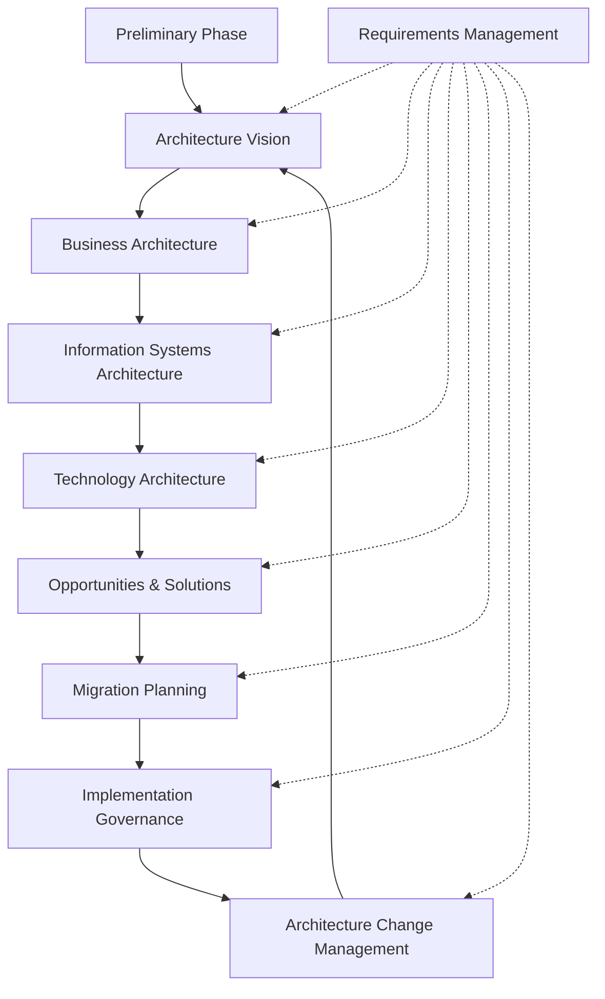
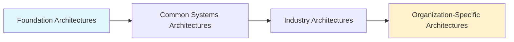
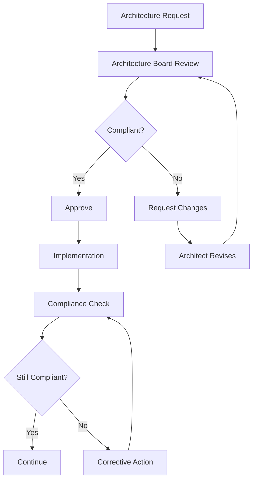
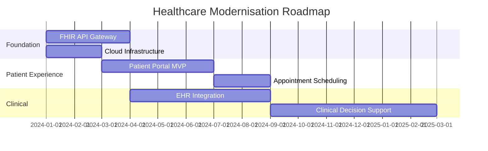

# Enterprise Architecture Frameworks

<Callout variant="info" type="info">
**CPD Hours:** 5.5 hours  
**Prerequisites:** Intermediate tier complete, experience with architecture documentation  
**Learning Outcomes:** Apply TOGAF ADM phases, use Zachman Framework for enterprise analysis, establish architecture governance
</Callout>

## Introduction

Here's the thing about enterprise architecture. Most people think it's just "big company stuff" with lots of PowerPoint slides and meetings. But proper enterprise architecture frameworks are what separate organisations that can actually execute their digital transformation from those that spend millions and achieve nothing.

Think of enterprise architecture like city planning. You wouldn't build a city by letting everyone construct whatever they want wherever they want. You need zoning laws (governance), infrastructure plans (architecture repository), and a way to make sure the new shopping centre doesn't block the fire station's access road (impact analysis). TOGAF and Zachman are your city planning frameworks.

<GlossaryTip term="enterprise-architecture">Enterprise Architecture</GlossaryTip> provides the bridge between business strategy and IT execution. It's how you turn "we need to be more customer-centric" into actual system changes that don't break everything.

## TOGAF Architecture Development Method (ADM)

The <GlossaryTip term="TOGAF">TOGAF</GlossaryTip> ADM is a comprehensive method for developing enterprise architectures. It's like a recipe book for architecture work, with nine phases that cycle continuously.

### The ADM Lifecycle



### Phase-by-Phase Breakdown

**Preliminary Phase: Framework and Principles**
- Establish architecture capability
- Define principles, standards, frameworks
- Tailor TOGAF to your organisation

Personal observation: Most organisations skip this and wonder why their architecture practice fails. You can't just "do TOGAF" without setting up the foundations.

**Phase A: Architecture Vision**
- Define scope and constraints
- Identify stakeholders and their concerns
- Create high-level architecture vision
- Obtain approval to proceed

**Phase B: Business Architecture**
- Develop baseline and target business architecture
- Analyse gaps
- Define business processes, organisation structure, business capabilities

**Phase C: Information Systems Architecture**
Split into two parts:
1. **Data Architecture:** Information entities, logical data model
2. **Application Architecture:** Application portfolio, application interfaces

**Phase D: Technology Architecture**
- Hardware, software, network infrastructure
- Platform services
- Technology standards

**Phase E: Opportunities and Solutions**
- Identify delivery vehicles (projects/programmes)
- Determine transition architectures
- Create implementation and migration plan

**Phase F: Migration Planning**
- Prioritise projects
- Create detailed roadmap
- Cost-benefit analysis

**Phase G: Implementation Governance**
- Provide architecture oversight
- Handle change requests
- Ensure compliance

**Phase H: Architecture Change Management**
- Monitor technology changes
- Manage architecture lifecycle
- Update architecture repository

**Requirements Management**
- Runs continuously across all phases
- Capture, prioritise, baseline requirements
- Manage changes to requirements

### TOGAF Artifacts

Key deliverables from the ADM:

```yaml
Architecture Artifacts:
  Catalogs:
    - Organization/Actor catalog
    - Role catalog
    - Business Service catalog
    - Application Portfolio catalog
    - Technology Standards catalog
  
  Matrices:
    - Stakeholder Matrix
    - Business Interaction Matrix
    - Application/Data Matrix
    - Application/Technology Matrix
  
  Diagrams:
    - Business Process diagram
    - Organization decomposition diagram
    - Application Communication diagram
    - Technology Platform diagram
    - Environments and Locations diagram
```

### Architecture Repository and Enterprise Continuum

The Architecture Repository stores all architecture assets:

1. **Architecture Metamodel:** Defines the structure of architecture content
2. **Architecture Capability:** Governance processes, skills, roles
3. **Architecture Landscape:** Current (baseline) and target architectures
4. **Standards Information Base:** Standards, specifications, compliance requirements
5. **Reference Library:** Guidelines, templates, patterns, architecture descriptions
6. **Governance Log:** Decisions, change requests, compliance assessments

The <GlossaryTip term="enterprise-continuum">Enterprise Continuum</GlossaryTip> provides a model for classifying architecture assets:



## Zachman Framework

The <GlossaryTip term="zachman-framework">Zachman Framework</GlossaryTip> is a schema for organizing architectural artifacts. Think of it as a periodic table for enterprise architecture.

### The 6x6 Matrix

The framework asks six questions (columns) from six perspectives (rows):

**Questions (Columns):**
1. **What** (Data): What information is used?
2. **How** (Function): How does it work?
3. **Where** (Network): Where is it located?
4. **Who** (People): Who is involved?
5. **When** (Time): When do things happen?
6. **Why** (Motivation): Why are we doing this?

**Perspectives (Rows):**
1. **Contextual** (Planner/Executive): Business context, scope
2. **Conceptual** (Owner/Business): Business model, requirements
3. **Logical** (Designer/Architect): System logic, design
4. **Physical** (Builder/Engineer): Technology specifics, implementation
5. **Detailed** (Technician/Developer): Actual components, code
6. **Functioning** (User/Operations): Operational system

| Perspective | What (Data) | How (Function) | Where (Network) | Who (People) | When (Time) | Why (Motivation) |
|-------------|-------------|----------------|-----------------|--------------|-------------|------------------|
| **Contextual** | List of things important to business | List of processes | List of locations | List of organizations | List of events | List of business goals |
| **Conceptual** | Semantic model | Business process model | Logistics network | Workflow model | Master schedule | Business plan |
| **Logical** | Logical data model | Application architecture | Distributed system architecture | Human interface architecture | Processing structure | Business rule model |
| **Physical** | Physical data model | System design | Technology architecture | Presentation architecture | Control structure | Rule design |
| **Detailed** | Data definition | Program | Network architecture | Security architecture | Timing definition | Rule specification |
| **Functioning** | Functioning database | Functioning system | Functioning network | Functioning organization | Functioning schedule | Functioning strategy |

### Example: E-commerce Platform Using Zachman

Let's fill in some cells for an e-commerce system:

**Contextual/What:** "We sell products to customers and need to track inventory, orders, payments"

**Conceptual/What:** "Customer entity with attributes (ID, name, email, address). Product entity with (SKU, name, price, stock). Order entity linking customers and products."

**Logical/What:**
```sql
-- Logical data model
Customer (customer_id PK, name, email, address)
Product (product_id PK, sku UNIQUE, name, description, price, stock_quantity)
Order (order_id PK, customer_id FK, order_date, total_amount, status)
OrderItem (order_item_id PK, order_id FK, product_id FK, quantity, price_at_time)
```

**Physical/What:** "PostgreSQL database, customer table with B-tree indexes on email, product table with full-text search index on name/description"

**Contextual/How:** "Customer browses products, adds to cart, checks out, pays, receives order"

**Conceptual/How:** "Browse Catalog → Add to Cart → Review Cart → Enter Shipping → Enter Payment → Confirm Order → Process Payment → Fulfill Order → Ship → Deliver"

**Logical/How:**
```javascript
// Application architecture
class CheckoutService {
  validateCart(cartItems) {
    // Check stock availability
    // Calculate totals including tax and shipping
  }
  
  processOrder(order, paymentInfo) {
    // Create order record
    // Call payment gateway
    // Reserve inventory
    // Trigger fulfillment workflow
  }
}
```

## Architecture Governance

<GlossaryTip term="architecture-governance">Architecture Governance</GlossaryTip> ensures that architectures are developed and implemented according to standards and that they deliver value.

### Governance Processes



**Key Governance Activities:**

1. **Architecture Board:**
   - Review architecture proposals
   - Ensure alignment with strategy
   - Approve exceptions
   - Resolve disputes

2. **Compliance Assessments:**
   - Review project deliverables against architecture
   - Identify deviations
   - Recommend corrective actions

3. **Architecture Contracts:**
   - Joint agreements between stakeholders
   - Define deliverables, quality criteria, acceptance
   - Establish accountability

4. **Dispensation Process:**
   - Handle requests to deviate from standards
   - Require business justification
   - Time-bound exceptions
   - Track technical debt

### Stakeholder Management

Different stakeholders care about different things:

**C-Level Executives:**
- Business value and ROI
- Risk mitigation
- Strategic alignment
- Cost and timeline

**Product Owners:**
- Feature delivery
- Time to market
- User experience
- Competitive advantage

**Development Teams:**
- Technical feasibility
- Developer experience
- Tool choices
- Technical debt

**Operations:**
- Reliability and uptime
- Operational cost
- Supportability
- Monitoring and alerting

**Compliance/Security:**
- Regulatory compliance
- Security posture
- Audit trail
- Data protection

Create a <GlossaryTip term="stakeholder-matrix">Stakeholder Matrix</GlossaryTip>:

| Stakeholder | Interest | Influence | Communication Approach |
|-------------|----------|-----------|------------------------|
| CEO | Strategic outcomes | High | Monthly executive summary |
| CTO | Technical direction | High | Weekly architecture sync |
| Product VPs | Feature velocity | Medium | Bi-weekly roadmap review |
| Dev Teams | Implementation details | Medium | Daily Slack, weekly office hours |
| InfoSec | Security compliance | Medium-High | Architecture review board |
| Auditors | Regulatory compliance | Low-Medium | Quarterly compliance reports |

## Practical Application: Healthcare System Architecture

Let's apply TOGAF ADM to a healthcare system modernisation:

**Preliminary Phase:**
- Principles: Patient data privacy (HIPAA), interoperability (HL7 FHIR), cloud-first
- Framework: TOGAF tailored with healthcare-specific artifacts
- Governance: Architecture Review Board with clinical and IT representation

**Phase A: Vision**
- Scope: Patient portal, EHR system, clinical decision support
- Stakeholders: Patients, clinicians, administrators, payers
- Vision: Unified patient experience with real-time clinical data access

**Phase B: Business Architecture**
- Business capabilities: Patient registration, appointment scheduling, clinical documentation, billing, reporting
- Value streams: Patient care delivery, revenue cycle management
- Organization: Hospital network with 5 facilities

**Phase C: Information Systems**
- Data: Patient demographics (PHI), clinical observations (FHIR resources), billing codes (ICD-10, CPT)
- Applications: Patient portal (React), EHR (Epic integration), CDS (custom), billing (existing)

**Phase D: Technology**
- Cloud: AWS (HIPAA-compliant regions)
- Integration: HL7 FHIR API gateway
- Security: Encryption at rest/transit, MFA, audit logging
- Infrastructure: Kubernetes for microservices, RDS for structured data, S3 for documents

**Phase E: Opportunities**
- Projects: 1) Patient portal MVP, 2) FHIR API gateway, 3) EHR integration, 4) Clinical decision support
- Transition architecture: Hybrid (cloud + on-premise EHR initially)

**Phase F: Migration Planning**


<Callout variant="practice" type="info">
**Practice Exercise (90 minutes):**

Choose an organization you're familiar with (your employer, a client, or a hypothetical one). Apply the first three TOGAF ADM phases:

1. **Preliminary (15 min):** Define 3-5 architecture principles
2. **Architecture Vision (30 min):** 
   - Identify 5-8 key stakeholders
   - Write a one-paragraph vision statement
   - Define scope (what's in, what's out)
3. **Business Architecture (45 min):**
   - List 5-10 business capabilities
   - Create a simple business process diagram for one capability
   - Identify 3-5 key business entities (data)

**Hints:**
- Start simple, don't try to be comprehensive
- Focus on one business area (e.g., customer onboarding, order fulfillment)
- Use the Zachman "What" and "How" columns as a guide
- Think about the current state and desired future state
</Callout>

## CPD Evidence Summary

For your CPD log, record:
- **Learning Activity:** Advanced enterprise architecture frameworks (TOGAF, Zachman)
- **Duration:** 5.5 hours
- **Key Concepts:** TOGAF ADM phases, Architecture Repository, Zachman Framework 6x6 matrix, architecture governance, stakeholder management
- **Practical Application:** Applied ADM to healthcare system modernisation scenario
- **Reflection:** Understanding of how enterprise frameworks provide structure for large-scale architecture work and enable governance

<Callout variant="accreditation" type="info">
**Accreditation Alignment:**
- **TOGAF 9 Certified:** Direct alignment with TOGAF Body of Knowledge
- **iSAQB CPSA-Advanced:** Architecture documentation and governance methods
- **ISO/IEC/IEEE 42010:** Architecture frameworks and viewpoints
- **PMP/PRINCE2:** Programme governance and stakeholder management
- **Zachman Certified:** Framework application
</Callout>

---

**Next Module:** [Regulatory Compliance Architectures](/notes/courses/software-architecture/advanced/compliance-architectures) - Apply architecture principles to GDPR, PCI-DSS, HIPAA, and SOC 2 compliance requirements.
