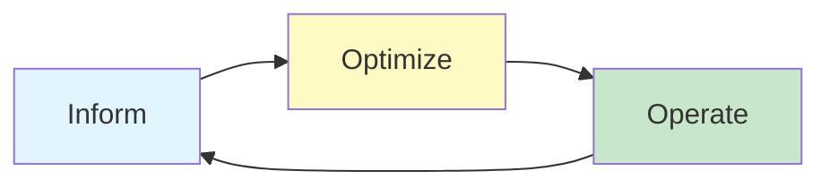
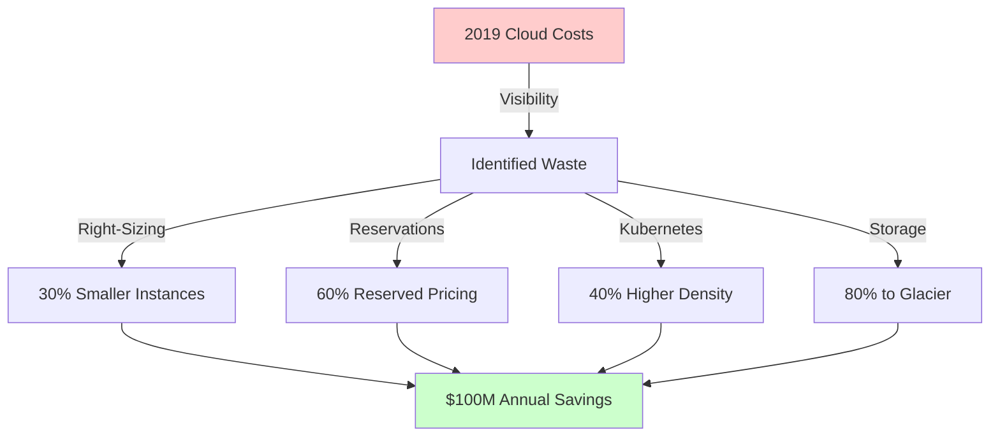

# FinOps & Cost Engineering

<Callout variant="info" type="info">
**CPD Hours:** 4.0 hours  
**Prerequisites:** Cloud architecture, infrastructure as code  
**Learning Outcomes:** Implement FinOps practices, design cost-aware architectures, optimize cloud spend, build chargeback models
</Callout>

## Introduction

Here's a painful truth: most organisations have absolutely no idea what they're actually spending on cloud services or why. They get a monthly AWS bill for £200,000 and everyone just shrugs and pays it. Then six months later it's £400,000 and suddenly the CFO is asking questions nobody can answer.

<GlossaryTip term="finops">FinOps</GlossaryTip> (Financial Operations) is the practice of bringing financial accountability to the variable spend model of cloud. It's not about spending less—it's about spending smart. Sometimes the right answer is to spend more if it unlocks business value.

Think of FinOps like turning on the lights in your house. Once you can see where the money is going, you can make informed decisions about whether that £50,000/month Elasticsearch cluster is actually being used or if it's just running because someone set it up three years ago and forgot about it.

## The FinOps Framework

The FinOps Foundation defines three phases:



**1. Inform**
- Visibility: What are we spending?
- Allocation: Who is spending it?
- Benchmarking: Is this normal?
- Forecasting: What will we spend?

**2. Optimize**
- Right-sizing: Match resources to actual needs
- Reserved capacity: Commit for discounts
- Spot/preemptible: Use spare capacity
- Waste elimination: Delete unused resources

**3. Operate**
- Automation: Enforce policies automatically
- Continuous improvement: Regular reviews
- Culture: Make cost a first-class metric

## Showback vs Chargeback

**<GlossaryTip term="showback">Showback</GlossaryTip>**: Report costs to teams without actually charging them
- Pro: Builds awareness without friction
- Con: No financial consequences

**<GlossaryTip term="chargeback">Chargeback</GlossaryTip>**: Actually bill teams for their resource usage
- Pro: Creates real incentive to optimize
- Con: Requires accounting infrastructure

```javascript
// Showback report generator
class ShowbackReport {
  async generateMonthlyReport(month) {
    const costs = await this.getCloudCosts(month);
    
    // Allocate costs by team
    const teamCosts = this.allocateCosts(costs);
    
    // Generate reports
    for (const [team, cost] of Object.entries(teamCosts)) {
      const report = {
        team: team,
        month: month,
        totalCost: cost.total,
        breakdown: {
          compute: cost.ec2 + cost.lambda,
          storage: cost.s3 + cost.ebs,
          database: cost.rds + cost.dynamodb,
          networking: cost.dataTransfer + cost.loadBalancers,
          other: cost.other,
        },
        trends: {
          vs_lastMonth: this.calculateChange(cost, month - 1),
          vs_lastYear: this.calculateChange(cost, month - 12),
        },
        topResources: await this.getTopCostResources(team, month, 10),
      };
      
      await this.sendReport(team, report);
    }
  }
  
  allocateCosts(costs) {
    // Use tags to allocate costs
    const allocation = {};
    
    for (const resource of costs.resources) {
      const team = resource.tags['Team'] || 'unallocated';
      const project = resource.tags['Project'] || 'unknown';
      const environment = resource.tags['Environment'] || 'unknown';
      
      if (!allocation[team]) {
        allocation[team] = { total: 0, projects: {} };
      }
      
      allocation[team].total += resource.cost;
      
      if (!allocation[team].projects[project]) {
        allocation[team].projects[project] = { total: 0, environments: {} };
      }
      
      allocation[team].projects[project].total += resource.cost;
      allocation[team].projects[project].environments[environment] = 
        (allocation[team].projects[project].environments[environment] || 0) + resource.cost;
    }
    
    return allocation;
  }
}

// Chargeback with budget enforcement
class ChargebackSystem {
  async enforceTeamBudget(team, month) {
    const budget = await this.getTeamBudget(team, month);
    const actual = await this.getTeamSpend(team, month);
    
    const utilization = actual / budget.allocated;
    
    if (utilization > 0.8) {
      // Approaching budget limit
      await this.notifyTeam(team, {
        type: 'WARNING',
        message: `You've used ${(utilization * 100).toFixed(1)}% of your monthly budget`,
        budget: budget.allocated,
        actual: actual,
        remaining: budget.allocated - actual,
      });
    }
    
    if (utilization > 0.95) {
      // Critical: About to exceed budget
      await this.notifyTeam(team, {
        type: 'CRITICAL',
        message: 'Budget limit imminent. Consider optimizing or requesting increase.',
      });
      
      // Optionally enforce hard limit
      if (budget.hardLimit) {
        await this.blockNewResources(team);
      }
    }
    
    if (actual > budget.allocated) {
      // Budget exceeded
      await this.recordOverage(team, actual - budget.allocated);
      
      if (budget.hardLimit) {
        await this.shutdownNonCriticalResources(team);
      } else {
        // Soft limit: charge overage at higher rate
        const overageCost = (actual - budget.allocated) * budget.overageMultiplier;
        await this.chargeTeam(team, budget.allocated + overageCost);
      }
    } else {
      await this.chargeTeam(team, actual);
    }
  }
}
```

## Cost Allocation Strategies

**Tag-Based Allocation**
- Pros: Flexible, granular, supports multiple dimensions
- Cons: Requires discipline, tags can be missing/wrong

```yaml
# Tagging strategy
resource_tags:
  required:
    - Team: "platform" | "product" | "data"
    - Project: "checkout-v2" | "recommendations" | "analytics-pipeline"
    - Environment: "prod" | "staging" | "dev"
    - CostCenter: "engineering" | "marketing" | "finance"
    - Owner: "email@company.com"
  
  optional:
    - Application: "web-frontend" | "api" | "worker"
    - Service: "user-service" | "order-service"
    - Version: "v1.2.3"

# Automated tag enforcement
resource "aws_config_rule" "required_tags" {
  name = "required-tags"
  
  source {
    owner             = "AWS"
    source_identifier = "REQUIRED_TAGS"
  }
  
  input_parameters = jsonencode({
    tag1Key = "Team"
    tag2Key = "Project"
    tag3Key = "Environment"
    tag4Key = "Owner"
  })
}
```

**Account-Based Allocation**
- Pros: Clean separation, easy to enforce
- Cons: Less flexible, harder to share resources

**Resource-Based Allocation**
- Pros: Precise, auditable
- Cons: Manual, doesn't scale

## Cost Optimization Strategies

### 1. Right-Sizing

Match instance sizes to actual usage:

```python
# Right-sizing analyzer
class RightSizingAnalyzer:
    def analyze_instance(self, instance_id, days=30):
        """Analyze instance metrics to recommend right size"""
        metrics = self.get_cloudwatch_metrics(instance_id, days)
        
        recommendations = []
        
        # Check CPU utilization
        avg_cpu = metrics['cpu'].mean()
        max_cpu = metrics['cpu'].max()
        
        if avg_cpu < 20 and max_cpu < 40:
            current_type = instance.type  # e.g., "m5.2xlarge"
            recommended_type = self.downsize(current_type)
            savings = self.calculate_savings(current_type, recommended_type)
            
            recommendations.append({
                'type': 'DOWNSIZE',
                'reason': f'Low CPU utilization ({avg_cpu:.1f}% avg, {max_cpu:.1f}% max)',
                'current': current_type,
                'recommended': recommended_type,
                'annual_savings': savings * 12,
                'risk': 'LOW'  # Plenty of headroom
            })
        
        # Check memory utilization
        avg_memory = metrics['memory'].mean()
        
        if avg_memory < 30:
            recommendations.append({
                'type': 'MEMORY_OPTIMIZED',
                'reason': f'Low memory usage ({avg_memory:.1f}%)',
                'recommended': self.switch_to_compute_optimized(instance.type),
            })
        
        # Check network utilization
        if metrics['network'].max() < instance.network_capacity * 0.1:
            recommendations.append({
                'type': 'NETWORK',
                'reason': 'Network capacity underutilized',
            })
        
        return recommendations
    
    def downsize(self, instance_type):
        """Suggest smaller instance type"""
        size_map = {
            '2xlarge': 'xlarge',
            'xlarge': 'large',
            'large': 'medium',
            'medium': 'small',
        }
        
        family, size = instance_type.rsplit('.', 1)
        new_size = size_map.get(size, size)
        return f"{family}.{new_size}"
```

### 2. Reserved Instances & Savings Plans

Commit to usage for 1-3 years in exchange for discounts:

**Reserved Instances (RIs)**
- 1-year: ~40% discount
- 3-year: ~60% discount
- Payment options: All upfront, partial upfront, no upfront

**Savings Plans**
- Compute Savings Plans: Flexible across instance types, regions
- EC2 Instance Savings Plans: Committed to instance family in region
- More flexible than RIs but slightly lower discount

```javascript
// RI/SP purchase recommendation engine
class ReservationAdvisor {
  async analyzeCommitmentOpportunities() {
    // Get past 30 days of usage
    const usage = await this.getUsageData(30);
    
    // Find consistent baseline usage
    const baseline = this.findBaselineUsage(usage);
    
    // Calculate break-even point
    const recommendations = [];
    
    for (const [instanceType, hours] of Object.entries(baseline)) {
      const onDemandCost = hours * this.getOnDemandPrice(instanceType);
      const riCost1Year = hours * this.getRIPrice(instanceType, '1year');
      const riCost3Year = hours * this.getRIPrice(instanceType, '3year');
      
      const savings1Year = (onDemandCost - riCost1Year) * 12;
      const savings3Year = (onDemandCost - riCost3Year) * 36;
      
      if (savings1Year > 1000) {  // £1000+ annual savings
        recommendations.push({
          instanceType,
          term: '1-year',
          quantity: Math.floor(hours / 730), // hours per month
          currentMonthlyCost: onDemandCost,
          newMonthlyCost: riCost1Year,
          monthlySavings: onDemandCost - riCost1Year,
          annualSavings: savings1Year,
          payback: this.calculatePayback(instanceType, '1year'),
        });
      }
    }
    
    return recommendations.sort((a, b) => b.annualSavings - a.annualSavings);
  }
  
  findBaselineUsage(usage) {
    // Find minimum usage across all hours (baseline that's always running)
    const hourlyUsage = {};
    
    for (const day of usage.days) {
      for (const hour of day.hours) {
        for (const [type, count] of Object.entries(hour.instances)) {
          hourlyUsage[type] = hourlyUsage[type] || [];
          hourlyUsage[type].push(count);
        }
      }
    }
    
    // Use 95th percentile as baseline (allows for some variation)
    const baseline = {};
    for (const [type, counts] of Object.entries(hourlyUsage)) {
      baseline[type] = this.percentile(counts, 95);
    }
    
    return baseline;
  }
}
```

### 3. Spot Instances & Preemptible VMs

Use spare capacity at up to 90% discount:

```yaml
# Kubernetes with spot instances
apiVersion: v1
kind: Node
metadata:
  labels:
    node.kubernetes.io/lifecycle: spot
    workload-type: batch
spec:
  taints:
    - key: spot
      value: "true"
      effect: NoSchedule

---
# Deploy fault-tolerant workloads to spot
apiVersion: apps/v1
kind: Deployment
metadata:
  name: batch-processor
spec:
  replicas: 10
  template:
    spec:
      # Tolerate spot instances
      tolerations:
        - key: spot
          operator: Equal
          value: "true"
          effect: NoSchedule
      
      # Use node affinity to prefer spot
      affinity:
        nodeAffinity:
          preferredDuringSchedulingIgnoredDuringExecution:
            - weight: 100
              preference:
                matchExpressions:
                  - key: node.kubernetes.io/lifecycle
                    operator: In
                    values:
                      - spot
      
      containers:
        - name: processor
          image: batch-processor:latest
          # Graceful shutdown for spot interruptions
          lifecycle:
            preStop:
              exec:
                command: ["/bin/sh", "-c", "sleep 120 && kill -TERM 1"]
```

**Good for:**
- Batch processing
- CI/CD workers
- Stateless web servers (with autoscaling)
- Development/test environments

**Bad for:**
- Databases
- Stateful services without replication
- Real-time processing with SLAs

### 4. Storage Optimization

```javascript
// S3 lifecycle policies for cost optimization
class S3LifecycleManager {
  async optimizeBucket(bucketName) {
    const policy = {
      Rules: [
        {
          Id: 'Archive old data',
          Status: 'Enabled',
          Transitions: [
            {
              // Move to Infrequent Access after 30 days
              Days: 30,
              StorageClass: 'STANDARD_IA'
            },
            {
              // Move to Glacier after 90 days
              Days: 90,
              StorageClass: 'GLACIER'
            },
            {
              // Move to Deep Archive after 1 year
              Days: 365,
              StorageClass: 'DEEP_ARCHIVE'
            }
          ],
          Expiration: {
            // Delete after 7 years (compliance retention)
            Days: 2555
          }
        },
        {
          Id: 'Clean up incomplete multipart uploads',
          Status: 'Enabled',
          AbortIncompleteMultipartUpload: {
            DaysAfterInitiation: 7
          }
        },
        {
          Id: 'Delete old versions',
          Status: 'Enabled',
          NoncurrentVersionExpiration: {
            NoncurrentDays: 90
          }
        }
      ]
    };
    
    await s3.putBucketLifecycleConfiguration({
      Bucket: bucketName,
      LifecycleConfiguration: policy
    });
  }
  
  async analyzeStorageCosts(bucketName) {
    const inventory = await this.getS3Inventory(bucketName);
    
    // Analyze access patterns
    const accessLogs = await this.getS3AccessLogs(bucketName, 90);
    
    const recommendations = [];
    
    for (const object of inventory) {
      const accessCount = accessLogs.filter(log => log.key === object.key).length;
      
      if (accessCount === 0 && object.age > 90) {
        // Not accessed in 90 days
        const currentCost = this.calculateStorageCost(object.size, 'STANDARD');
        const glacierCost = this.calculateStorageCost(object.size, 'GLACIER');
        
        recommendations.push({
          key: object.key,
          action: 'MOVE_TO_GLACIER',
          monthlySavings: currentCost - glacierCost,
          retrievalCost: 'Note: $0.01/GB retrieval cost if accessed'
        });
      }
    }
    
    return recommendations;
  }
}
```

**Storage Class Costs (AWS S3 - approximate):**
- Standard: $0.023/GB/month, instant access
- Standard-IA: $0.0125/GB/month, retrieval fee $0.01/GB
- Glacier: $0.004/GB/month, minutes to hours retrieval
- Deep Archive: $0.00099/GB/month, 12+ hours retrieval

## Cost-Aware Architecture Design

Design systems with cost as a first-class consideration:

### Serverless for Variable Workloads

```yaml
# Cost comparison: EC2 vs Lambda
EC2_Option:
  instance: t3.medium
  cost: $30/month (730 hours)
  utilization: 5%  # Only used 36.5 hours/month
  wasted_cost: $28.50/month

Lambda_Option:
  invocations: 100,000/month
  duration: 200ms average
  memory: 512MB
  cost: $0.83/month  # Only pay for actual usage
  savings: $29.17/month (97% cheaper)
```

### Auto-Scaling Policies

```javascript
// Cost-aware auto-scaling
class CostAwareAutoScaler {
  async scaleDecision(currentLoad, currentInstances) {
    const onDemandCost = this.getOnDemandPrice(this.instanceType);
    const spotCost = this.getSpotPrice(this.instanceType);
    
    // Try spot first (90% cheaper)
    if (spotCost < onDemandCost * 0.5) {
      await this.scaleSpotInstances(currentLoad);
    }
    
    // Use reserved instances next (already paid for)
    const reservedAvailable = await this.getAvailableRIs();
    if (reservedAvailable > 0) {
      await this.launchReservedInstances(Math.min(reservedAvailable, currentLoad));
    }
    
    // Finally, on-demand as last resort
    if (currentLoad > currentInstances) {
      // But check if current load justifies cost
      const projectedCost = (currentLoad - currentInstances) * onDemandCost;
      const latencyImpact = this.estimateLatencyImpact(currentLoad, currentInstances);
      
      if (latencyImpact > this.slaThreshold) {
        // SLA violation imminent, scale regardless of cost
        await this.scaleOnDemand(currentLoad - currentInstances);
      } else if (projectedCost < this.costThreshold) {
        // Cost acceptable, scale
        await this.scaleOnDemand(currentLoad - currentInstances);
      } else {
        // Cost too high, accept some degradation
        await this.notifyOncall({
          message: 'Cost threshold prevents scaling',
          currentCost: projectedCost,
          threshold: this.costThreshold,
        });
      }
    }
  }
}
```

## Case Study: Lyft's $100M Cloud Cost Reduction

Lyft reduced their cloud costs by over $100 million annually through systematic FinOps practices:

**What They Did:**

1. **Visibility & Attribution**
   - Tagged every resource with team, service, environment
   - Built internal dashboards showing real-time costs per team
   - Made cost visible in deployment pipelines

2. **Right-Sizing at Scale**
   - Analyzed utilization across 100,000+ instances
   - Automated right-sizing recommendations
   - Reduced average instance size by 30%

3. **Commitment-Based Discounts**
   - Purchased multi-year reserved instances for baseline workloads
   - Used Savings Plans for flexible workloads
   - Achieved 60% of compute at reserved pricing

4. **Kubernetes Optimization**
   - Bin-packed pods more efficiently (increased density by 40%)
   - Used spot instances for fault-tolerant workloads (50% of batch processing)
   - Implemented cluster autoscaling with aggressive scale-down

5. **Storage Optimization**
   - Lifecycle policies moved 80% of S3 data to Glacier
   - Deleted orphaned EBS volumes (found £2M/year in unused volumes)
   - Compressed logs before storage

6. **Engineering Culture**
   - Made cost a KPI for engineering teams
   - Cost reviews in architecture discussions
   - "Cost of change" estimates in RFCs

**Results:**
- $100M+ annual savings
- Cost per ride decreased by 35%
- Engineer productivity increased (better visibility)



## FinOps Metrics & KPIs

**Unit Economics**
- Cost per transaction
- Cost per user
- Cost per API call
- Revenue per dollar spent

**Efficiency Metrics**
- CPU utilization (target: 60-70%)
- Memory utilization
- Storage utilization
- Reserved instance utilization (target: 80%+)

**Waste Metrics**
- Unattached volumes
- Unused reserved instances
- Over-provisioned instances
- Idle resources

**Forecast Accuracy**
- Actual vs forecasted spend
- Variance percentage
- Trend accuracy

```javascript
// FinOps dashboard metrics
class FinOpsMetrics {
  async calculateUnitEconomics(month) {
    const costs = await this.getTotalCosts(month);
    const usage = await this.getUsageMetrics(month);
    
    return {
      costPerUser: costs.total / usage.activeUsers,
      costPerTransaction: costs.total / usage.transactions,
      costPerRequest: costs.total / usage.apiRequests,
      
      // Breakdown by service
      compute: {
        cost: costs.compute,
        utilization: usage.computeUtilization,
        costPerCPUHour: costs.compute / usage.cpuHours,
      },
      
      storage: {
        cost: costs.storage,
        utilisedGB: usage.storageUsed,
        provisionedGB: usage.storageProvisioned,
        wastedGB: usage.storageProvisioned - usage.storageUsed,
        wastedCost: (usage.storageProvisioned - usage.storageUsed) * this.storagePrice,
      },
      
      // Cost attribution
      byTeam: this.groupBy(costs, 'team'),
      byProject: this.groupBy(costs, 'project'),
      byEnvironment: this.groupBy(costs, 'environment'),
    };
  }
  
  async forecastNextMonth() {
    const history = await this.getCostHistory(12); // 12 months
    
    // Simple linear regression
    const trend = this.linearRegression(history);
    
    // Adjust for known changes
    const knownChanges = await this.getPlannedChanges();
    
    return {
      baselineForecast: trend.predict(history.length + 1),
      adjustedForecast: trend.predict(history.length + 1) + knownChanges.impact,
      confidence: trend.r2,
      assumptions: knownChanges.assumptions,
    };
  }
}
```

<Callout variant="practice" type="info">
**Practice Exercise (60 minutes):**

You're brought in as a FinOps consultant for a SaaS company spending $500k/month on AWS. Initial analysis shows:
- 40% of EC2 instances have <20% CPU utilization
- No reserved instances or savings plans
- 500TB of S3 data, 80% not accessed in 90 days
- 50 unused EBS volumes ($2k/month)
- Poor tagging (30% of resources untagged)

Tasks:
1. **Quick Wins (15 min):** List 5 actions that could be implemented this week
2. **Cost Savings Estimate (20 min):** Calculate potential annual savings from:
   - Right-sizing EC2 (assume 30% reduction)
   - Purchasing RIs (assume 40% discount on baseline usage)
   - S3 lifecycle to Glacier (assume 85% cost reduction on archived data)
   - Deleting unused EBS volumes
3. **Implementation Roadmap (25 min):** Create a 3-month plan with priorities, owners, and success metrics

**Hints:**
- Focus on high-impact, low-effort wins first
- Build visibility before optimization
- Change management is harder than technical implementation
</Callout>

## CPD Evidence Summary

For your CPD log, record:
- **Learning Activity:** FinOps and cost engineering for cloud architectures
- **Duration:** 4.0 hours
- **Key Concepts:** Showback/chargeback models, right-sizing, reserved instances, savings plans, spot instances, cost-aware architecture design, unit economics
- **Practical Application:** Analyzed cost optimization strategies, studied Lyft $100M case study, calculated ROI for commitment-based discounts
- **Reflection:** Understanding how FinOps practices drive cloud cost accountability and enable cost-aware architectural decisions

<Callout variant="accreditation" type="info">
**Accreditation Alignment:**
- **FinOps Foundation Certified Practitioner:** Core FinOps principles and practices
- **AWS Certified Solutions Architect:** Cost optimization best practices
- **TOGAF:** Architecture governance including cost management
- **ITIL:** Financial management for IT services
</Callout>

---

**Next Module:** [Chaos Engineering & Resilience](/notes/courses/software-architecture/advanced/chaos-engineering) - Build resilient systems with Netflix-inspired failure injection and game day exercises.
