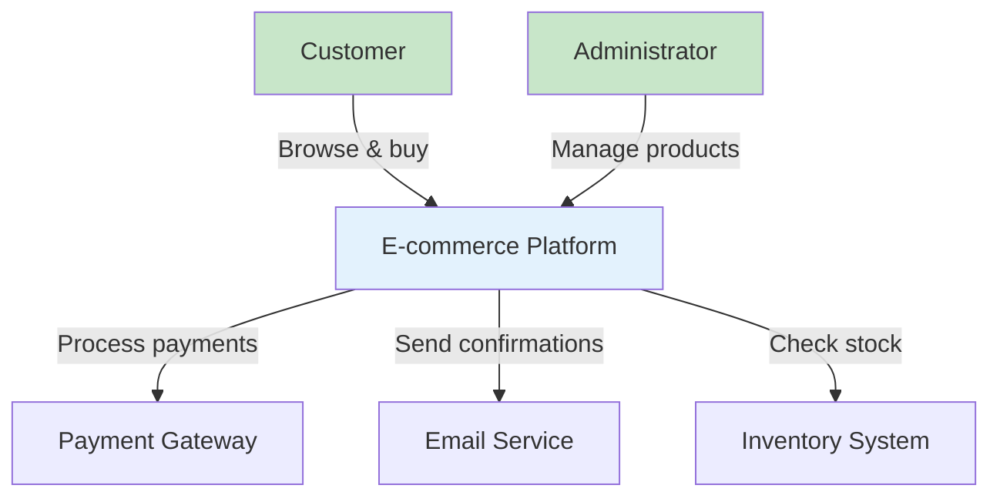
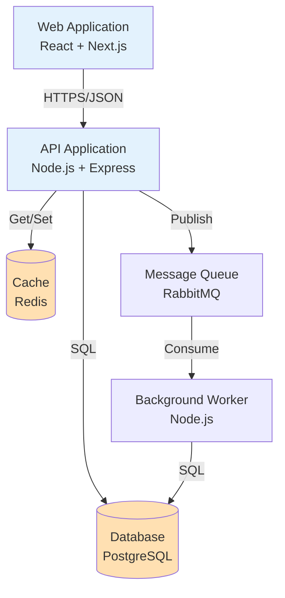
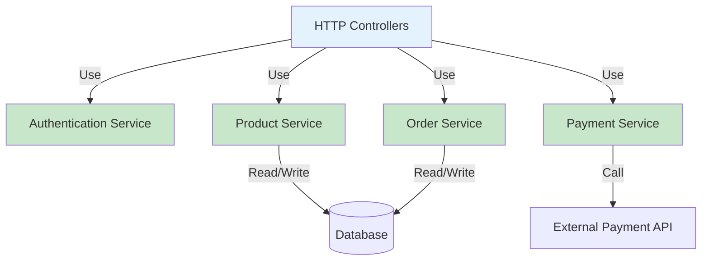
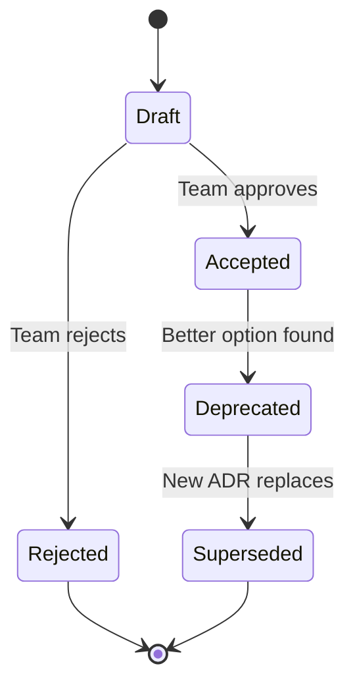
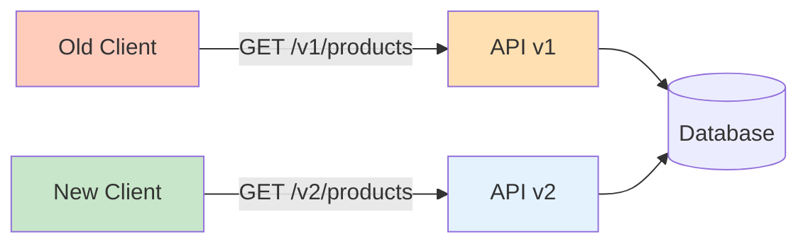
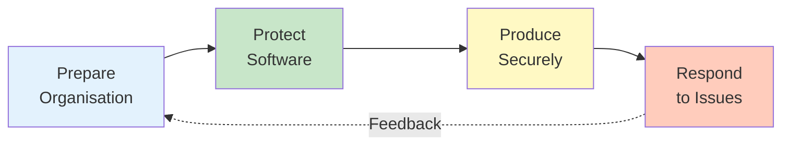
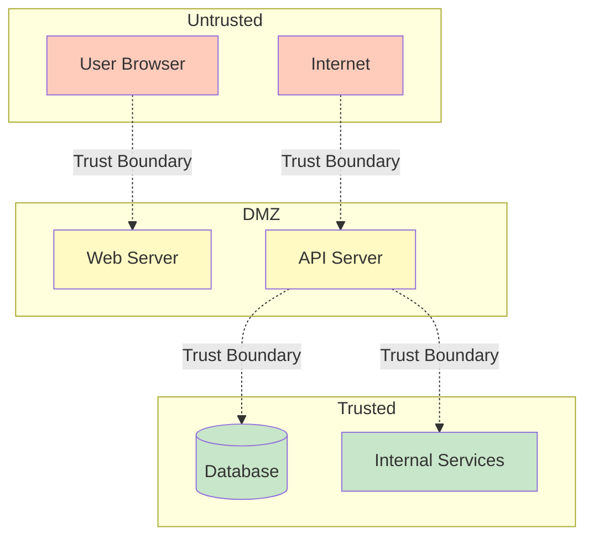
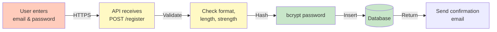

import ToolCard from "@/components/notes/ToolCard"
import Callout from "@/components/notes/Callout"
import GlossaryTip from "@/components/notes/GlossaryTip"
import SectionProgressToggle from "@/components/notes/SectionProgressToggle"
import DiagramBlock from "@/components/DiagramBlock"

# Architecture and Design

<SectionProgressToggle courseId="software-architecture" levelId="foundations" sectionId="soft-arch-foundations-architecture-design" />

Here's the thing about architecture: it's not the diagrams. The diagrams just make the decisions visible. This section is about making those decisions explicit, documenting them clearly, and designing with security baked in from the start.

<Callout variant="accreditation" type="info">
**Accreditation Alignment:**
- **iSAQB CPSA-F:** Architecture documentation and communication
- **ISO/IEC/IEEE 42010:** Architecture viewpoints and views
- **TOGAF Foundation:** Architecture Development Method (Architecture Vision and Design phases)
- **ABET:** Software design and architecture fundamentals
</Callout>

---

## C4 model

The <GlossaryTip term="C4 model">The C4 model provides four levels of abstraction for documenting software architecture: Context, Container, Component, and Code</GlossaryTip> gives you four levels of zoom for describing a system. Think of it like Google Maps: you start with the country view and zoom into street level.

### Level 1: Context

<GlossaryTip term="context diagram">A context diagram shows the system boundary and how it interacts with users and external systems</GlossaryTip> answers one question: what does this system do and who uses it?

It shows:
- Your system (one box)
- People who use it
- Other systems it talks to

<DiagramBlock title="Context diagram example" subtitle="E-commerce system at the highest level">

</DiagramBlock>

**When to use:** Explaining your system to non-technical stakeholders, new team members, or executives who just need the big picture.

### Level 2: Container

<GlossaryTip term="container diagram">A container diagram shows the major technology choices and how they communicate, where a container is a separately deployable unit</GlossaryTip> zooms into your system to show the major pieces. A "container" here means something that runs: a web app, a mobile app, a database, a microservice.

<DiagramBlock title="Container diagram example" subtitle="Inside the e-commerce platform">

</DiagramBlock>

**Key points:**
- Show technology choices (React, PostgreSQL, etc.)
- Show protocols (HTTPS, SQL, message queues)
- Highlight trust boundaries (user-facing vs internal)

**When to use:** Planning deployments, discussing tech stack, understanding scaling points.

### Level 3: Component

<GlossaryTip term="component diagram">A component diagram breaks a container into logical groupings of code with clear responsibilities</GlossaryTip> breaks one container into its major logical pieces. These are groupings of code with a clear purpose.

<DiagramBlock title="Component diagram example" subtitle="Inside the API application">

</DiagramBlock>

**When to use:** Onboarding developers, planning refactors, discussing where new features belong.

### Level 4: Code

<GlossaryTip term="class diagram">A class diagram shows the actual classes, interfaces, and their relationships in code</GlossaryTip> shows actual classes and methods. This is usually UML class diagrams. Honestly, most teams don't bother with this level. The code is the code. Level 3 is usually detailed enough.

**When to use:** Documenting complex algorithms, sharing design patterns, teaching.

<Callout variant="concept" type="info">
**Simon Brown's Advice:**

The C4 model creator, Simon Brown, says: "The code is the code." Don't over-document. Focus on Levels 1-3, and keep them up to date.
</Callout>

### Practice: Draw a C4 Context diagram

**Exercise (20 minutes):**

Pick a system you know: a food delivery app, a banking app, or your workplace system. Draw a Context diagram showing:
1. The system (one box)
2. At least three types of users
3. At least two external systems

**Hint:** Keep it simple. If your diagram has more than 8 boxes, you're probably going too deep.

---

## Architecture Decision Records

An <GlossaryTip term="ADR">An Architecture Decision Record documents a significant architectural decision, its context, options considered, and rationale</GlossaryTip> is a lightweight document that captures why you made a decision. Future you (and your teammates) will thank you.

### Why ADRs matter

Six months from now, someone will ask: "Why did we choose PostgreSQL instead of MongoDB?" Without an ADR, the best answer you'll have is: "I think someone said it was better." With an ADR, you'll have: "We needed ACID transactions for payment processing, and the team had strong PostgreSQL experience."

### ADR template

```markdown
# ADR-001: Use PostgreSQL for primary database

## Status
Accepted

## Context
We need a database for our e-commerce platform. Requirements:
- ACID transactions for payment processing
- Complex queries with joins (products, orders, inventory)
- Team has limited NoSQL experience
- Need mature tooling and hosting options

## Decision
We will use PostgreSQL 15 as our primary database.

## Consequences

### Positive
- Strong ACID guarantees for financial data
- Excellent query optimiser for complex joins
- Mature ecosystem (ORMs, migration tools, hosting)
- Team familiarity reduces risk

### Negative
- Vertical scaling limits (can't easily shard)
- Less flexible schema than document databases
- Requires careful index management for performance

## Alternatives considered

### MongoDB
- Pros: Flexible schema, horizontal scaling
- Cons: Weaker consistency, team has no experience

### MySQL
- Pros: Similar to PostgreSQL, slightly simpler
- Cons: Weaker JSON support, less advanced query features
```

<Callout variant="standard" type="info">
**Michael Nygard's ADR Format:**

This template is based on Michael Nygard's widely adopted format. It's deliberately lightweight: one page, no UML, just text. The goal is to make writing ADRs so easy that you actually do it.
</Callout>

### When to write an ADR

Write an ADR when:
- The decision is hard to reverse (database, framework, protocol)
- Multiple people need to understand it
- It affects multiple teams or systems
- You had a debate and need to record the outcome

Don't write an ADR for:
- Trivial choices (button colour, variable names)
- Temporary decisions (quick fixes, experiments)
- Obvious choices with no debate

### ADR lifecycle

1. **Proposed:** Someone drafts it, team discusses
2. **Accepted:** Team agrees, decision is active
3. **Deprecated:** Still in effect, but we're moving away
4. **Superseded:** Replaced by a new ADR

<DiagramBlock title="ADR lifecycle" subtitle="How decisions evolve">

</DiagramBlock>

### Practice: Write an ADR

**Exercise (25 minutes):**

Write an ADR for one of these decisions:
- REST vs GraphQL for your API
- Monorepo vs separate repos
- JWT vs session cookies for authentication

Use the template above. Include:
- Context (requirements, constraints)
- Decision (clear statement)
- Consequences (both positive and negative)
- At least one alternative considered

**Hint:** The hardest part is being honest about the downsides. Every decision has trade-offs.

---

## API contracts and versioning strategies

An <GlossaryTip term="API contract">An API contract is a formal specification of what an API promises to do, including endpoints, data formats, and behaviour</GlossaryTip> is a promise about how your API behaves. Break the contract, and you break clients.

### Why contracts matter

Imagine you're building a mobile app that calls your API. You deploy a new backend that changes the `/users` endpoint from returning an array to returning an object. Your mobile app crashes for every user until they update.

Contracts prevent this. They make promises explicit and versioning intentional.

### OpenAPI (Swagger) example

```yaml
openapi: 3.0.0
info:
  title: E-commerce API
  version: 1.0.0

paths:
  /products:
    get:
      summary: List all products
      parameters:
        - name: category
          in: query
          schema:
            type: string
      responses:
        '200':
          description: Successful response
          content:
            application/json:
              schema:
                type: array
                items:
                  $ref: '#/components/schemas/Product'

components:
  schemas:
    Product:
      type: object
      required:
        - id
        - name
        - price
      properties:
        id:
          type: string
        name:
          type: string
        price:
          type: number
          format: double
```

<Callout variant="concept" type="info">
**OpenAPI Benefits:**
- Auto-generates documentation
- Enables contract testing
- Can generate client libraries
- Validates requests/responses
</Callout>

### Versioning strategies

When you need to change an API, you have four main strategies:

1. **URI versioning:** `/v1/products`, `/v2/products`
   - **Pros:** Clear, easy to route
   - **Cons:** Proliferates endpoints

2. **Header versioning:** `Accept: application/vnd.myapi.v2+json`
   - **Pros:** Clean URIs, follows HTTP semantics
   - **Cons:** Less visible, harder to test in browser

3. **Query parameter:** `/products?version=2`
   - **Pros:** Easy to add, backwards compatible
   - **Cons:** Can clutter query strings

4. **Content negotiation:** Client requests specific format
   - **Pros:** Most RESTful, fine-grained control
   - **Cons:** Complex to implement correctly

<DiagramBlock title="URI versioning example" subtitle="Most common strategy">

</DiagramBlock>

**Recommendation:** Start with URI versioning (`/v1/`). It's the simplest and most explicit. Graduate to header versioning if you need fine-grained control.

### Breaking vs non-breaking changes

**Non-breaking changes** (safe to add):
- Adding new endpoints
- Adding optional parameters
- Adding new fields to responses

**Breaking changes** (require new version):
- Removing or renaming fields
- Changing field types
- Making optional parameters required
- Changing error response formats

<Callout variant="standard" type="info">
**Semantic Versioning for APIs:**
- **Major version (v1 → v2):** Breaking changes
- **Minor version (v1.1 → v1.2):** New features, backwards compatible
- **Patch version (v1.1.0 → v1.1.1):** Bug fixes, backwards compatible
</Callout>

### Practice: Design an API contract

**Exercise (20 minutes):**

Design an OpenAPI contract for a simple "Task Management API" with:
1. `GET /tasks` - List all tasks
2. `POST /tasks` - Create a task
3. `PATCH /tasks/{id}` - Update a task status

Include:
- Request parameters
- Request body schemas
- Response schemas
- At least one error response

**Hint:** Use the OpenAPI example above as a starting point. Keep it simple.

---

## Security by design principles

<GlossaryTip term="security by design">Security by design means building security into the architecture from the start, not adding it later as an afterthought</GlossaryTip> means you don't bolt security on at the end. You design it in from the start.

### Microsoft SDL principles

The <GlossaryTip term="Microsoft SDL">Microsoft Security Development Lifecycle is a set of security practices integrated into software development</GlossaryTip> gives us battle-tested principles:

1. **Secure by default:** Users shouldn't have to configure security
2. **Secure by design:** Architecture minimises attack surface
3. **Secure in deployment:** Easy to deploy securely
4. **Communications:** Security guidance is clear and actionable

### NIST SSDF practices

The <GlossaryTip term="NIST SSDF">NIST Secure Software Development Framework defines practices for integrating security throughout the development lifecycle</GlossaryTip> organises security practices into four groups:

1. **Prepare:** Organisation-level security culture and processes
2. **Protect:** Building security into the software itself
3. **Produce:** Secure development practices and tooling
4. **Respond:** Handling vulnerabilities and incidents

<DiagramBlock title="NIST SSDF groups" subtitle="Security throughout the lifecycle">

</DiagramBlock>

### Key principles in practice

**1. Least privilege**

<GlossaryTip term="least privilege">Least privilege means giving users and systems only the minimum permissions they need to do their job</GlossaryTip> is simple: give the minimum permissions needed, nothing more.

**Bad:** Web server runs as root, can access everything
**Good:** Web server runs as dedicated user, can only access its files

**2. Defence in depth**

Layer security controls so one failure doesn't doom you:
- Authentication (are you who you say?)
- Authorisation (are you allowed to do this?)
- Input validation (is this data safe?)
- Output encoding (can this data harm the viewer?)
- Logging (did something bad happen?)

**3. Fail securely**

When something goes wrong, fail safely:

**Bad:**
```javascript
try {
  checkPermission(user, resource);
  return resource;
} catch (err) {
  // Oops, error in permission check, let them through
  return resource;
}
```

**Good:**
```javascript
try {
  checkPermission(user, resource);
  return resource;
} catch (err) {
  logger.error('Permission check failed', err);
  throw new ForbiddenError();
}
```

**4. Don't trust user input**

All user input is potentially malicious:
- Validate on the server, not just the client
- Use allowlists, not denylists ("allow only A-Z" beats "block everything bad")
- Encode output based on context (HTML, JavaScript, SQL)

<Callout variant="standard" type="info">
**OWASP Secure Coding Practices:**

OWASP maintains a comprehensive Secure Coding Practices checklist covering input validation, output encoding, authentication, session management, access control, cryptography, error handling, and logging.
</Callout>

### Practice: Apply security principles

**Exercise (25 minutes):**

You're designing a blog platform. Apply security by design to:
1. User login (authentication)
2. Post publishing (authorisation)
3. Comment submission (input validation)

For each, describe:
- What could go wrong (threat)
- Which principle applies
- How you'd mitigate it

**Hint:** Start with STRIDE from the previous module. Each STRIDE category has corresponding security principles.

---

## Trust boundaries and data flow diagrams

A <GlossaryTip term="data flow diagram">A data flow diagram shows how data moves through a system, highlighting trust boundaries and transformation points</GlossaryTip> shows where data goes and where it transforms. Combined with trust boundaries, it reveals where attacks are most likely.

### Marking trust boundaries

<DiagramBlock title="Trust boundaries in a web app" subtitle="Where validation is critical">

</DiagramBlock>

**Key insight:** Data crossing a trust boundary must be validated and potentially transformed. Don't trust anything from the untrusted zone.

### Data flow diagram example

<DiagramBlock title="Data flow for user registration" subtitle="From submission to storage">

</DiagramBlock>

**Security analysis:**
1. **A → B:** Trust boundary. Validate HTTPS, rate limit requests
2. **B → C:** Input validation. Reject malformed data
3. **C → D:** Cryptography. Use strong hashing (bcrypt, Argon2)
4. **D → E:** Database. Use parameterised queries
5. **E → F:** Email. Don't leak whether email exists

### STRIDE on data flows

For each data flow, ask STRIDE questions:

| Flow | Spoofing | Tampering | Info Disclosure |
|------|----------|-----------|-----------------|
| User → API | Check origin | Validate input | Use HTTPS |
| API → DB | Use creds | Parameterise | Encrypt at rest |
| API → Email | Auth with provider | Sign messages | Don't leak data |

<Callout variant="concept" type="info">
**Threat Modelling Tool:**

Microsoft Threat Modeling Tool and OWASP Threat Dragon both support data flow diagrams with STRIDE analysis. They're free and worth trying for larger systems.
</Callout>

### Practice: Draw a data flow diagram

**Exercise (30 minutes):**

Pick a sensitive flow: password reset, payment processing, or file upload. Create a data flow diagram showing:
1. All steps from user input to storage/action
2. Trust boundaries (dotted lines)
3. Validation points
4. Cryptographic operations

Then, for each trust boundary crossing, identify:
- One STRIDE threat
- One mitigation

**Hint:** Use Mermaid syntax (like the examples above) or draw on paper. The thinking matters more than the tool.

---

## Summary and next steps

You've learned how to:
- Document architecture at multiple levels using the C4 model
- Capture decisions with ADRs
- Define API contracts and version them safely
- Apply security by design principles (Microsoft SDL, NIST SSDF)
- Map trust boundaries and data flows for threat analysis

These architecture and design practices create a solid foundation for building secure, maintainable systems.

**Next module:** Implementation - where we'll translate designs into secure code with proper input validation, session management, and error handling.

---

**CPD Evidence:**
- Estimated time: 2.8 hours
- Learning objectives achieved:
  1. ✅ Apply C4 model for multi-level architecture documentation
  2. ✅ Write Architecture Decision Records with proper rationale
  3. ✅ Design API contracts and choose versioning strategies
  4. ✅ Apply security by design principles from Microsoft SDL and NIST SSDF
  5. ✅ Create data flow diagrams with trust boundary analysis

**Accreditation mapping:** This module directly supports iSAQB CPSA-F architecture documentation criteria, ISO 42010 viewpoint specifications, TOGAF ADM Architecture Design, and ABET software design outcomes.
