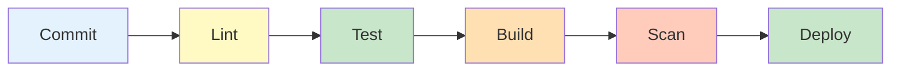
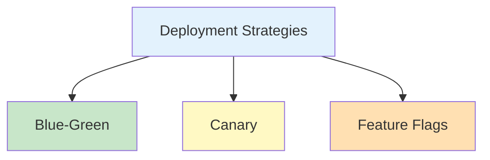

import SectionProgressToggle from "@/components/notes/SectionProgressToggle"
import Callout from "@/components/notes/Callout"
import GlossaryTip from "@/components/notes/GlossaryTip"
import DiagramBlock from "@/components/DiagramBlock"

# Deployment and CI/CD

<SectionProgressToggle courseId="software-architecture" levelId="foundations" sectionId="soft-arch-foundations-deployment-cicd" />

Manual deployments are like manually typing SQL queries into production. Sure, it works, but one typo and everything breaks. This section is about automating the path from code to production safely.

<Callout variant="accreditation" type="info">
**Accreditation Alignment:**
- **iSAQB CPSA-F:** Deployment and operations practices
- **Microsoft SDL:** Secure development lifecycle automation
- **NIST SSDF:** Automated security testing integration
- **ABET:** Software deployment and DevOps fundamentals
</Callout>

---

## CI/CD pipeline anatomy

A <GlossaryTip term="CI/CD pipeline">CI/CD pipeline is an automated sequence of steps that builds, tests, and deploys code changes</GlossaryTip> turns commits into production deployments without human intervention.

<DiagramBlock title="CI/CD pipeline stages" subtitle="From commit to production">

</DiagramBlock>

**Pipeline stages:**

1. **Lint:** Check code style and catch simple errors
2. **Test:** Run unit, integration, and E2E tests
3. **Build:** Compile code and create artifacts
4. **Scan:** Security scanning (SAST, DAST, dependencies)
5. **Deploy:** Push to staging or production

**Example GitHub Actions pipeline:**

```yaml
name: CI/CD Pipeline

on:
  push:
    branches: [main]
  pull_request:
    branches: [main]

jobs:
  test:
    runs-on: ubuntu-latest
    steps:
      - uses: actions/checkout@v3
      
      - name: Set up Node.js
        uses: actions/setup-node@v3
        with:
          node-version: '18'
      
      - name: Install dependencies
        run: npm ci
      
      - name: Lint
        run: npm run lint
      
      - name: Run tests
        run: npm test
      
      - name: Build
        run: npm run build

  security:
    runs-on: ubuntu-latest
    steps:
      - uses: actions/checkout@v3
      
      - name: Run security scan
        uses: snyk/actions/node@master
        env:
          SNYK_TOKEN: ${{ secrets.SNYK_TOKEN }}

  deploy:
    needs: [test, security]
    if: github.ref == 'refs/heads/main'
    runs-on: ubuntu-latest
    steps:
      - name: Deploy to production
        run: |
          npm run deploy
```

---

## DevSecOps integration

<GlossaryTip term="DevSecOps">DevSecOps integrates security practices into the DevOps pipeline, making security everyones responsibility</GlossaryTip> means security checks happen automatically, not as an afterthought.

### SAST (Static Application Security Testing)

Analyses source code without running it.

**Tools:** SonarQube, CodeQL, Semgrep

### DAST (Dynamic Application Security Testing)

Tests running applications for vulnerabilities.

**Tools:** OWASP ZAP, Burp Suite

### Secret scanning

Prevents credentials from being committed.

**Tools:** git-secrets, Gitleaks, GitHub secret scanning

---

## Deployment strategies

<DiagramBlock title="Deployment strategies" subtitle="Managing risk during releases">

</DiagramBlock>

### Blue-green deployment

Two identical environments. Switch traffic instantly.

### Canary deployment

<GlossaryTip term="canary deployment">A canary deployment gradually routes a small percentage of traffic to a new version, monitoring for errors before full rollout</GlossaryTip> reduces risk by testing with real users first.

### Feature flags

<GlossaryTip term="feature flag">A feature flag allows code to be deployed but not activated until the flag is toggled</GlossaryTip> decouples deployment from release.

---

## Infrastructure as Code basics

<GlossaryTip term="Infrastructure as Code">Infrastructure as Code defines infrastructure using configuration files that can be versioned and tested</GlossaryTip> makes environments reproducible and auditable.

**Example Terraform:**

```hcl
resource "aws_instance" "web" {
  ami           = "ami-0c55b159cbfafe1f0"
  instance_type = "t2.micro"
  
  tags = {
    Name = "WebServer"
  }
}
```

### Practice: Design a CI/CD pipeline

**Exercise (25 minutes):**

Design a pipeline for a Node.js web application with:
1. Three stages you would include
2. Two security checks
3. One deployment strategy

**Hint:** Think about what could fail and how to catch it early.

---

## Summary and next steps

You have learned about CI/CD pipeline anatomy, DevSecOps integration with SAST/DAST/secret scanning, deployment strategies, and Infrastructure as Code basics.

**Next module:** Operations where we cover SRE principles, observability, and incident response.

---

**CPD Evidence:**
- Estimated time: 2.5 hours
- Learning objectives achieved:
  1. ✅ Design CI/CD pipelines with security integration
  2. ✅ Apply DevSecOps practices (SAST, DAST, secret scanning)
  3. ✅ Choose appropriate deployment strategies
  4. ✅ Use Infrastructure as Code fundamentals

**Accreditation mapping:** This module supports iSAQB CPSA-F deployment practices, Microsoft SDL automation requirements, NIST SSDF security integration, and ABET DevOps fundamentals.
