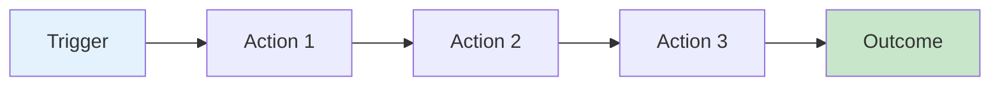
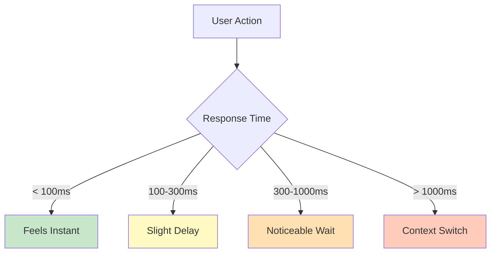
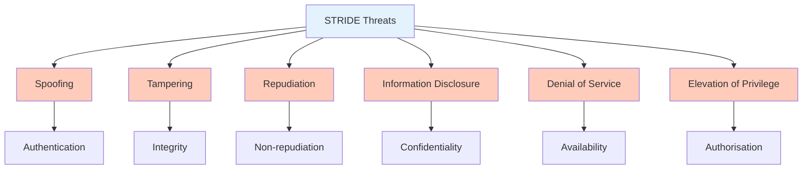
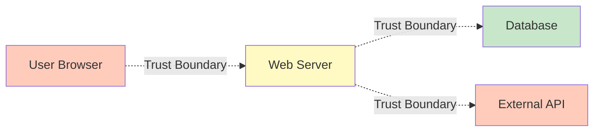
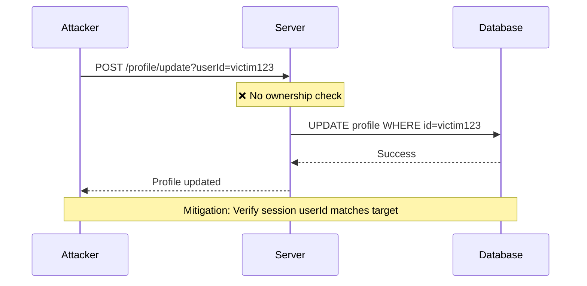

import ToolCard from "@/components/notes/ToolCard"
import Callout from "@/components/notes/Callout"
import GlossaryTip from "@/components/notes/GlossaryTip"
import QuizBlock from "@/components/notes/QuizBlock"
import SectionProgressToggle from "@/components/notes/SectionProgressToggle"
import DiagramBlock from "@/components/DiagramBlock"

# Discovery and Requirements

<SectionProgressToggle courseId="software-architecture" levelId="foundations" sectionId="soft-arch-foundations-discovery-requirements" />

Here's the thing: most systems don't fail because of bad code. They fail because we built the wrong thing, or we didn't think hard enough about what could go wrong. This section is about getting clear on what you're actually building and what could break it.

<Callout variant="accreditation" type="info">
**Accreditation Alignment:**
- **iSAQB CPSA-F:** Methods for designing architectures (requirements analysis)
- **ISO/IEC/IEEE 42010:** Architecture description practices
- **TOGAF Foundation:** Architecture Development Method (Preliminary and Vision phases)
- **ABET:** Requirements engineering fundamentals
</Callout>

---

## User journeys and problem statements

Software exists to help someone do something. Before you draw a single box, you need to know who that someone is and what they're trying to accomplish. A <GlossaryTip term="user journey">A user journey is the sequence of steps a person takes to accomplish a goal with your system</GlossaryTip> gives you that clarity.

Think of it like planning a route. If you don't know where you're starting or where you need to go, any road will do. But if you know you need to get from your kitchen to the supermarket, buy milk, and get home before the baby wakes up, suddenly the route matters. You need to optimise for speed, not scenery.

<DiagramBlock title="User journey structure" subtitle="From trigger to outcome">

</DiagramBlock>

A good user journey includes:
- **Trigger:** What makes someone start this task?
- **Actions:** What do they actually do, step by step?
- **Outcome:** What does success look like?
- **Pain points:** Where do they get stuck or frustrated?

### Example: Online banking transfer

1. **Trigger:** User needs to pay rent
2. **Actions:**
   - Log in with username and password
   - Navigate to transfers
   - Enter recipient details
   - Specify amount
   - Review and confirm
3. **Outcome:** Rent is paid, confirmation received
4. **Pain points:** Forgotten password, unclear error messages, slow loading

<Callout variant="concept" type="info">
**Technical Definition:**

A user journey maps the end-to-end experience of a user interacting with a system, including all touchpoints, decisions, and potential failure modes. It differs from a use case in that it emphasises the user's perspective and emotions, not just functional steps.
</Callout>

### Problem statements

A <GlossaryTip term="problem statement">A problem statement clearly defines what problem you're solving, for whom, and why current solutions are inadequate</GlossaryTip> keeps you honest. It's easy to build features. It's hard to build the right features.

Good problem statements follow this pattern:
- **Who** has the problem?
- **What** is the problem?
- **Why** is it a problem?
- **How** do we know it's a problem?

**Example:** "University students (who) struggle to find available study spaces during exam periods (what) because the library booking system doesn't show real-time availability (why). This leads to wasted time searching and reduced study efficiency (impact). We know this because 67% of surveyed students report this as their top campus frustration (evidence)."

### Practice: Write your own user journey

**Exercise (15 minutes):**

Pick a common task: ordering food delivery, booking a doctor's appointment, or filing an expense claim. Write out:
1. The trigger
2. All the steps
3. The desired outcome
4. Three things that could go wrong

**Hint:** Walk through it yourself or watch someone else do it. Don't guess.

---

## Non-functional requirements

Functional requirements tell you what the system should do. <GlossaryTip term="non-functional requirements">Non-functional requirements specify how well the system should perform, covering quality attributes like performance, security, and usability</GlossaryTip> tell you how well it should do it. These are the qualities that make a system actually usable in the real world.

### Latency

How fast must the system respond? Latency matters because humans notice delays. Research shows:
- **< 100ms:** Feels instant
- **100-300ms:** Slight delay, still feels responsive
- **300-1000ms:** Noticeable delay, user waits
- **> 1 second:** User starts to lose focus

<DiagramBlock title="Latency thresholds" subtitle="User perception of response times">

</DiagramBlock>

When defining latency requirements, be specific:
- **p50 latency:** 50% of requests faster than X
- **p95 latency:** 95% of requests faster than Y
- **p99 latency:** 99% of requests faster than Z

**Example:** "Search results must return with p50 < 200ms, p95 < 500ms, p99 < 1000ms, measured at the server."

### Availability

<GlossaryTip term="availability">Availability is the percentage of time a system is operational and accessible, typically measured as uptime over a period</GlossaryTip> is about being there when needed. It's measured as a percentage of uptime.

Common targets:
- **99% (two nines):** 3.65 days downtime per year
- **99.9% (three nines):** 8.76 hours downtime per year
- **99.99% (four nines):** 52.56 minutes downtime per year
- **99.999% (five nines):** 5.26 minutes downtime per year

Each additional nine gets exponentially more expensive. A banking system might need five nines. A personal blog probably doesn't need more than two.

### Accessibility

<GlossaryTip term="accessibility">Accessibility ensures systems are usable by people with diverse abilities, including those using assistive technologies like screen readers</GlossaryTip> means everyone can use your system, including people with disabilities. It's not just the right thing to do; it's often the law.

Key considerations:
- **Keyboard navigation:** Can you do everything without a mouse?
- **Screen readers:** Can blind users understand the content?
- **Colour contrast:** Can people with low vision read the text?
- **Captions and transcripts:** Can deaf users access audio/video content?

<Callout variant="standard" type="info">
**WCAG 2.2 Levels:**
- **Level A:** Minimum accessibility
- **Level AA:** Standard target for most organisations
- **Level AAA:** Highest level, often required for government sites
</Callout>

### Privacy

<GlossaryTip term="privacy">Privacy requirements define how personal data is collected, processed, stored, and protected, ensuring compliance with regulations like GDPR</GlossaryTip> requirements protect user data. Under regulations like GDPR, you must:
- Only collect data you need (data minimisation)
- Tell users what you're collecting and why (transparency)
- Get explicit consent for sensitive data
- Allow users to see, correct, or delete their data
- Report breaches within 72 hours

**Example:** "The system must not store credit card numbers. Payment processing must use tokenisation via a PCI-compliant provider. User data must be encrypted at rest and in transit."

### Cost

How much can you spend to run this system? Cost includes:
- **Infrastructure:** Servers, databases, bandwidth
- **Licensing:** Third-party services, libraries
- **Operations:** Monitoring, support, maintenance
- **Personnel:** Developers, ops, security

<Callout variant="concept" type="info">
Cost is a constraint, not a goal. The goal is to deliver value. The constraint is how much you can spend to do it.
</Callout>

### Practice: Define your NFRs

**Exercise (20 minutes):**

For a simple system (e.g., a todo list app), define:
1. Acceptable latency for loading tasks
2. Target availability (be realistic)
3. One accessibility requirement
4. One privacy requirement
5. Maximum monthly cost

**Hint:** Start with what users would actually notice, not what sounds impressive.

---

## Threat modelling fundamentals

<GlossaryTip term="threat modelling">Threat modelling is the structured process of identifying, assessing, and mitigating security threats to a system</GlossaryTip> is thinking about what could go wrong from a security perspective. It's like doing a pre-mortem: imagine your system has been hacked. What happened?

### STRIDE introduction

STRIDE is a framework for categorising threats. It's an acronym:

- **S**poofing: Pretending to be someone else
- **T**ampering: Changing data you shouldn't
- **R**epudiation: Denying you did something
- **I**nformation disclosure: Leaking data
- **D**enial of service: Making the system unavailable
- **E**levation of privilege: Getting permissions you shouldn't have

<DiagramBlock title="STRIDE threat categories" subtitle="Six categories of security threats">

</DiagramBlock>

**Example: Login page**
- **Spoofing:** Attacker tries to log in as someone else (mitigation: strong passwords, MFA)
- **Tampering:** Attacker modifies form data (mitigation: server-side validation)
- **Information disclosure:** Error messages reveal valid usernames (mitigation: generic errors)
- **Denial of service:** Attacker floods login attempts (mitigation: rate limiting)

<Callout variant="standard" type="info">
**Microsoft SDL Reference:**

STRIDE was developed as part of Microsoft's Security Development Lifecycle (SDL). It's a lightweight way to think systematically about threats without needing deep security expertise.
</Callout>

### Trust boundaries

A <GlossaryTip term="trust boundary">A trust boundary is a line between components with different levels of trust, where data must be validated and secured</GlossaryTip> is a line between trusted and untrusted components. Data crossing a trust boundary must be validated.

Common boundaries:
- **User to server:** All user input is untrusted
- **Public internet to internal network:** Firewall boundary
- **One service to another:** Especially with different owners
- **Application to database:** Even internal data can be tainted

<DiagramBlock title="Trust boundaries in a web app" subtitle="Where validation is critical">

</DiagramBlock>

**Rule:** Never trust data from the other side of a boundary. Always validate.

### Practice: STRIDE analysis

**Exercise (25 minutes):**

Pick a simple system: a password reset flow. Map out:
1. User enters email
2. System sends reset link
3. User clicks link
4. User enters new password

For each step, identify at least one STRIDE threat and propose a mitigation.

**Hint:** Start with Spoofing and Tampering. Those are usually the most obvious.

---

## Abuse cases mapped to OWASP Top 10

While user journeys show how things should work, <GlossaryTip term="abuse case">An abuse case describes how an attacker might misuse system functionality to cause harm</GlossaryTip> show how attackers might misuse your system. They're the evil twin of use cases.

### OWASP Top 10 overview

The <GlossaryTip term="OWASP Top 10">The OWASP Top 10 is a regularly updated list of the most critical security risks to web applications</GlossaryTip> lists the most common and dangerous web application vulnerabilities:

1. **Broken Access Control:** Users can access things they shouldn't
2. **Cryptographic Failures:** Sensitive data exposed due to weak encryption
3. **Injection:** Attacker inserts malicious code (SQL, command, etc.)
4. **Insecure Design:** Fundamental security flaws in architecture
5. **Security Misconfiguration:** Default passwords, unnecessary features enabled
6. **Vulnerable and Outdated Components:** Using libraries with known vulnerabilities
7. **Identification and Authentication Failures:** Weak login mechanisms
8. **Software and Data Integrity Failures:** Unsigned updates, untrusted sources
9. **Security Logging and Monitoring Failures:** Can't detect or respond to attacks
10. **Server-Side Request Forgery (SSRF):** Attacker makes server request malicious URLs

<Callout variant="standard" type="info">
**OWASP ASVS Connection:**

The OWASP Application Security Verification Standard (ASVS) provides detailed requirements for addressing these vulnerabilities. We'll cover ASVS in depth in the Verification and Testing module.
</Callout>

### Mapping abuse cases to OWASP Top 10

Let's take a simple feature: user profile updates.

**Normal use case:** User updates their display name and saves.

**Abuse cases:**

1. **Broken Access Control (OWASP #1)**
   - **Abuse:** Attacker changes URL parameter to modify another user's profile
   - **Mitigation:** Server validates user can only edit their own profile

2. **Injection (OWASP #3)**
   - **Abuse:** Attacker enters `` as display name
   - **Mitigation:** Sanitise input, encode output, use Content Security Policy

3. **Security Misconfiguration (OWASP #5)**
   - **Abuse:** Stack traces in errors reveal internal paths and framework versions
   - **Mitigation:** Generic error messages in production, detailed logs server-side

<DiagramBlock title="Abuse case flow" subtitle="How an attacker exploits broken access control">

</DiagramBlock>

### Defence in depth

<GlossaryTip term="defence in depth">Defence in depth is a security strategy that uses multiple layers of protection, so if one fails, others remain</GlossaryTip> means you don't rely on a single security control. You layer protections so that if one fails, others catch the attack.

**Example: Protecting sensitive data**
1. **Authentication:** Verify user identity
2. **Authorisation:** Check user has permission
3. **Encryption in transit:** Use HTTPS
4. **Encryption at rest:** Encrypt database
5. **Audit logging:** Record who accessed what
6. **Monitoring:** Alert on suspicious patterns

No single layer is perfect, but together they make attacks much harder.

<Callout variant="concept" type="info">
**NIST SSDF Alignment:**

The NIST Secure Software Development Framework (SSDF) emphasises identifying and mitigating security risks early in design. Threat modelling and abuse cases are key practices in SSDF's "Produce Well-Secured Software" objective.
</Callout>

### Practice: Create abuse cases

**Exercise (30 minutes):**

For an e-commerce checkout flow, create abuse cases for:
1. Broken Access Control
2. Injection
3. Cryptographic Failures

For each:
- Describe the attack
- Identify the OWASP category
- Propose a mitigation

**Hint:** Think like an attacker. How would you try to get something for free or steal data?

---

## Summary and next steps

You've learned how to:
- Map user journeys to understand what you're building
- Define non-functional requirements (latency, availability, accessibility, privacy, cost)
- Apply STRIDE threat modelling to identify security risks
- Create abuse cases mapped to OWASP Top 10 vulnerabilities

These discovery and requirements practices set the foundation for secure, user-centred architecture.

**Next module:** Architecture and Design - where we'll translate requirements into structure using C4 models, ADRs, and security-by-design principles.

---

**CPD Evidence:**
- Estimated time: 2.4 hours
- Learning objectives achieved:
  1. ✅ Map user journeys and write problem statements
  2. ✅ Define non-functional requirements across five key dimensions
  3. ✅ Apply STRIDE threat modelling framework
  4. ✅ Create abuse cases mapped to OWASP Top 10

**Accreditation mapping:** This module directly supports iSAQB CPSA-F requirements analysis criteria, ISO 42010 stakeholder concerns, TOGAF ADM Preliminary phase, and ABET requirements engineering outcomes.
