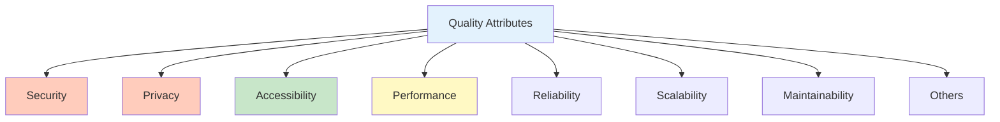
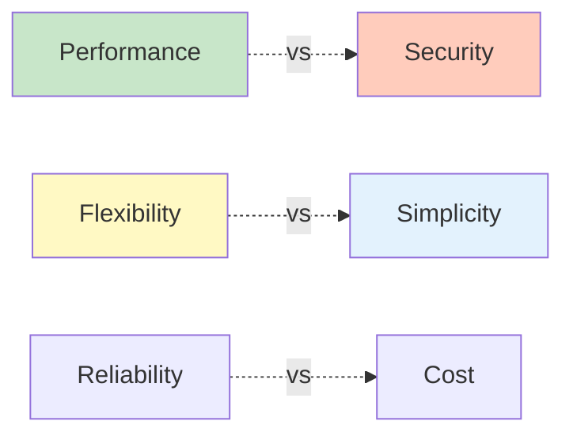

import SectionProgressToggle from "@/components/notes/SectionProgressToggle"
import Callout from "@/components/notes/Callout"
import GlossaryTip from "@/components/notes/GlossaryTip"
import DiagramBlock from "@/components/DiagramBlock"

# The "Ilities" Framework

<SectionProgressToggle courseId="software-architecture" levelId="foundations" sectionId="soft-arch-foundations-ilities-framework" />

Architecture is not just about making systems work. It is about making them work well across many dimensions. This section gives you a framework for evaluating quality attributes.

<Callout variant="accreditation" type="info">
**Accreditation Alignment:**
- **iSAQB CPSA-F:** Quality attributes and trade-off analysis
- **ISO/IEC 25010:** Software product quality model
- **TOGAF:** Architecture requirements management
- **ABET:** Software quality engineering
</Callout>

---

## Core quality attributes

<DiagramBlock title="The Ilities" subtitle="Quality attributes for system evaluation">

</DiagramBlock>

---

## Security

<GlossaryTip term="security">Security protects systems and data from unauthorized access, disclosure, modification, or destruction</GlossaryTip> requires defence in depth.

**Key principles:**
- Least privilege
- Defence in depth
- Fail securely
- Never trust user input

We covered this extensively in previous modules (STRIDE, OWASP).

---

## Privacy

<GlossaryTip term="privacy">Privacy ensures personal data is collected, processed, and stored in compliance with regulations and user expectations</GlossaryTip> is increasingly regulated (GDPR, CCPA).

**Key principles:**
- Data minimisation (collect only what you need)
- Purpose limitation (use data only for stated purposes)
- Transparency (tell users what you collect and why)
- User rights (access, correction, deletion)

---

## Accessibility

<GlossaryTip term="accessibility">Accessibility ensures systems are usable by people with disabilities</GlossaryTip> is both ethical and legal.

**WCAG 2.2 Level AA** is the standard target.

**Beyond compliance:**
- Neurodivergent-friendly design (clear language, predictable navigation)
- Mobile accessibility
- Low-bandwidth support

---

## Performance

<GlossaryTip term="performance">Performance measures how quickly and efficiently a system responds to requests</GlossaryTip> directly impacts user experience.

**Core Web Vitals:**
- LCP (Largest Contentful Paint) < 2.5s
- FID (First Input Delay) < 100ms
- CLS (Cumulative Layout Shift) < 0.1

---

## Reliability

<GlossaryTip term="reliability">Reliability is the probability that a system will perform correctly over a specified period</GlossaryTip> builds user trust.

**Patterns:**
- Graceful degradation
- Circuit breakers
- Retry with exponential backoff
- Bulkheads (isolate failures)

---

## Other key ilities

### Scalability

<GlossaryTip term="scalability">Scalability is the ability to handle increased load by adding resources</GlossaryTip> can be vertical (bigger servers) or horizontal (more servers).

### Maintainability

<GlossaryTip term="maintainability">Maintainability measures how easily code can be understood, modified, and extended</GlossaryTip> determines long-term cost.

**Factors:**
- Code clarity
- Documentation
- Test coverage
- Modularity

### Testability

<GlossaryTip term="testability">Testability measures how easily software can be tested</GlossaryTip> is a design quality.

### Observability

<GlossaryTip term="observability">Observability enables understanding system behaviour from external outputs</GlossaryTip> requires logs, metrics, and traces.

### Portability

<GlossaryTip term="portability">Portability is the ease of moving software between environments or platforms</GlossaryTip> reduces vendor lock-in.

### Interoperability

<GlossaryTip term="interoperability">Interoperability is the ability to work with other systems</GlossaryTip> requires standards and APIs.

### Compliance

<GlossaryTip term="compliance">Compliance means meeting legal, regulatory, and industry standards</GlossaryTip> varies by industry.

### Cost efficiency

<GlossaryTip term="cost efficiency">Cost efficiency optimises value delivered per unit of resource consumed</GlossaryTip> includes development and operational costs.

---

## Trade-off analysis

You cannot optimise everything. Architecture is about choosing which quality attributes matter most.

<DiagramBlock title="Quality attribute trade-offs" subtitle="Common tensions">

</DiagramBlock>

**Examples:**
- **Performance vs Security:** Encryption adds latency
- **Flexibility vs Simplicity:** Generic solutions are complex
- **Reliability vs Cost:** High availability is expensive

### Practice: Quality attribute evaluation

**Exercise (25 minutes):**

For a system you know (or hypothetical online banking):
1. Rank 5 quality attributes by importance (most to least)
2. Identify 2 trade-offs you would make
3. Justify your choices

**Hint:** Consider the users, business goals, and regulatory environment.

---

## Summary and next steps

You have learned to evaluate systems across multiple quality attributes: security, privacy, accessibility, performance, reliability, scalability, maintainability, testability, observability, portability, interoperability, compliance, and cost efficiency. You understand that architecture involves trade-off analysis.

**Next step:** Foundation assessment to validate your learning across all 8 modules.

---

**CPD Evidence:**
- Estimated time: 2.0 hours
- Learning objectives achieved:
  1. ✅ Evaluate systems across multiple quality attributes
  2. ✅ Apply trade-off analysis frameworks
  3. ✅ Balance competing quality requirements
  4. ✅ Make architecture decisions with explicit quality targets

**Accreditation mapping:** This module supports iSAQB CPSA-F quality attribute analysis, ISO/IEC 25010 software quality models, TOGAF requirements management, and ABET software quality engineering outcomes.
