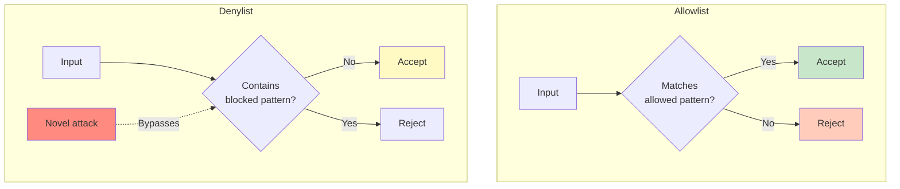
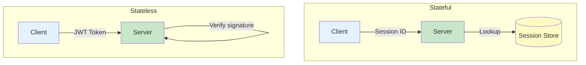
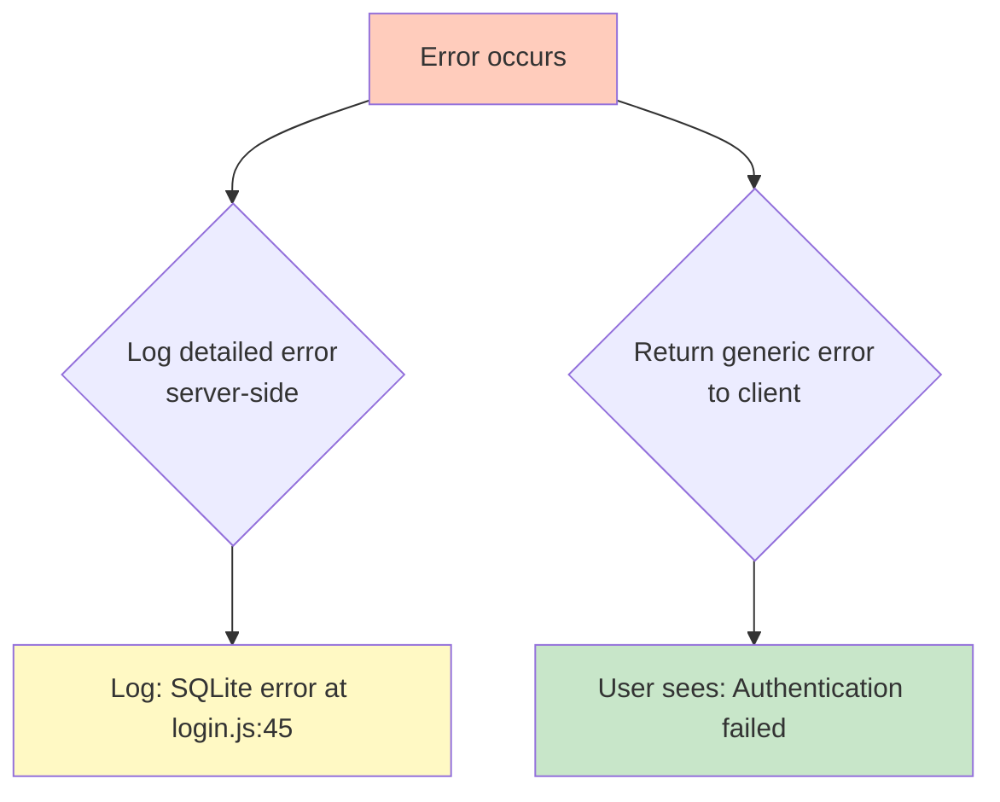

import ToolCard from "@/components/notes/ToolCard"
import Callout from "@/components/notes/Callout"
import GlossaryTip from "@/components/notes/GlossaryTip"
import SectionProgressToggle from "@/components/notes/SectionProgressToggle"
import DiagramBlock from "@/components/DiagramBlock"

# Implementation (Build)

<SectionProgressToggle courseId="software-architecture" levelId="foundations" sectionId="soft-arch-foundations-implementation" />

Here's the thing: good architecture doesn't matter if the implementation is full of holes. This section covers the secure coding practices that turn designs into production-ready code.

<Callout variant="accreditation" type="info">
**Accreditation Alignment:**
- **iSAQB CPSA-F:** Implementation and coding practices
- **TOGAF Foundation:** Solution Building Blocks
- **ABET:** Software construction and secure coding
- **OWASP:** Secure Coding Practices Quick Reference
</Callout>

---

## Secure coding foundations

<GlossaryTip term="secure coding">Secure coding is the practice of writing software that is resilient against vulnerabilities and attacks</GlossaryTip> isn't about being paranoid. It's about being realistic. Users make mistakes, attackers are creative, and systems fail. Write code that survives contact with reality.

### Input validation

All external input is untrusted. This includes:
- Form data from users
- URL parameters
- HTTP headers
- File uploads
- API payloads
- Database results (if the DB could be compromised)

**Two approaches:**

1. **Allowlist (preferred):** Define what's valid, reject everything else
2. **Denylist (avoid):** Try to block bad things, allow the rest

<DiagramBlock title="Allowlist vs Denylist" subtitle="Why allowlists are safer">

</DiagramBlock>

**Example: Username validation**

Bad (denylist):
```javascript
function validateUsername(username) {
  if (username.includes('<') || username.includes('>')) {
    throw new Error('Invalid characters');
  }
  return username;
}
// Attacker: "admin' OR '1'='1" bypasses this
```

Good (allowlist):
```javascript
function validateUsername(username) {
  const usernameRegex = /^[a-zA-Z0-9_-]{3,20}$/;
  if (!usernameRegex.test(username)) {
    throw new Error('Username must be 3-20 alphanumeric characters');
  }
  return username;
}
```

<Callout variant="standard" type="info">
**OWASP Input Validation Cheat Sheet:**

OWASP provides detailed guidance on input validation, including regular expressions for common patterns (email, phone, postal codes) and how to validate in different contexts (SQL, HTML, JavaScript, OS commands).
</Callout>

### Output encoding

<GlossaryTip term="output encoding">Output encoding transforms data to be safe for its destination context, preventing injection attacks</GlossaryTip> makes data safe for where it's going. The same data needs different encoding depending on context.

**Example: User comment `<script>alert('XSS')</script>`**

| Context | Encoding | Result |
|---------|----------|--------|
| HTML body | HTML entity encode | `&lt;script&gt;alert('XSS')&lt;/script&gt;` |
| HTML attribute | Attribute encode | Similar to HTML, plus quote encoding |
| JavaScript string | JavaScript encode | `\x3Cscript\x3Ealert('XSS')\x3C/script\x3E` |
| URL parameter | URL encode | `%3Cscript%3Ealert%28%27XSS%27%29%3C%2Fscript%3E` |
| SQL query | Use parameterised queries | Not encoded, kept separate from query |

**The rule:** Encode for the output context, not the input context.

**Example: Safe HTML output**

Bad:
```javascript
// Directly inserting user input
document.getElementById('comment').innerHTML = userComment;
```

Good:
```javascript
// Using textContent (automatically encodes)
document.getElementById('comment').textContent = userComment;

// Or use a library like DOMPurify for rich content
import DOMPurify from 'dompurify';
document.getElementById('comment').innerHTML = DOMPurify.sanitize(userComment);
```

### Practice: Input validation and output encoding

**Exercise (25 minutes):**

Write validation and encoding for a blog comment feature:
1. Input validation for comment text (max length, no scripts)
2. Output encoding for displaying comments in HTML
3. Handle a test case: `Hello <b>world</b> & <script>alert('xss')</script>`

**Hint:** Decide if you allow any HTML (like `<b>`, `<i>`) or strip all tags. Both are valid; just be consistent.

---

## Session management

<GlossaryTip term="session management">Session management tracks user state across multiple requests, typically using cookies or tokens</GlossaryTip> is how you remember who someone is between page loads. Get it wrong, and attackers can hijack user accounts.

### Stateless vs stateful sessions

**Stateful (server-side sessions):**
- Server stores session data
- Client gets a session ID cookie
- Each request includes the session ID
- Server looks up session data

**Stateless (JWT tokens):**
- Client stores all session data in a signed token
- Server verifies token signature
- No server-side storage needed

<DiagramBlock title="Stateful vs Stateless sessions" subtitle="Where session data lives">

</DiagramBlock>

### JWT security considerations

<GlossaryTip term="JWT">JSON Web Token is a compact, URL-safe token format for transmitting claims between parties</GlossaryTip> are popular but have gotchas:

1. **Don't store sensitive data in JWTs:** They're base64-encoded, not encrypted. Anyone can read them.

2. **Use strong signing algorithms:**
   - ✅ HS256 (HMAC with SHA-256)
   - ✅ RS256 (RSA signature with SHA-256)
   - ❌ None (no signature - never use!)

3. **Set expiration times:** Short-lived tokens (15 minutes) with refresh tokens for longer sessions.

4. **Validate all claims:** Check `exp` (expiration), `iat` (issued at), `aud` (audience).

**Example: Secure JWT creation**

```javascript
const jwt = require('jsonwebtoken');

function createToken(user) {
  return jwt.sign(
    {
      sub: user.id,           // Subject (user ID)
      email: user.email,
      role: user.role,
      iat: Math.floor(Date.now() / 1000),
    },
    process.env.JWT_SECRET,   // Keep this secret!
    {
      algorithm: 'HS256',
      expiresIn: '15m',        // Short-lived
      issuer: 'myapp.com',
      audience: 'myapp.com',
    }
  );
}

function verifyToken(token) {
  return jwt.verify(token, process.env.JWT_SECRET, {
    algorithms: ['HS256'],
    issuer: 'myapp.com',
    audience: 'myapp.com',
  });
}
```

<Callout variant="standard" type="info">
**OWASP JWT Security Cheat Sheet:**

OWASP provides comprehensive JWT security guidance, including algorithm selection, key management, token storage, and how to handle token revocation in stateless architectures.
</Callout>

### Cookie security flags

If using cookies for session management, set these flags:

- **HttpOnly:** JavaScript can't access the cookie (prevents XSS theft)
- **Secure:** Cookie only sent over HTTPS
- **SameSite:** Prevents CSRF attacks
  - `Strict`: Cookie only sent on same-site requests
  - `Lax`: Cookie sent on top-level navigation
  - `None`: Cookie sent on all requests (requires Secure flag)

```javascript
res.cookie('sessionId', sessionId, {
  httpOnly: true,
  secure: true,
  sameSite: 'strict',
  maxAge: 900000, // 15 minutes
});
```

### Practice: Session security review

**Exercise (20 minutes):**

Review this session implementation and identify security issues:

```javascript
app.post('/login', async (req, res) => {
  const user = await db.findUser(req.body.username);
  if (user && user.password === req.body.password) {
    const token = jwt.sign({ id: user.id }, 'secret123');
    res.cookie('token', token);
    res.json({ success: true });
  }
});
```

**Hint:** There are at least 5 security issues. Look for: password handling, JWT configuration, cookie settings, and algorithm choice.

---

## Error handling that doesn't leak internals

Errors happen. How you handle them determines whether you're helping users or helping attackers.

### The problem with detailed errors

**Bad (leaks too much):**
```
Error: SQLITE_ERROR: no such table: users
  at Database.prepare (/app/node_modules/better-sqlite3/lib/methods/prepare.js:12:21)
  at /app/routes/login.js:45:22
```

**Attacker learns:**
- You're using SQLite
- Table name is `users`
- Code structure and file paths
- Vulnerable to SQL injection

**Good (safe for production):**
```
Error: Unable to process request. Please try again later.
Reference: ERR-2024-001-a3b9
```

### Structured error handling

<DiagramBlock title="Error handling layers" subtitle="Different detail for different audiences">

</DiagramBlock>

**Implementation pattern:**

```javascript
class AppError extends Error {
  constructor(message, statusCode, isOperational = true) {
    super(message);
    this.statusCode = statusCode;
    this.isOperational = isOperational; // vs programming error
  }
}

// In route handler
try {
  const user = await loginUser(credentials);
  res.json({ user });
} catch (error) {
  logger.error('Login failed', {
    error: error.message,
    stack: error.stack,
    userId: credentials.username,
  });
  
  if (error.isOperational) {
    // Safe to send to client
    res.status(error.statusCode).json({
      error: error.message,
      reference: generateErrorId(),
    });
  } else {
    // Programming error, don't leak details
    res.status(500).json({
      error: 'Internal server error',
      reference: generateErrorId(),
    });
  }
}
```

<Callout variant="concept" type="info">
**Error reference IDs:**

Generate unique IDs for errors (like `ERR-2024-001-a3b9`) so users can report issues, and you can correlate with server logs without leaking sensitive details.
</Callout>

### What to log vs what to show

**Log server-side (for debugging):**
- Full error message and stack trace
- Input values (sanitised, no passwords/tokens)
- User ID and session info
- Timestamp and request ID

**Show to users:**
- Generic error message
- What they can do to fix it
- Error reference ID for support

**Never show:**
- Stack traces
- Database queries or errors
- File paths
- Internal variable names
- Library versions

### Practice: Improve error handling

**Exercise (20 minutes):**

Refactor this error handling code to be production-safe:

```javascript
app.post('/transfer', async (req, res) => {
  try {
    const result = await db.query(
      `UPDATE accounts SET balance = balance - ${req.body.amount} WHERE id = ${req.body.from}`
    );
    res.json({ success: true });
  } catch (err) {
    res.status(500).json({ error: err.message, stack: err.stack });
  }
});
```

Fix:
1. SQL injection vulnerability
2. Error message leakage
3. Missing input validation
4. No logging

**Hint:** Use parameterised queries, validate inputs, log internally, show generic errors.

---

## Supply chain security

<GlossaryTip term="supply chain security">Supply chain security protects against compromised dependencies and third-party components</GlossaryTip> means not trusting that every npm package or library you install is safe. Supply chain attacks are real and growing.

### The risk

When you run `npm install`, you're trusting:
- The package author
- All dependencies (and their dependencies)
- The registry (npm, PyPI, etc.)
- Your network (could be MITM attacked)

**Real example:** The `event-stream` npm package was compromised in 2018. It was downloaded millions of times per month. The attacker added code to steal cryptocurrency wallet credentials.

### Dependency pinning

<GlossaryTip term="dependency pinning">Dependency pinning locks dependencies to specific versions to prevent unexpected changes</GlossaryTip> means using exact versions, not ranges.

**Bad (package.json):**
```json
{
  "dependencies": {
    "express": "^4.18.0"
  }
}
```
The `^` allows any `4.x.x` version. A new version could introduce vulnerabilities.

**Good:**
```json
{
  "dependencies": {
    "express": "4.18.2"
  }
}
```

**Better:** Use a lock file (`package-lock.json`, `yarn.lock`, `Pipfile.lock`). Commit it to version control. This pins transitive dependencies too.

### Software Bill of Materials (SBOM)

An <GlossaryTip term="SBOM">A Software Bill of Materials is a comprehensive inventory of all components in a software product</GlossaryTip> lists every dependency, including versions and licenses. It's like an ingredient list for software.

**Why it matters:**
- **Vulnerability management:** Know what to patch when a CVE is announced
- **License compliance:** Ensure you're not violating licenses
- **Supply chain transparency:** Know exactly what you're shipping

**Generate an SBOM:**

```bash
# For Node.js
npm install -g @cyclonedx/cyclonedx-npm
cyclonedx-npm --output-file sbom.json

# For Python
pip install cyclonedx-bom
cyclonedx-py --output sbom.json
```

<Callout variant="standard" type="info">
**Executive Order 14028:**

The US government now requires SBOMs for software sold to federal agencies. Many private organisations are following suit. Expect SBOM requirements to become standard.
</Callout>

### Automated dependency scanning

Use tools to catch vulnerabilities:

- **npm audit:** Built into npm, checks for known vulnerabilities
- **Snyk:** Scans dependencies and provides fix advice
- **Dependabot:** GitHub's tool, opens PRs to update vulnerable dependencies
- **OWASP Dependency-Check:** Multi-language scanner

**Example: npm audit**

```bash
$ npm audit

found 3 vulnerabilities (2 moderate, 1 high)

  moderate  Regular Expression Denial of Service
  Package   minimatch
  Patched in >=3.0.5
  Dependency of  mocha
  Path           mocha > glob > minimatch
  More info      https://npmjs.com/advisories/123

Run `npm audit fix` to fix 2 of them.
```

### Practice: Supply chain security audit

**Exercise (25 minutes):**

For a project you're working on (or create a sample):
1. Check `package.json` for version ranges (^, ~)
2. Run `npm audit` or equivalent
3. Generate an SBOM
4. Review the SBOM: Do you recognise all dependencies?

Then answer:
- How many direct dependencies do you have?
- How many total dependencies (including transitive)?
- Are there any high-severity vulnerabilities?

**Hint:** Most projects have far more transitive dependencies than direct ones. It's normal to be surprised.

---

## Summary and next steps

You've learned how to:
- Validate input with allowlists and encode output for context
- Manage sessions securely (stateful vs stateless, JWT security)
- Handle errors without leaking internals
- Secure your supply chain with dependency pinning and SBOMs

These implementation practices create software that's resilient against common attacks and easier to maintain.

**Next module:** Verification and Testing - where we'll cover test strategies, OWASP ASVS integration, accessibility testing, and performance testing.

---

**CPD Evidence:**
- Estimated time: 3.0 hours
- Learning objectives achieved:
  1. ✅ Apply secure input validation and output encoding
  2. ✅ Implement secure session management (stateful and JWT)
  3. ✅ Design error handling that doesn't leak internals
  4. ✅ Secure software supply chain with dependency management and SBOMs

**Accreditation mapping:** This module directly supports OWASP Secure Coding Practices, iSAQB CPSA-F implementation criteria, NIST SSDF secure development practices, and ABET software construction outcomes.
