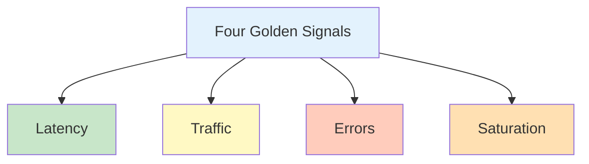
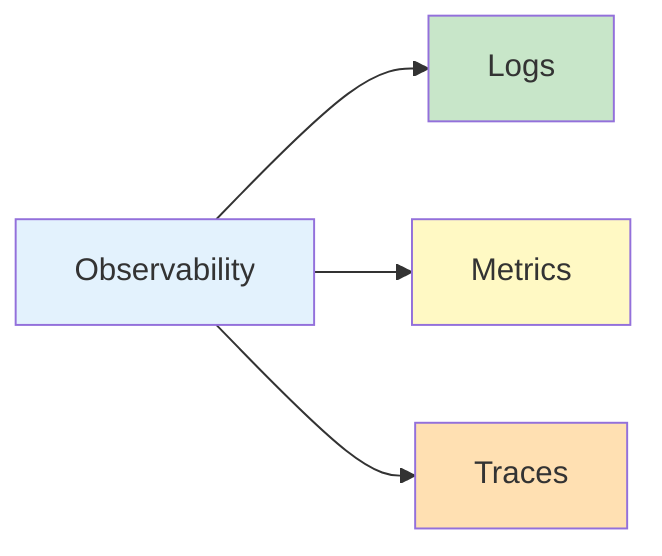

import SectionProgressToggle from "@/components/notes/SectionProgressToggle"
import Callout from "@/components/notes/Callout"
import GlossaryTip from "@/components/notes/GlossaryTip"
import DiagramBlock from "@/components/DiagramBlock"

# Operations

<SectionProgressToggle courseId="software-architecture" levelId="foundations" sectionId="soft-arch-foundations-operations" />

Shipping code is not the finish line. It is the starting line. This section is about keeping systems running reliably in production.

<Callout variant="accreditation" type="info">
**Accreditation Alignment:**
- **iSAQB CPSA-F:** Operations and monitoring practices
- **Google SRE:** Site Reliability Engineering principles
- **ITIL:** Service operations fundamentals
- **ABET:** Software operations and maintenance
</Callout>

---

## Google SRE principles

<GlossaryTip term="Site Reliability Engineering">Site Reliability Engineering applies software engineering principles to operations, focusing on automation and reliability</GlossaryTip> treats operations as a software problem.

### Error budgets

An <GlossaryTip term="error budget">An error budget is the acceptable amount of downtime or errors, calculated from the SLO target</GlossaryTip> balances reliability with innovation.

**Example:** If your SLO is 99.9% uptime (three nines), your error budget is 0.1% downtime per month = 43.8 minutes.

### SLOs (Service Level Objectives)

<GlossaryTip term="SLO">A Service Level Objective is a target level of reliability measured by specific metrics</GlossaryTip> defines what "reliable enough" means.

**Example SLO:**
- 99.9% of API requests return in < 500ms
- 99.95% of requests return successfully (non-5xx)

### Toil reduction

<GlossaryTip term="toil">Toil is manual, repetitive, automatable work that scales linearly with service growth</GlossaryTip> steals time from engineering work.

**Examples of toil:**
- Manually restarting servers
- Copying files between environments
- Running the same SQL query daily

**Solution:** Automate it or eliminate it.

---

## Four golden signals

Google's four metrics that matter most for monitoring:

<DiagramBlock title="Four golden signals" subtitle="What to monitor in production">

</DiagramBlock>

### 1. Latency

How long requests take.

**What to measure:**
- p50, p95, p99 response times
- Distinguish successful vs failed request latency

### 2. Traffic

How much demand your system is handling.

**What to measure:**
- Requests per second
- Active users
- Database queries per second

### 3. Errors

Rate of failed requests.

**What to measure:**
- HTTP 5xx error rate
- HTTP 4xx error rate
- Failed database queries

### 4. Saturation

How full your resources are.

**What to measure:**
- CPU usage
- Memory usage
- Disk I/O
- Network bandwidth

---

## Observability triad

<GlossaryTip term="observability">Observability is the ability to understand internal system state from external outputs</GlossaryTip> requires three pillars:

<DiagramBlock title="Observability triad" subtitle="Logs, metrics, and traces">

</DiagramBlock>

### Logs

Discrete events with timestamps.

### Metrics

Numerical measurements over time.

### Traces

Request paths through distributed systems.

**OpenTelemetry** unifies all three.

---

## Incident response

<GlossaryTip term="incident">An incident is an unplanned interruption or reduction in quality of service</GlossaryTip> will happen. How you respond matters.

### Severity classification

| Level | Impact | Response Time | Example |
|-------|--------|---------------|---------|
| P0 (Critical) | Service down | Immediate | Database outage |
| P1 (High) | Major feature broken | < 1 hour | Payment failing |
| P2 (Medium) | Minor feature broken | < 4 hours | Search slow |
| P3 (Low) | Cosmetic issue | Next business day | Button misaligned |

### Blameless post-mortems

<GlossaryTip term="post-mortem">A post-mortem is a structured review of an incident focusing on what happened, why, and how to prevent recurrence</GlossaryTip> improves systems, not punishes people.

**Structure:**
1. Timeline of events
2. Root cause analysis
3. What went well
4. What went poorly
5. Action items with owners

<Callout variant="concept" type="info">
**Blameless culture:**

Focus on systems and processes, not individuals. "How did our systems allow this to happen?" not "Who broke production?"
</Callout>

### Practice: Incident response planning

**Exercise (25 minutes):**

For a hypothetical database outage:
1. Classify severity (P0-P3)
2. List first three steps in your response
3. Draft a post-mortem outline

**Hint:** Think about detection, communication, mitigation, and recovery.

---

## Summary and next steps

You have learned Google SRE principles (error budgets, SLOs, toil), four golden signals for monitoring, observability triad (logs, metrics, traces), and incident response with blameless post-mortems.

**Next module:** OSI Model and Diagnostics where we cover network fundamentals and troubleshooting tools.

---

**CPD Evidence:**
- Estimated time: 3.2 hours
- Learning objectives achieved:
  1. ✅ Apply Google SRE principles (error budgets, SLOs, toil reduction)
  2. ✅ Monitor four golden signals (latency, traffic, errors, saturation)
  3. ✅ Implement observability with logs, metrics, and traces
  4. ✅ Conduct incident response with blameless post-mortems

**Accreditation mapping:** This module supports iSAQB CPSA-F operations practices, Google SRE principles, ITIL service operations, and ABET software maintenance outcomes.
