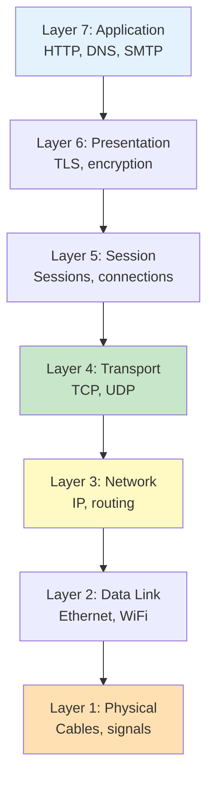

import SectionProgressToggle from "@/components/notes/SectionProgressToggle"
import Callout from "@/components/notes/Callout"
import GlossaryTip from "@/components/notes/GlossaryTip"
import DiagramBlock from "@/components/DiagramBlock"

# OSI Model and Browser/Terminal Diagnostics

<SectionProgressToggle courseId="software-architecture" levelId="foundations" sectionId="soft-arch-foundations-osi-diagnostics" />

When something breaks, you need to know where to look. This section gives you the mental model (OSI) and practical tools (browser and CLI) to diagnose network and application issues.

<Callout variant="accreditation" type="info">
**Accreditation Alignment:**
- **iSAQB CPSA-F:** Technical foundation and diagnostic skills
- **CompTIA Network+:** OSI model and troubleshooting
- **ABET:** Computer networking fundamentals
</Callout>

---

## OSI layers 1-7

The <GlossaryTip term="OSI model">The OSI model is a conceptual framework that divides network communication into seven layers</GlossaryTip> helps you think systematically about where problems occur.

<DiagramBlock title="OSI model layers" subtitle="From physical to application">

</DiagramBlock>

**Troubleshooting tip:** Start at Layer 1 (is it plugged in?) and work up.

**Layer 7 tools:** curl, wget, browser DevTools
**Layer 4 tools:** netstat, ss, tcpdump
**Layer 3 tools:** ping, traceroute, ip
**Layer 1 tools:** cable testers, WiFi analyser

---

## Browser DevTools mastery

Modern browsers have powerful diagnostic tools built in.

### Network tab

See all HTTP requests with timing breakdown.

**What to check:**
- Status codes (200, 404, 500)
- Response times
- Request/response headers
- Waterfall view (what blocks what)

### Security tab

Check TLS certificate details.

**What to check:**
- Certificate validity
- Cipher suite
- Protocol version (TLS 1.2+)

### Application tab

Inspect storage and service workers.

**What to check:**
- Cookies
- LocalStorage
- Service worker status

---

## Command-line diagnostics

### curl with timing

```bash
curl -w "@curl-format.txt" -o /dev/null -s https://example.com
```

**curl-format.txt:**
```
time_namelookup:  %{time_namelookup}s
time_connect:     %{time_connect}s
time_appconnect:  %{time_appconnect}s
time_pretransfer: %{time_pretransfer}s
time_starttransfer: %{time_starttransfer}s
time_total:       %{time_total}s
```

### openssl for TLS

```bash
openssl s_client -connect example.com:443 -servername example.com
```

Shows certificate chain and TLS details.

### traceroute

```bash
traceroute example.com
```

Shows network path to destination.

### dig for DNS

```bash
dig example.com
```

Shows DNS resolution details.

---

## TLS certificate inspection

<GlossaryTip term="TLS certificate">A TLS certificate cryptographically proves a server's identity and enables encrypted connections</GlossaryTip> issues are a common source of production problems.

**Common issues:**
- Expired certificate
- Wrong hostname (name mismatch)
- Untrusted CA
- Weak cipher suite

**Check certificate expiry:**

```bash
echo | openssl s_client -connect example.com:443 2>/dev/null | openssl x509 -noout -dates
```

### Practice: Diagnostic troubleshooting

**Exercise (20 minutes):**

Use browser DevTools to diagnose a slow-loading page:
1. Identify the slowest resource
2. Check if it's DNS, connection, or download time
3. Propose an optimization

**Hint:** Look for large images, slow API calls, or blocking resources.

---

## Summary and next steps

You have learned the OSI model layers, browser DevTools (Network, Security, Application tabs), CLI diagnostics (curl, openssl, traceroute, dig), and TLS certificate inspection.

**Next module:** The "Ilities" Framework where we evaluate systems across multiple quality attributes.

---

**CPD Evidence:**
- Estimated time: 1.8 hours
- Learning objectives achieved:
  1. ✅ Apply OSI model for systematic troubleshooting
  2. ✅ Use browser DevTools for network and security diagnostics
  3. ✅ Use CLI tools (curl, openssl, traceroute, dig)
  4. ✅ Inspect and troubleshoot TLS certificates

**Accreditation mapping:** This module supports iSAQB CPSA-F technical foundations, CompTIA Network+ troubleshooting, and ABET networking fundamentals.
