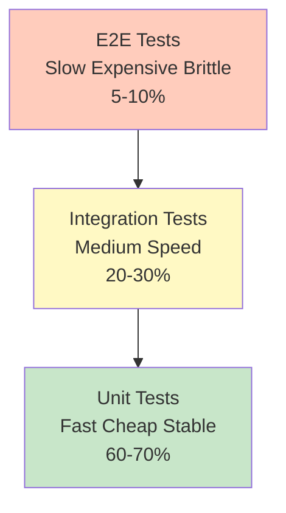

import SectionProgressToggle from "@/components/notes/SectionProgressToggle"
import Callout from "@/components/notes/Callout"
import GlossaryTip from "@/components/notes/GlossaryTip"
import DiagramBlock from "@/components/DiagramBlock"

# Verification and Testing

<SectionProgressToggle courseId="software-architecture" levelId="foundations" sectionId="soft-arch-foundations-verification-testing" />

Here's the thing: code that works in development but fails in production is worse than code that never worked at all. At least with obviously broken code, you know not to ship it. This section is about building confidence that your system will behave correctly when it matters.

<Callout variant="accreditation" type="info">
**Accreditation Alignment:**
- **iSAQB CPSA-F:** Quality assurance and testing strategies
- **OWASP ASVS:** Application Security Verification Standard
- **WCAG 2.2:** Web Content Accessibility Guidelines
- **ABET:** Software testing and quality assurance fundamentals
</Callout>

---

## Test strategy pyramid

The <GlossaryTip term="test pyramid">The test pyramid is a testing strategy with many fast unit tests at the base, fewer integration tests in the middle, and even fewer slow end-to-end tests at the top</GlossaryTip> tells you how to balance different types of tests. Get it wrong, and you will either have slow flaky tests that nobody runs or fast tests that miss real bugs.

<DiagramBlock title="Test pyramid" subtitle="More tests at the bottom, fewer at the top">

</DiagramBlock>

### Unit tests

<GlossaryTip term="unit test">A unit test validates a single function or class in isolation, with dependencies mocked or stubbed</GlossaryTip> are fast, deterministic, and cheap to write. They are your first line of defence.

**Characteristics:**
- Test one thing at a time
- No network calls, no database, no file system
- Run in milliseconds
- Easy to debug when they fail

**Example: Testing a password validator**

```javascript
// passwordValidator.js
export function validatePassword(password) {
  if (!password || password.length < 12) {
    return { valid: false, reason: 'Password must be at least 12 characters' };
  }
  if (!/[A-Z]/.test(password)) {
    return { valid: false, reason: 'Password must contain uppercase letter' };
  }
  if (!/[a-z]/.test(password)) {
    return { valid: false, reason: 'Password must contain lowercase letter' };
  }
  if (!/[0-9]/.test(password)) {
    return { valid: false, reason: 'Password must contain number' };
  }
  return { valid: true };
}

// passwordValidator.test.js
describe('validatePassword', () => {
  test('rejects passwords shorter than 12 characters', () => {
    expect(validatePassword('Short1!').valid).toBe(false);
  });

  test('accepts valid password', () => {
    expect(validatePassword('ValidPass123!').valid).toBe(true);
  });
});
```

### Integration tests

<GlossaryTip term="integration test">An integration test validates that multiple components work together correctly, including external dependencies like databases or APIs</GlossaryTip> check the seams between your code and the real world.

### Practice: Design a test strategy

**Exercise (25 minutes):**

For a simple e-commerce checkout flow, list 3 unit tests, 2 integration tests, and 1 E2E test you would write.

**Hint:** Think about what could go wrong at each step.

---

## OWASP ASVS integration

The <GlossaryTip term="OWASP ASVS">OWASP Application Security Verification Standard is a framework for testing web application security across three verification levels</GlossaryTip> gives you a checklist of security controls to verify.

<Callout variant="standard" type="info">
**ASVS in practice:**

Start with Level 1 requirements. Get those right before moving to Level 2. Most applications should target Level 2 for production.
</Callout>

---

## Accessibility testing

<GlossaryTip term="accessibility testing">Accessibility testing ensures digital products are usable by people with disabilities, including those using assistive technologies</GlossaryTip> is not optional. In many jurisdictions, it is the law.

### WCAG 2.2 levels

**Level AA:** Standard target for most organisations and legal requirements.

### Practice: Accessibility audit

**Exercise (30 minutes):**

Audit a page with keyboard navigation, colour contrast checking, and screen reader testing. List three violations and how to fix them.

---

## Performance testing

<GlossaryTip term="performance testing">Performance testing measures how a system behaves under load, identifying bottlenecks and ensuring acceptable response times</GlossaryTip> prevents surprises when you go viral.

---

## Summary and next steps

You have learned how to apply the test pyramid strategy, integrate OWASP ASVS security verification, test accessibility with WCAG 2.2 standards, and perform load testing.

**Next module:** Deployment and CI/CD where we will automate testing and security checks in continuous integration pipelines.

---

**CPD Evidence:**
- Estimated time: 3.5 hours
- Learning objectives achieved:
  1. ✅ Design test strategies using the test pyramid
  2. ✅ Apply OWASP ASVS security verification requirements
  3. ✅ Test accessibility with WCAG 2.2 standards
  4. ✅ Perform load testing and identify performance bottlenecks

**Accreditation mapping:** This module directly supports iSAQB CPSA-F quality assurance criteria, OWASP ASVS Level 2 requirements, WCAG 2.2 AA compliance standards, and ABET software testing outcomes.
