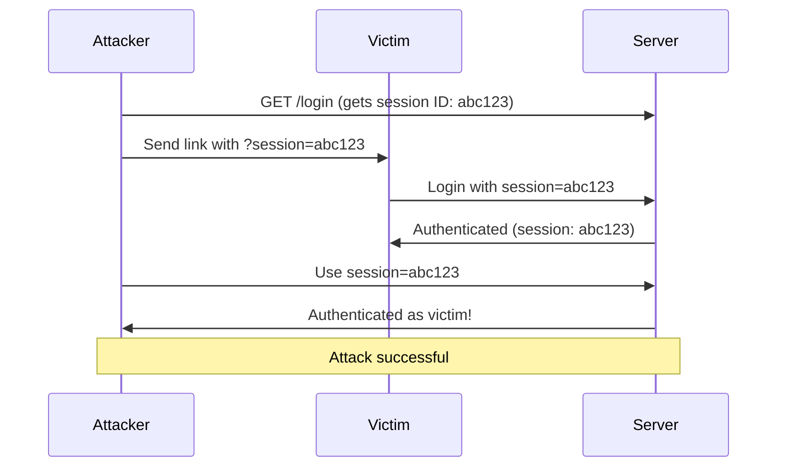
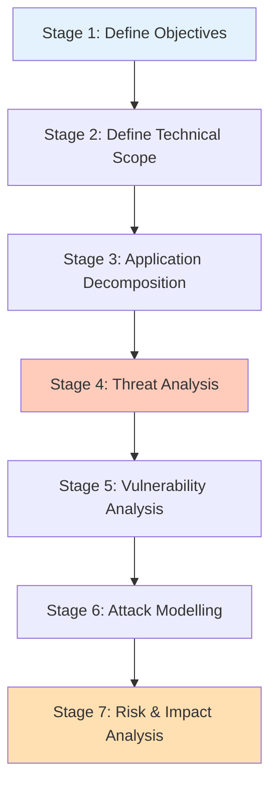
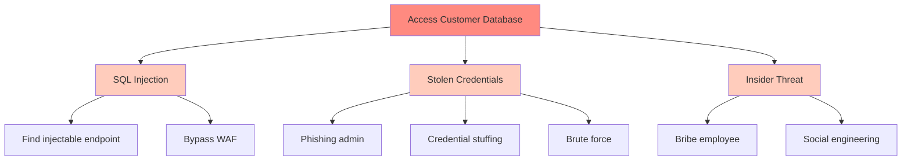
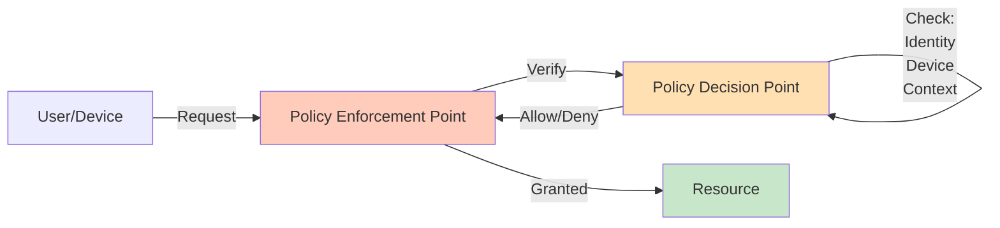
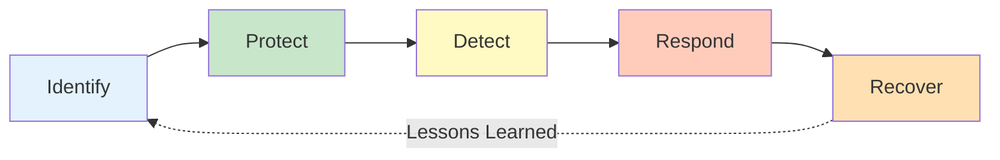

import SectionProgressToggle from "@/components/notes/SectionProgressToggle"
import Callout from "@/components/notes/Callout"
import GlossaryTip from "@/components/notes/GlossaryTip"
import DiagramBlock from "@/components/DiagramBlock"

# Advanced Security Architecture

<SectionProgressToggle courseId="software-architecture" levelId="intermediate" sectionId="soft-arch-intermediate-advanced-security" />

Here's the thing about security: basic protections catch amateur attackers. Advanced security architecture is about defending against professionals who study your system for weaknesses. This module takes you beyond the fundamentals.

<Callout variant="accreditation" type="info">
**Accreditation Alignment:**
- **iSAQB CPSA-A:** Advanced security architecture patterns
- **NIST Cybersecurity Framework:** Comprehensive security practices
- **ISO 27001:** Information security management
- **CISSP:** Security architecture domain knowledge
</Callout>

---

## STRIDE deep dive with case studies

You learned STRIDE basics in the Foundation tier. Now we go deeper with real-world attack scenarios and comprehensive mitigation strategies.

### Spoofing: Real-world case study

**Attack scenario:** Session fixation attack on banking application

<GlossaryTip term="session fixation">Session fixation is an attack where an attacker tricks a user into using a session ID the attacker already knows</GlossaryTip> bypasses authentication.

**How it works:**
1. Attacker gets a valid session ID from the site
2. Attacker tricks victim into using that session ID (via link or XSS)
3. Victim authenticates with that session ID
4. Attacker now has an authenticated session

<DiagramBlock title="Session fixation attack" subtitle="Stealing authentication through session control">

</DiagramBlock>

**Mitigation strategies:**
1. **Regenerate session ID after authentication**
2. **Reject session IDs from query parameters**
3. **Use HTTP-only cookies with SameSite flag**
4. **Implement idle timeout**
5. **Track session metadata (IP, user agent) and alert on changes**

**Code example:**

```javascript
// Bad: Accepts session ID from URL
app.get('/login', (req, res) => {
  const sessionId = req.query.session || generateSession();
  req.session.id = sessionId;
});

// Good: Always regenerates session after login
app.post('/login', async (req, res) => {
  const user = await authenticate(req.body);
  if (user) {
    // Regenerate session ID
    req.session.regenerate((err) => {
      req.session.userId = user.id;
      req.session.createdAt = Date.now();
      req.session.ipAddress = req.ip;
      res.json({ success: true });
    });
  }
});
```

### Tampering: Data integrity attacks

**Attack scenario:** Price manipulation in e-commerce checkout

Attacker modifies the price in the request before it reaches the server.

**Mitigation with cryptographic signatures:**

```javascript
const crypto = require('crypto');

// Server-side: Generate signed price token
function generatePriceToken(productId, price, secret) {
  const data = `${productId}:${price}`;
  const signature = crypto
    .createHmac('sha256', secret)
    .update(data)
    .digest('hex');
  return `${data}:${signature}`;
}

// Server-side: Verify price token
function verifyPriceToken(token, secret) {
  const [productId, price, signature] = token.split(':');
  const expectedSignature = crypto
    .createHmac('sha256', secret)
    .update(`${productId}:${price}`)
    .digest('hex');
  
  if (signature !== expectedSignature) {
    throw new Error('Price tampering detected');
  }
  return { productId, price: parseFloat(price) };
}

// In checkout
app.post('/checkout', (req, res) => {
  try {
    const { productId, price, token } = req.body;
    verifyPriceToken(token, process.env.PRICE_SECRET);
    // Proceed with checkout
  } catch (err) {
    res.status(400).json({ error: 'Invalid price data' });
  }
});
```

---

## PASTA methodology

<GlossaryTip term="PASTA">Process for Attack Simulation and Threat Analysis is a seven-stage threat modelling methodology</GlossaryTip> provides a systematic approach to threat analysis.

### The 7 stages of PASTA

<DiagramBlock title="PASTA stages" subtitle="Seven-stage threat analysis process">

</DiagramBlock>

**Stage 1: Define objectives**
- Business impact analysis
- Compliance requirements
- Security and privacy requirements

**Stage 2: Define technical scope**
- Network diagrams
- Software inventory
- Technology stack

**Stage 3: Application decomposition**
- Data flow diagrams
- Trust boundaries
- Entry and exit points

**Stage 4: Threat analysis**
- Threat intelligence gathering
- Industry-specific threats
- Historical attack patterns

**Stage 5: Vulnerability analysis**
- Code analysis (SAST)
- Dependency scanning
- Configuration review

**Stage 6: Attack modelling**
- Attack trees (covered next section)
- Attack simulation
- Probability scoring

**Stage 7: Risk and impact analysis**
- Risk matrix (likelihood × impact)
- Prioritised mitigation plans
- Residual risk assessment

---

## Attack trees with probability scoring

<GlossaryTip term="attack tree">An attack tree is a hierarchical diagram showing ways to achieve an attack goal, with sub-goals and required conditions</GlossaryTip> helps visualise and prioritise threats.

### Building an attack tree

**Goal:** Unauthorised access to customer database

<DiagramBlock title="Attack tree example" subtitle="Multiple paths to compromise database">

</DiagramBlock>

### Probability scoring

Assign probability to each attack path:

| Attack Path | Probability | Impact | Risk Score |
|-------------|-------------|---------|------------|
| SQL Injection | 0.3 (Low) | Critical | Medium |
| Phishing Admin | 0.6 (Medium) | Critical | High |
| Credential Stuffing | 0.7 (High) | Critical | Critical |
| Insider Threat | 0.1 (Very Low) | Critical | Low |

**Formula:** Risk Score = Probability × Impact

**Prioritisation:** Focus on High and Critical risk scores first.

---

## Zero trust architecture

<GlossaryTip term="zero trust">Zero trust is a security model that assumes no implicit trust, requiring verification for every access request</GlossaryTip> treats every request as potentially hostile.

### Core principles

1. **Verify explicitly:** Always authenticate and authorise
2. **Least privilege access:** Minimum permissions needed
3. **Assume breach:** Minimise blast radius

<DiagramBlock title="Zero trust architecture" subtitle="Never trust, always verify">

</DiagramBlock>

### Implementation pattern

```javascript
// Policy Decision Point
async function evaluateAccess(request) {
  const checks = await Promise.all([
    verifyIdentity(request.token),
    verifyDevice(request.deviceId),
    verifyContext(request.ipAddress, request.time),
    checkPermissions(request.userId, request.resource),
  ]);
  
  return checks.every(check => check.passed);
}

// Policy Enforcement Point
app.use(async (req, res, next) => {
  const accessRequest = {
    token: req.headers.authorization,
    deviceId: req.headers['x-device-id'],
    ipAddress: req.ip,
    time: Date.now(),
    userId: req.user?.id,
    resource: req.path,
  };
  
  const allowed = await evaluateAccess(accessRequest);
  
  if (!allowed) {
    return res.status(403).json({ error: 'Access denied' });
  }
  
  next();
});
```

---

## NIST Cybersecurity Framework integration

The <GlossaryTip term="NIST CSF">NIST Cybersecurity Framework provides standards, guidelines, and practices for managing cybersecurity risk</GlossaryTip> organises security into five functions.

### The five functions

1. **Identify:** Asset management, risk assessment
2. **Protect:** Access control, data security, protective technology
3. **Detect:** Anomaly detection, continuous monitoring
4. **Respond:** Incident response planning, communication
5. **Recover:** Recovery planning, improvements

<DiagramBlock title="NIST CSF lifecycle" subtitle="Continuous security improvement">

</DiagramBlock>

### Practice: Advanced threat modelling

**Exercise (35 minutes):**

For a payment processing system:
1. Create an attack tree with at least 3 attack paths
2. Assign probability scores to each path
3. Apply PASTA Stage 6 (attack modelling)
4. Recommend top 3 mitigations based on risk scores

**Hint:** Consider SQL injection, credential theft, man-in-the-middle, and insider threats. Focus on realistic probabilities.

---

## Summary and next steps

You have learned advanced security architecture including STRIDE deep dives with real case studies, PASTA methodology for systematic threat analysis, attack trees with probability scoring, zero trust architecture principles, and NIST Cybersecurity Framework integration.

**Next module:** Cloud-Native Patterns where we cover multi-region architectures, disaster recovery, CAP theorem, and service mesh patterns.

---

**CPD Evidence:**
- Estimated time: 4.5 hours
- Learning objectives achieved:
  1. ✅ Apply STRIDE with real-world attack scenarios and mitigations
  2. ✅ Use PASTA methodology for systematic threat analysis
  3. ✅ Create attack trees with probability scoring
  4. ✅ Design zero trust architectures
  5. ✅ Integrate NIST Cybersecurity Framework

**Accreditation mapping:** This module supports iSAQB CPSA-A advanced security patterns, NIST CSF comprehensive practices, ISO 27001 information security management, and CISSP security architecture domain.
