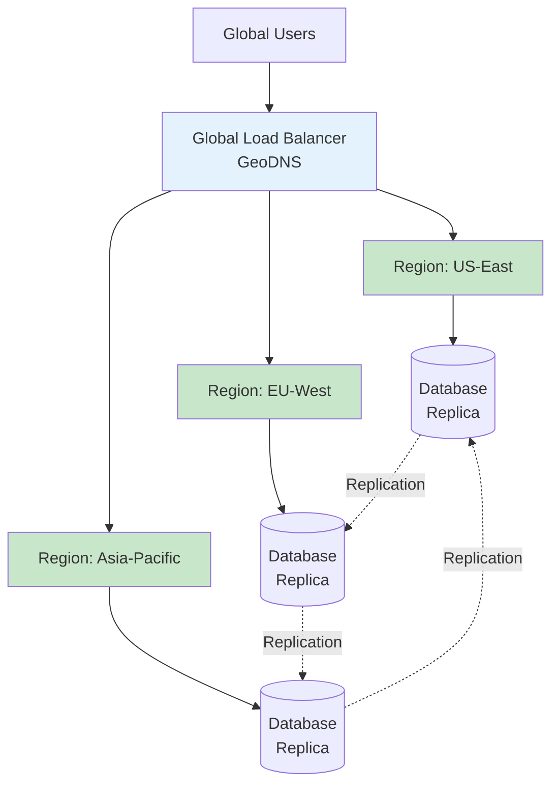
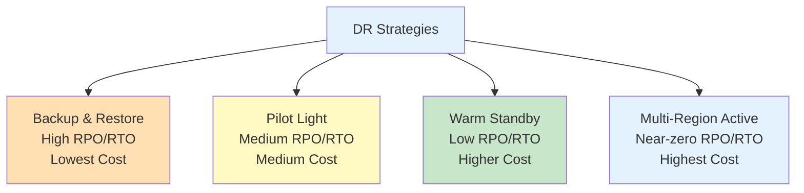
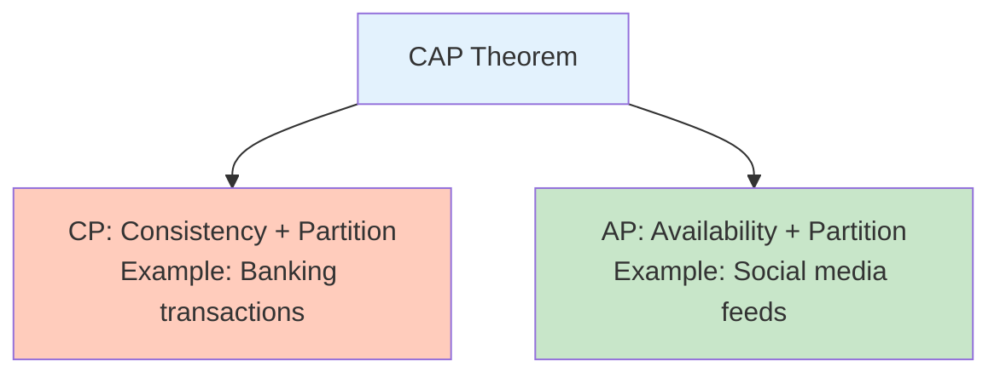
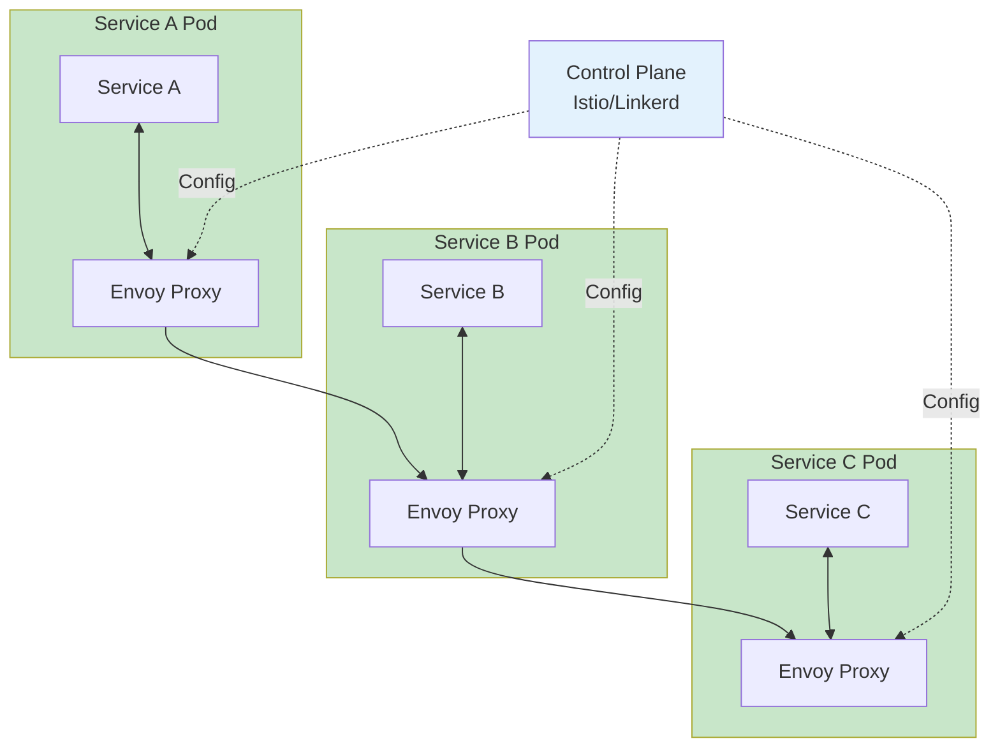
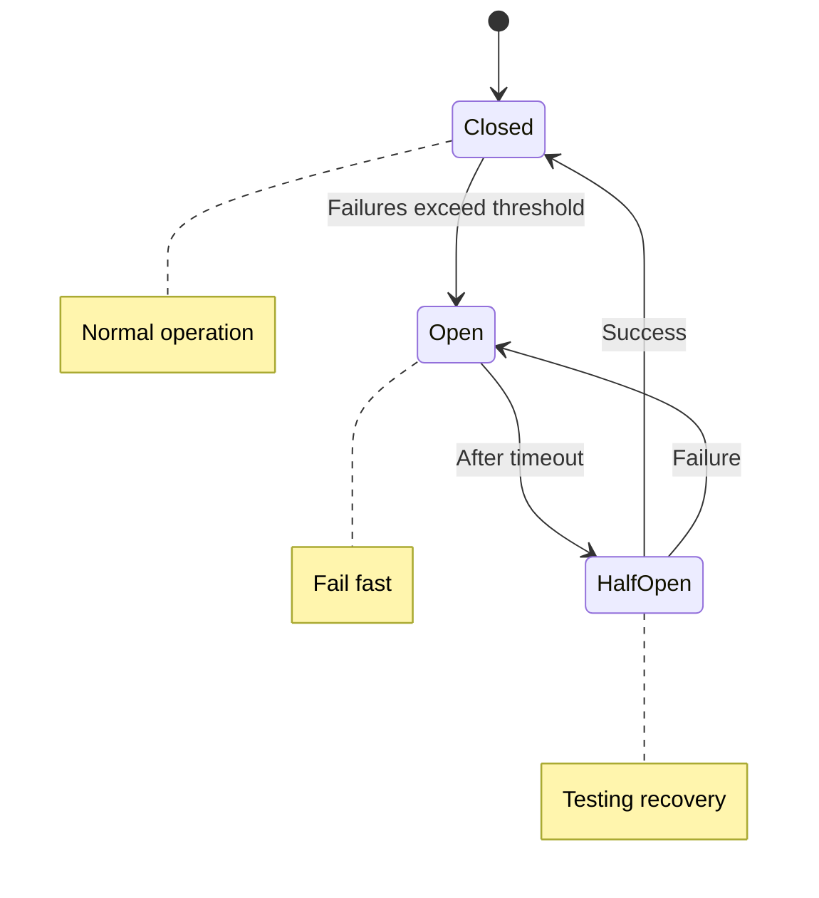

import SectionProgressToggle from "@/components/notes/SectionProgressToggle"
import Callout from "@/components/notes/Callout"
import GlossaryTip from "@/components/notes/GlossaryTip"
import DiagramBlock from "@/components/DiagramBlock"

# Cloud-Native Patterns

<SectionProgressToggle courseId="software-architecture" levelId="intermediate" sectionId="soft-arch-intermediate-cloud-native-patterns" />

Cloud-native is not just running on AWS. It is designing systems that embrace distributed computing, expect failure, and scale elastically. This module covers patterns that define modern cloud architecture.

<Callout variant="accreditation" type="info">
**Accreditation Alignment:**
- **iSAQB CPSA-A:** Distributed systems architecture
- **Cloud Native Computing Foundation:** CNCF patterns and practices
- **AWS Well-Architected Framework:** Reliability pillar
- **TOGAF:** Technology architecture principles
</Callout>

---

## Multi-region active-active architectures

<GlossaryTip term="active-active">Active-active is a configuration where multiple systems process requests simultaneously across different regions</GlossaryTip> provides both high availability and performance.

### Why multi-region matters

**Single region risks:**
- Regional outage takes you down completely
- High latency for distant users
- No disaster recovery without complex failover

**Multi-region benefits:**
- Survive complete regional failures
- Route users to nearest region (low latency)
- Distribute load globally

<DiagramBlock title="Multi-region active-active" subtitle="Traffic distributed across regions">

</DiagramBlock>

### Data replication strategies

**Synchronous replication:**
- Write to all regions before confirming
- Strong consistency
- High latency (wait for all regions)

**Asynchronous replication:**
- Write to local region, replicate later
- Low latency
- Eventual consistency

**Conflict resolution:**
- Last-write-wins (timestamp-based)
- Application-specific merge logic
- CRDTs (Conflict-free Replicated Data Types)

---

## Disaster recovery strategies

<GlossaryTip term="disaster recovery">Disaster recovery is the process of restoring systems and data after a catastrophic failure</GlossaryTip> requires planning for the worst.

### RPO and RTO targets

**RPO (Recovery Point Objective):** How much data can you afford to lose?
- RPO = 0: Zero data loss (synchronous replication)
- RPO = 1 hour: Can lose up to 1 hour of data

**RTO (Recovery Time Objective):** How quickly must you recover?
- RTO = 0: Instant failover (active-active)
- RTO = 4 hours: Can be down for up to 4 hours

<DiagramBlock title="DR strategies by RPO/RTO" subtitle="Cost increases with stricter requirements">

</DiagramBlock>

### DR testing

<GlossaryTip term="disaster recovery testing">DR testing validates that recovery procedures work by simulating failures</GlossaryTip> is essential but often neglected.

**Testing approaches:**
1. **Tabletop exercise:** Walk through procedures on paper
2. **Simulated failover:** Test in non-production environment
3. **Chaos engineering:** Inject failures in production (carefully)
4. **Game day:** Full-scale DR drill with all teams

---

## CAP theorem and eventual consistency

The <GlossaryTip term="CAP theorem">CAP theorem states that distributed systems can only guarantee two of three properties: Consistency, Availability, and Partition tolerance</GlossaryTip> forces architectural trade-offs.

### The three properties

**Consistency (C):** All nodes see the same data at the same time

**Availability (A):** Every request receives a response (success or failure)

**Partition Tolerance (P):** System continues despite network splits

<Callout variant="concept" type="info">
**CAP reality:**

In practice, you must tolerate partitions (P is non-negotiable in distributed systems). So you choose between Consistency (CP) or Availability (AP).
</Callout>

<DiagramBlock title="CAP theorem trade-offs" subtitle="Choose two of three">

</DiagramBlock>

### Eventual consistency patterns

<GlossaryTip term="eventual consistency">Eventual consistency guarantees that all replicas will converge to the same value given enough time</GlossaryTip> enables high availability.

**Conflict resolution strategies:**

1. **Last Write Wins (LWW):**
```javascript
function resolveConflict(valueA, valueB) {
  return valueA.timestamp > valueB.timestamp ? valueA : valueB;
}
```

2. **Version Vectors:**
Track causality to detect concurrent writes

3. **CRDTs (Conflict-free Replicated Data Types):**
Data structures that automatically merge without conflicts

---

## Service mesh patterns

A <GlossaryTip term="service mesh">A service mesh is a dedicated infrastructure layer for managing service-to-service communication</GlossaryTip> handles cross-cutting concerns like observability, security, and reliability.

### Service mesh architecture

<DiagramBlock title="Service mesh with sidecars" subtitle="Proxy in every pod">

</DiagramBlock>

### Service mesh capabilities

**Traffic management:**
- Load balancing
- Circuit breaking
- Retries and timeouts
- Traffic splitting (canary deployments)

**Security:**
- Mutual TLS (mTLS) encryption
- Service-to-service authentication
- Authorization policies

**Observability:**
- Distributed tracing
- Metrics collection
- Access logging

---

## Case study: Netflix resilience

Netflix pioneered many cloud-native patterns. Their approach to resilience offers valuable lessons.

### Chaos Monkey

<GlossaryTip term="Chaos Monkey">Chaos Monkey randomly terminates instances in production to test resilience</GlossaryTip> forces systems to be fault-tolerant.

**Philosophy:** If you cannot survive random failures in testing, you will not survive them in production.

**Implementation levels:**
1. **Chaos Monkey:** Terminates random instances
2. **Chaos Kong:** Takes down entire AWS regions
3. **Chaos Gorilla:** Simulates complete zone failures

### Hystrix circuit breaker

Prevents cascading failures by detecting and stopping calls to failing services.

**Circuit breaker states:**

<DiagramBlock title="Circuit breaker states" subtitle="Preventing cascade failures">

</DiagramBlock>

**Example implementation:**

```javascript
class CircuitBreaker {
  constructor(failureThreshold = 5, timeout = 60000) {
    this.state = 'CLOSED';
    this.failureCount = 0;
    this.failureThreshold = failureThreshold;
    this.timeout = timeout;
    this.nextAttempt = Date.now();
  }
  
  async call(fn) {
    if (this.state === 'OPEN') {
      if (Date.now() < this.nextAttempt) {
        throw new Error('Circuit breaker is OPEN');
      }
      this.state = 'HALF_OPEN';
    }
    
    try {
      const result = await fn();
      this.onSuccess();
      return result;
    } catch (error) {
      this.onFailure();
      throw error;
    }
  }
  
  onSuccess() {
    this.failureCount = 0;
    this.state = 'CLOSED';
  }
  
  onFailure() {
    this.failureCount++;
    if (this.failureCount >= this.failureThreshold) {
      this.state = 'OPEN';
      this.nextAttempt = Date.now() + this.timeout;
    }
  }
}

// Usage
const breaker = new CircuitBreaker();
const result = await breaker.call(() => callExternalAPI());
```

### Practice: Design a resilient architecture

**Exercise (30 minutes):**

Design a multi-region active-active architecture for a video streaming service:
1. Specify RPO and RTO requirements
2. Choose CP or AP (and justify)
3. Identify 3 failure scenarios and mitigations
4. Propose a DR testing schedule

**Hint:** Consider regional failures, database replication lag, and CDN failures. Video streaming needs high availability but can tolerate some eventual consistency.

---

## Summary and next steps

You have learned cloud-native patterns including multi-region active-active architectures, disaster recovery with RPO/RTO targets, CAP theorem trade-offs and eventual consistency, service mesh patterns, and resilience engineering lessons from Netflix.

**Next module:** Performance & Scalability Engineering where we cover CPU profiling, query optimization, caching strategies, and load balancing.

---

**CPD Evidence:**
- Estimated time: 5.0 hours
- Learning objectives achieved:
  1. ✅ Design multi-region active-active architectures
  2. ✅ Plan disaster recovery with RPO/RTO targets
  3. ✅ Apply CAP theorem to architecture decisions
  4. ✅ Implement service mesh patterns
  5. ✅ Apply resilience engineering principles from Netflix

**Accreditation mapping:** This module supports iSAQB CPSA-A distributed systems architecture, CNCF cloud-native patterns, AWS Well-Architected reliability pillar, and TOGAF technology architecture principles.
