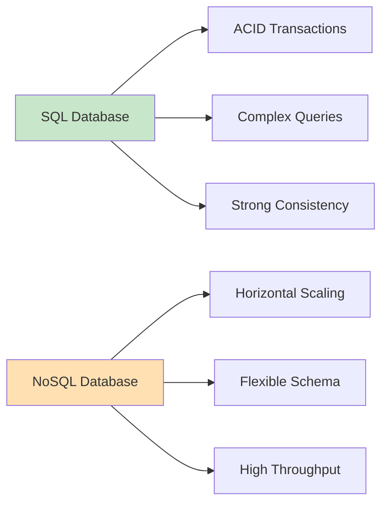
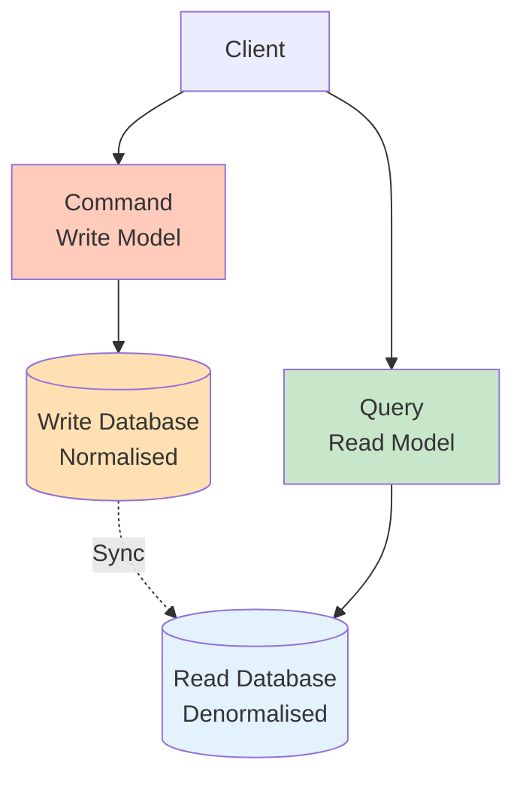
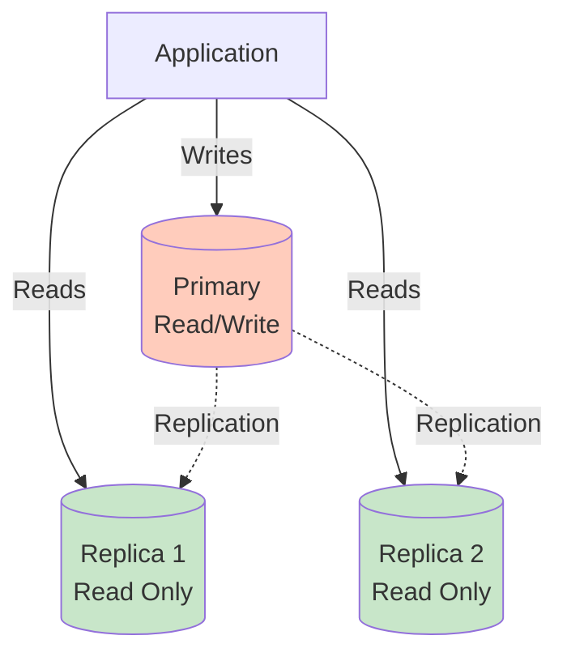

import SectionProgressToggle from "@/components/notes/SectionProgressToggle"
import Callout from "@/components/notes/Callout"
import GlossaryTip from "@/components/notes/GlossaryTip"
import DiagramBlock from "@/components/DiagramBlock"

# Data Architecture

<SectionProgressToggle courseId="software-architecture" levelId="intermediate" sectionId="soft-arch-intermediate-data-architecture" />

Data outlives code. Your database choices today constrain your architecture for years. This module covers patterns for designing data systems that scale, remain consistent, and adapt to changing requirements.

<Callout variant="accreditation" type="info">
**Accreditation Alignment:**
- **iSAQB CPSA-A:** Data architecture patterns
- **DAMA-DMBOK:** Data management body of knowledge
- **AWS Well-Architected:** Data architecture best practices
- **TOGAF:** Data architecture domain
</Callout>

---

## SQL vs NoSQL trade-offs

The choice between <GlossaryTip term="SQL database">A relational database using structured query language with ACID guarantees</GlossaryTip> and <GlossaryTip term="NoSQL database">A non-relational database optimised for specific data models like document, key-value, graph, or columnar</GlossaryTip> depends on your specific requirements.

### When to use SQL

**Strengths:**
- ACID transactions
- Complex queries with JOINs
- Strong consistency
- Mature tooling and expertise

**Use cases:**
- Financial transactions
- E-commerce orders
- User authentication
- Any data requiring strict consistency

**Example: PostgreSQL for orders**

```sql
BEGIN TRANSACTION;

-- Deduct from inventory
UPDATE inventory 
SET quantity = quantity - 1 
WHERE product_id = 123 AND quantity > 0;

-- Create order
INSERT INTO orders (user_id, product_id, amount)
VALUES (456, 123, 99.99);

COMMIT;
```

### When to use NoSQL

**Strengths:**
- Horizontal scalability
- Flexible schema
- High throughput
- Optimised for specific access patterns

**Types and use cases:**

| Type | Example | Best For |
|------|---------|----------|
| Document | MongoDB | JSON documents, flexible schema |
| Key-Value | Redis, DynamoDB | Caching, sessions |
| Wide-Column | Cassandra | Time-series, analytics |
| Graph | Neo4j | Social networks, recommendations |

<DiagramBlock title="SQL vs NoSQL trade-offs" subtitle="Choose based on requirements">

</DiagramBlock>

---

## CQRS pattern

<GlossaryTip term="CQRS">Command Query Responsibility Segregation separates read and write operations into different models</GlossaryTip> optimises each for its specific use case.

### CQRS architecture

<DiagramBlock title="CQRS pattern" subtitle="Separate read and write models">

</DiagramBlock>

### Implementation example

```javascript
// Command side: Write model
class CreateOrderCommand {
  async execute(orderData) {
    // Validate business rules
    if (orderData.amount < 0) {
      throw new Error('Invalid amount');
    }
    
    // Write to transactional database
    const order = await writeDB.orders.create(orderData);
    
    // Publish event for read model update
    await eventBus.publish('OrderCreated', order);
    
    return order.id;
  }
}

// Query side: Read model
class GetOrderQuery {
  async execute(orderId) {
    // Read from optimised read database
    // Might be denormalised with joins pre-computed
    return await readDB.orderViews.findOne({ id: orderId });
  }
}

// Event handler: Keep read model in sync
eventBus.on('OrderCreated', async (order) => {
  // Update read model with denormalised data
  await readDB.orderViews.create({
    id: order.id,
    customerName: order.customer.name,
    items: order.items.map(i => i.name),
    total: order.amount,
  });
});
```

### When to use CQRS

**Good fit:**
- Read/write ratio heavily skewed
- Complex read queries
- Different scalability needs for reads and writes
- Multiple read models from same data

**Not needed:**
- Simple CRUD applications
- Roughly equal read/write traffic
- Small scale systems

---

## Event sourcing

<GlossaryTip term="event sourcing">Event sourcing stores all changes as a sequence of events rather than current state</GlossaryTip> provides complete audit trail and time travel.

### Event sourcing concepts

Instead of storing current state, store all events that led to that state.

**Traditional approach:**
```javascript
// Store current state
users.update({ id: 123 }, { email: 'new@example.com' });
// Lost: What was the old email? When did it change?
```

**Event sourcing approach:**
```javascript
// Store event
events.append({
  type: 'EmailChanged',
  userId: 123,
  oldEmail: 'old@example.com',
  newEmail: 'new@example.com',
  timestamp: '2026-01-01T20:00:00Z',
  reason: 'User request',
});

// Rebuild current state from events
function getCurrentState(userId) {
  const events = events.getForUser(userId);
  let state = {};
  for (const event of events) {
    state = applyEvent(state, event);
  }
  return state;
}
```

### Benefits and challenges

**Benefits:**
- Complete audit trail
- Time travel (rebuild state at any point)
- Event replay for debugging
- Multiple projections from same events

**Challenges:**
- More complex than CRUD
- Event schema evolution
- Storage grows indefinitely
- Eventually consistent reads

---

## Database scaling strategies

### Replication

<GlossaryTip term="database replication">Database replication copies data to multiple database servers for redundancy and read scalability</GlossaryTip> improves availability and performance.

<DiagramBlock title="Primary-replica replication" subtitle="One writer, multiple readers">

</DiagramBlock>

**Replication lag:** Time for changes to propagate to replicas.

### Sharding

<GlossaryTip term="database sharding">Sharding partitions data across multiple databases, with each database containing a subset of data</GlossaryTip> enables horizontal scaling for writes.

**Sharding strategies:**

1. **Range-based:** Partition by ID ranges
2. **Hash-based:** Partition by hash of key
3. **Geographic:** Partition by user location
4. **Entity-based:** Partition by tenant/customer

**Example: Hash-based sharding**

```javascript
function getShardForUser(userId) {
  const numShards = 4;
  const hash = hashCode(userId);
  return hash % numShards;
}

async function getUser(userId) {
  const shard = getShardForUser(userId);
  const db = databases[shard];
  return await db.query('SELECT * FROM users WHERE id = ?', [userId]);
}
```

**Challenges:**
- Cross-shard queries are expensive
- Rebalancing shards is complex
- Transactions across shards difficult

---

## Data governance and retention

<GlossaryTip term="data governance">Data governance defines policies for data quality, security, privacy, and lifecycle management</GlossaryTip> ensures compliance and trustworthiness.

### Data retention policies

**Example retention policy:**

| Data Type | Retention Period | Rationale |
|-----------|------------------|-----------|
| Order history | 7 years | Tax compliance |
| User activity logs | 90 days | Analytics, debugging |
| Audit logs | 2 years | Security compliance |
| Personal data | Until deletion request | GDPR Article 17 |

### Data anonymisation

**Techniques:**
1. **Pseudonymisation:** Replace identifiers with pseudonyms
2. **Aggregation:** Group data to remove individual identification
3. **Data masking:** Partial redaction (e.g., `***-**-1234`)

```javascript
function anonymiseUser(user) {
  return {
    userId: hashUserId(user.id), // Pseudonymised
    age: Math.floor(user.age / 10) * 10, // Aggregated to decade
    email: maskEmail(user.email), // Masked
  };
}

function maskEmail(email) {
  const [local, domain] = email.split('@');
  return `${local[0]}***@${domain}`;
}
```

### Practice: Data architecture design

**Exercise (30 minutes):**

Design data architecture for a social media platform:
1. Choose SQL, NoSQL, or both (justify)
2. Decide if CQRS is appropriate
3. Design a sharding strategy for user data
4. Define retention policies for posts, messages, and analytics

**Hint:** Consider read/write patterns, consistency requirements, and scale. Social graphs often benefit from graph databases.

---

## Summary and next steps

You have learned data architecture including SQL vs NoSQL trade-offs, CQRS pattern for separating reads and writes, event sourcing for complete audit trails, database scaling with replication and sharding, and data governance with retention policies.

**Next module:** Service Design & Decomposition where we cover Domain-Driven Design, microservices evaluation, and API gateway patterns.

---

**CPD Evidence:**
- Estimated time: 4.5 hours
- Learning objectives achieved:
  1. ✅ Choose between SQL and NoSQL based on requirements
  2. ✅ Apply CQRS pattern for optimised read/write models
  3. ✅ Understand event sourcing trade-offs
  4. ✅ Design database scaling with replication and sharding
  5. ✅ Implement data governance and retention policies

**Accreditation mapping:** This module supports iSAQB CPSA-A data architecture, DAMA-DMBOK data management principles, AWS data architecture best practices, and TOGAF data architecture domain.
