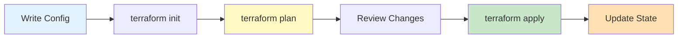
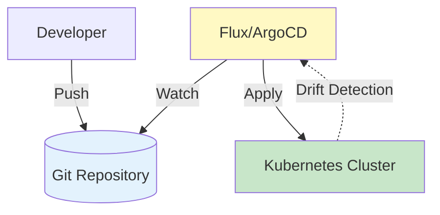

import SectionProgressToggle from "@/components/notes/SectionProgressToggle"
import Callout from "@/components/notes/Callout"
import GlossaryTip from "@/components/notes/GlossaryTip"
import DiagramBlock from "@/components/DiagramBlock"

# Infrastructure as Code

<SectionProgressToggle courseId="software-architecture" levelId="intermediate" sectionId="soft-arch-intermediate-infrastructure-as-code" />

Clicking through a cloud console to provision infrastructure does not scale. Infrastructure as Code treats infrastructure like software with version control, code review, and automated testing. This module covers modern IaC practices and tools.

<Callout variant="accreditation" type="info">
**Accreditation Alignment:**
- **iSAQB CPSA-A:** Infrastructure architecture patterns
- **Cloud Native Computing Foundation:** IaC best practices
- **AWS Well-Architected:** Infrastructure management
- **DevOps practices:** Infrastructure automation
</Callout>

---

## Terraform deep dive

<GlossaryTip term="Terraform">Terraform is an open-source Infrastructure as Code tool using declarative configuration files</GlossaryTip> supports multiple cloud providers.

### Terraform core concepts

**Resources:** Infrastructure objects (VMs, networks, databases)
**Providers:** Plugins for different platforms (AWS, Azure, GCP)
**State:** Current infrastructure state tracking
**Modules:** Reusable infrastructure components

### Example: Complete AWS infrastructure

```hcl
# Provider configuration
terraform {
  required_providers {
    aws = {
      source  = "hashicorp/aws"
      version = "~> 5.0"
    }
  }
  
  backend "s3" {
    bucket = "my-terraform-state"
    key    = "prod/terraform.tfstate"
    region = "us-east-1"
  }
}

provider "aws" {
  region = var.aws_region
}

# VPC
resource "aws_vpc" "main" {
  cidr_block           = "10.0.0.0/16"
  enable_dns_hostnames = true
  
  tags = {
    Name        = "main-vpc"
    Environment = var.environment
  }
}

# Subnet
resource "aws_subnet" "public" {
  vpc_id            = aws_vpc.main.id
  cidr_block        = "10.0.1.0/24"
  availability_zone = "${var.aws_region}a"
  
  map_public_ip_on_launch = true
  
  tags = {
    Name = "public-subnet"
  }
}

# Security group
resource "aws_security_group" "web" {
  name        = "web-sg"
  description = "Allow web traffic"
  vpc_id      = aws_vpc.main.id
  
  ingress {
    from_port   = 80
    to_port     = 80
    protocol    = "tcp"
    cidr_blocks = ["0.0.0.0/0"]
  }
  
  ingress {
    from_port   = 443
    to_port     = 443
    protocol    = "tcp"
    cidr_blocks = ["0.0.0.0/0"]
  }
  
  egress {
    from_port   = 0
    to_port     = 0
    protocol    = "-1"
    cidr_blocks = ["0.0.0.0/0"]
  }
}

# EC2 instance
resource "aws_instance" "web" {
  ami           = var.ami_id
  instance_type = "t3.micro"
  subnet_id     = aws_subnet.public.id
  
  vpc_security_group_ids = [aws_security_group.web.id]
  
  user_data = <<-EOF
              #!/bin/bash
              apt-get update
              apt-get install -y nginx
              systemctl start nginx
              EOF
  
  tags = {
    Name = "web-server"
  }
}

# Variables
variable "aws_region" {
  description = "AWS region"
  type        = string
  default     = "us-east-1"
}

variable "environment" {
  description = "Environment name"
  type        = string
}

variable "ami_id" {
  description = "AMI ID for EC2 instance"
  type        = string
}

# Outputs
output "instance_public_ip" {
  description = "Public IP of web server"
  value       = aws_instance.web.public_ip
}
```

### Terraform workflow

<DiagramBlock title="Terraform workflow" subtitle="Plan before apply">

</DiagramBlock>

---

## Pulumi multi-language support

<GlossaryTip term="Pulumi">Pulumi is an Infrastructure as Code platform that uses general-purpose programming languages instead of DSLs</GlossaryTip> brings software engineering practices to infrastructure.

### Why Pulumi?

**Advantages over Terraform:**
- Use familiar languages (TypeScript, Python, Go, C#)
- Real programming constructs (loops, functions, classes)
- Existing package ecosystems (npm, pip)
- Stronger type checking
- Better IDE support

**Example: AWS infrastructure in TypeScript**

```typescript
import * as aws from "@pulumi/aws";
import * as pulumi from "@pulumi/pulumi";

// Configuration
const config = new pulumi.Config();
const environment = config.require("environment");

// VPC
const vpc = new aws.ec2.Vpc("main-vpc", {
  cidrBlock: "10.0.0.0/16",
  enableDnsHostnames: true,
  tags: {
    Name: "main-vpc",
    Environment: environment,
  },
});

// Subnet
const subnet = new aws.ec2.Subnet("public-subnet", {
  vpcId: vpc.id,
  cidrBlock: "10.0.1.0/24",
  availabilityZone: "us-east-1a",
  mapPublicIpOnLaunch: true,
  tags: {
    Name: "public-subnet",
  },
});

// Security group with dynamic rules
const securityGroup = new aws.ec2.SecurityGroup("web-sg", {
  vpcId: vpc.id,
  description: "Allow web traffic",
  ingress: [
    { protocol: "tcp", fromPort: 80, toPort: 80, cidrBlocks: ["0.0.0.0/0"] },
    { protocol: "tcp", fromPort: 443, toPort: 443, cidrBlocks: ["0.0.0.0/0"] },
  ],
  egress: [{
    protocol: "-1",
    fromPort: 0,
    toPort: 0,
    cidrBlocks: ["0.0.0.0/0"],
  }],
});

// Function to create multiple instances
function createWebServer(name: string, instanceType: string) {
  return new aws.ec2.Instance(`web-${name}`, {
    ami: config.require("amiId"),
    instanceType,
    subnetId: subnet.id,
    vpcSecurityGroupIds: [securityGroup.id],
    userData: `#!/bin/bash
      apt-get update
      apt-get install -y nginx
      systemctl start nginx
    `,
    tags: {
      Name: `web-${name}`,
      Environment: environment,
    },
  });
}

// Create multiple servers programmatically
const webServers = ["prod-1", "prod-2"].map(name =>
  createWebServer(name, "t3.micro")
);

// Export outputs
export const vpcId = vpc.id;
export const subnetId = subnet.id;
export const serverIps = webServers.map(server => server.publicIp);
```

---

## GitOps with Flux/ArgoCD

<GlossaryTip term="GitOps">GitOps uses Git as the single source of truth for infrastructure and application configuration</GlossaryTip> enables declarative, auditable deployments.

### GitOps principles

1. **Declarative:** System described declaratively
2. **Versioned:** Configuration stored in Git
3. **Pulled automatically:** Agents pull changes
4. **Continuously reconciled:** System matches Git state

<DiagramBlock title="GitOps workflow" subtitle="Git as source of truth">

</DiagramBlock>

### Flux example

```yaml
# flux-system/gotk-sync.yaml
apiVersion: source.toolkit.fluxcd.io/v1
kind: GitRepository
metadata:
  name: webapp-repo
  namespace: flux-system
spec:
  interval: 1m
  url: https://github.com/example/webapp
  ref:
    branch: main

---
apiVersion: kustomize.toolkit.fluxcd.io/v1
kind: Kustomization
metadata:
  name: webapp
  namespace: flux-system
spec:
  interval: 5m
  path: "./deploy"
  prune: true
  sourceRef:
    kind: GitRepository
    name: webapp-repo
  healthChecks:
    - apiVersion: apps/v1
      kind: Deployment
      name: webapp
      namespace: default
```

---

## Infrastructure testing

<GlossaryTip term="infrastructure testing">Infrastructure testing validates that infrastructure code produces expected resources and configurations</GlossaryTip> catches errors before deployment.

### Testing approaches

**1. Unit tests:** Test individual modules
**2. Integration tests:** Test provisioned infrastructure
**3. Compliance tests:** Verify security/compliance rules

### Terratest example

```go
package test

import (
  "testing"
  "github.com/gruntwork-io/terratest/modules/terraform"
  "github.com/stretchr/testify/assert"
)

func TestWebServerCreation(t *testing.T) {
  t.Parallel()
  
  terraformOptions := &terraform.Options{
    TerraformDir: "../examples/web-server",
    Vars: map[string]interface{}{
      "aws_region": "us-east-1",
      "environment": "test",
    },
  }
  
  // Clean up after test
  defer terraform.Destroy(t, terraformOptions)
  
  // Deploy infrastructure
  terraform.InitAndApply(t, terraformOptions)
  
  // Validate outputs
  publicIP := terraform.Output(t, terraformOptions, "instance_public_ip")
  assert.NotEmpty(t, publicIP)
  
  // Test instance is accessible
  instanceID := terraform.Output(t, terraformOptions, "instance_id")
  assert.NotEmpty(t, instanceID)
}
```

---

## Policy as code with OPA

<GlossaryTip term="Open Policy Agent">Open Policy Agent (OPA) is a general-purpose policy engine for enforcing rules across infrastructure</GlossaryTip> codifies compliance requirements.

### OPA policy example

```rego
package terraform.analysis

import input as tfplan

# Deny if any security group allows SSH from anywhere
deny[msg] {
  resource := tfplan.resource_changes[_]
  resource.type == "aws_security_group"
  
  ingress := resource.change.after.ingress[_]
  ingress.from_port == 22
  "0.0.0.0/0" == ingress.cidr_blocks[_]
  
  msg := sprintf("Security group %s allows SSH from anywhere", [resource.name])
}

# Deny if S3 bucket is publicly accessible
deny[msg] {
  resource := tfplan.resource_changes[_]
  resource.type == "aws_s3_bucket_public_access_block"
  
  block_public_acls := resource.change.after.block_public_acls
  block_public_acls == false
  
  msg := sprintf("S3 bucket %s allows public access", [resource.name])
}
```

### Practice: IaC implementation

**Exercise (30 minutes):**

Write Terraform or Pulumi code to create:
1. VPC with public and private subnets
2. Application load balancer
3. Auto-scaling group with 2-5 instances
4. Security groups with least privilege

**Hint:** Start with networking (VPC, subnets), then security groups, then compute resources. Use variables for configurability.

---

## Summary and next steps

You have learned Infrastructure as Code including Terraform deep dive with complete examples, Pulumi multi-language support, GitOps with Flux/ArgoCD, infrastructure testing with Terratest, and policy as code with OPA.

**Next step:** Intermediate tier assessment to validate your learning across all 6 modules.

---

**CPD Evidence:**
- Estimated time: 4.0 hours
- Learning objectives achieved:
  1. ✅ Write production-ready Terraform configurations
  2. ✅ Use Pulumi with programming languages
  3. ✅ Implement GitOps workflows with Flux/ArgoCD
  4. ✅ Test infrastructure code with Terratest
  5. ✅ Enforce policies with Open Policy Agent

**Accreditation mapping:** This module supports iSAQB CPSA-A infrastructure patterns, CNCF IaC best practices, AWS Well-Architected infrastructure management, and DevOps automation principles.
