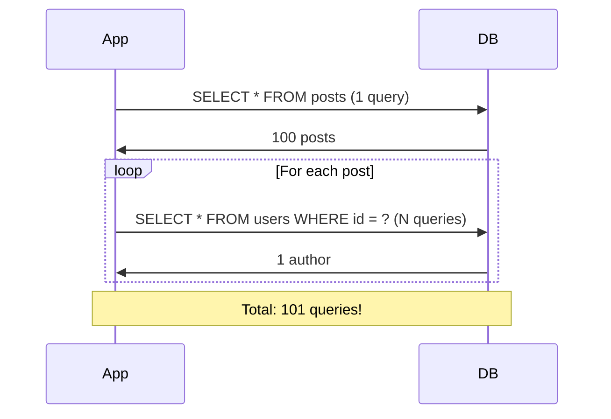
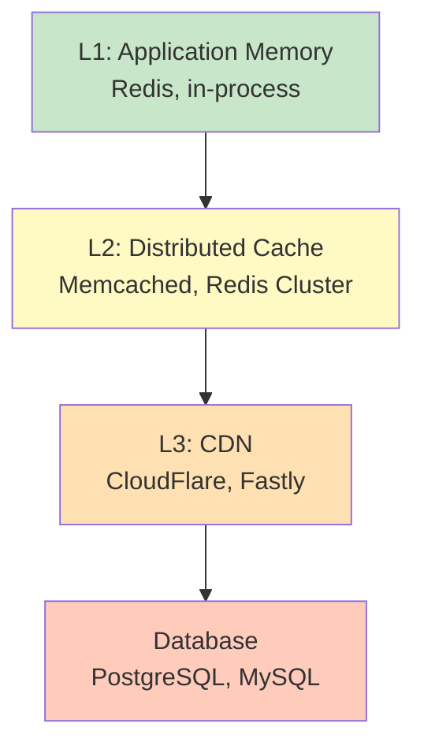
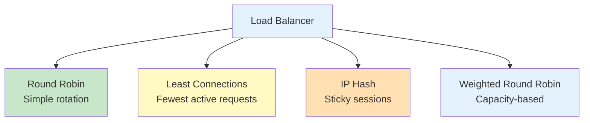

import SectionProgressToggle from "@/components/notes/SectionProgressToggle"
import Callout from "@/components/notes/Callout"
import GlossaryTip from "@/components/notes/GlossaryTip"
import DiagramBlock from "@/components/DiagramBlock"

# Performance & Scalability Engineering

<SectionProgressToggle courseId="software-architecture" levelId="intermediate" sectionId="soft-arch-intermediate-performance-engineering" />

Users do not care about your elegant architecture if your system is slow. Performance is a feature, and scalability is insurance against success. This module covers systematic approaches to making systems fast and keeping them fast under load.

<Callout variant="accreditation" type="info">
**Accreditation Alignment:**
- **iSAQB CPSA-A:** Performance and scalability architecture patterns
- **Google SRE:** Performance engineering practices
- **AWS Well-Architected:** Performance efficiency pillar
- **TOGAF:** Performance architecture requirements
</Callout>

---

## CPU profiling with flame graphs

<GlossaryTip term="CPU profiling">CPU profiling measures where your code spends time, identifying performance bottlenecks</GlossaryTip> tells you where to optimise.

### Flame graphs explained

A <GlossaryTip term="flame graph">A flame graph visualises CPU profiling data with stack traces, where width shows time spent</GlossaryTip> makes bottlenecks obvious at a glance.

**How to read a flame graph:**
- **Width:** Time spent (wider = more CPU time)
- **Height:** Stack depth (how deep function calls go)
- **Colour:** Usually random (for visual distinction)
- **Top plateau:** The actual function doing work

**Example profiling with Node.js:**

```bash
# Install profiler
npm install -g 0x

# Profile your application
0x -- node app.js

# Generate flame graph
# Browser opens automatically with interactive flame graph
```

### Finding hotspots

**Look for:**
1. **Wide plateaus** at top: Functions consuming most CPU
2. **Tall stacks**: Deep call chains (recursion or complex logic)
3. **Unexpected patterns**: Libraries you didn't know were called

**Example hotspot: Inefficient JSON parsing**

```javascript
// Bad: Parsing JSON repeatedly in a loop
function processRecords(jsonStrings) {
  const results = [];
  for (const str of jsonStrings) {
    const obj = JSON.parse(str); // Hotspot!
    results.push(transform(obj));
  }
  return results;
}

// Better: Parse once, cache if needed
function processRecords(jsonStrings) {
  // Parse all at once
  const objects = jsonStrings.map(str => JSON.parse(str));
  // Process parsed objects
  return objects.map(obj => transform(obj));
}
```

---

## N+1 query problem

The <GlossaryTip term="N+1 query problem">The N+1 query problem occurs when you fetch N items, then make an additional query for each item</GlossaryTip> is a classic performance killer.

### Identifying N+1 queries

**Symptom:** API response time increases linearly with result count.

**Example scenario:** Blog with posts and authors

```javascript
// BAD: N+1 queries
async function getPosts() {
  const posts = await db.query('SELECT * FROM posts'); // 1 query
  
  for (const post of posts) {
    post.author = await db.query(
      'SELECT * FROM users WHERE id = ?',
      [post.authorId]
    ); // N queries (one per post)
  }
  
  return posts;
}

// Result: 1 + N queries = 101 queries for 100 posts
```

<DiagramBlock title="N+1 query problem" subtitle="One query becomes many">

</DiagramBlock>

### Solutions

**Solution 1: Eager loading (JOIN)**

```javascript
// GOOD: Single query with JOIN
async function getPosts() {
  return await db.query(`
    SELECT 
      posts.*,
      users.name as author_name,
      users.email as author_email
    FROM posts
    JOIN users ON posts.author_id = users.id
  `);
}

// Result: 1 query for all data
```

**Solution 2: Batch loading**

```javascript
// GOOD: Batch load authors
async function getPosts() {
  const posts = await db.query('SELECT * FROM posts'); // 1 query
  
  // Extract unique author IDs
  const authorIds = [...new Set(posts.map(p => p.authorId))];
  
  // Fetch all authors in one query
  const authors = await db.query(
    'SELECT * FROM users WHERE id IN (?)',
    [authorIds]
  ); // 1 query
  
  // Create lookup map
  const authorMap = new Map(authors.map(a => [a.id, a]));
  
  // Attach authors to posts
  posts.forEach(post => {
    post.author = authorMap.get(post.authorId);
  });
  
  return posts;
}

// Result: 2 queries total, regardless of post count
```

---

## Caching strategies and invalidation

<GlossaryTip term="caching">Caching stores frequently accessed data in fast storage to reduce expensive computations or database queries</GlossaryTip> is essential for performance.

### Cache levels

<DiagramBlock title="Cache hierarchy" subtitle="From fastest to slowest">

</DiagramBlock>

### Cache invalidation strategies

**1. Time-based (TTL)**

```javascript
// Set with expiration
await cache.set('user:123', userData, { ttl: 300 }); // 5 minutes

// Simple but can serve stale data
```

**2. Event-based invalidation**

```javascript
// Invalidate on update
async function updateUser(userId, updates) {
  await db.update('users', userId, updates);
  await cache.del(`user:${userId}`); // Invalidate cache
}
```

**3. Cache-aside pattern**

```javascript
async function getUser(userId) {
  // Try cache first
  let user = await cache.get(`user:${userId}`);
  
  if (!user) {
    // Cache miss: fetch from database
    user = await db.query('SELECT * FROM users WHERE id = ?', [userId]);
    
    // Store in cache for next time
    await cache.set(`user:${userId}`, user, { ttl: 300 });
  }
  
  return user;
}
```

**4. Write-through cache**

```javascript
async function updateUser(userId, updates) {
  // Write to database
  await db.update('users', userId, updates);
  
  // Update cache immediately
  const user = await db.query('SELECT * FROM users WHERE id = ?', [userId]);
  await cache.set(`user:${userId}`, user, { ttl: 300 });
}
```

### Cache stampede prevention

<GlossaryTip term="cache stampede">Cache stampede occurs when many requests simultaneously try to regenerate the same expired cache entry</GlossaryTip> can overwhelm your database.

**Solution: Lock-based regeneration**

```javascript
async function getCachedData(key, generateFn, ttl = 300) {
  let data = await cache.get(key);
  
  if (!data) {
    // Try to acquire lock
    const lockKey = `lock:${key}`;
    const locked = await cache.set(lockKey, '1', { nx: true, ex: 10 });
    
    if (locked) {
      // This request won the race: regenerate data
      try {
        data = await generateFn();
        await cache.set(key, data, { ttl });
      } finally {
        await cache.del(lockKey);
      }
    } else {
      // Another request is regenerating: wait and retry
      await sleep(100);
      return getCachedData(key, generateFn, ttl);
    }
  }
  
  return data;
}
```

---

## Load balancing algorithms

<GlossaryTip term="load balancing">Load balancing distributes incoming requests across multiple servers to improve performance and reliability</GlossaryTip> prevents any single server from becoming a bottleneck.

### Load balancing algorithms

<DiagramBlock title="Load balancing strategies" subtitle="Different approaches for different needs">

</DiagramBlock>

**1. Round Robin**
- Simplest algorithm
- Distributes requests evenly
- No consideration for server load

**2. Least Connections**
- Routes to server with fewest active connections
- Better for long-running requests
- Requires state tracking

**3. IP Hash (Sticky Sessions)**
- Routes same client to same server
- Preserves session state
- Can cause uneven distribution

**4. Weighted Round Robin**
- Accounts for server capacity
- More powerful servers get more requests
- Requires capacity configuration

### Health checks

```javascript
// Example health check endpoint
app.get('/health', async (req, res) => {
  try {
    // Check database connection
    await db.query('SELECT 1');
    
    // Check cache connection
    await cache.ping();
    
    // Check CPU and memory
    const usage = process.cpuUsage();
    const memory = process.memoryUsage();
    
    if (memory.heapUsed / memory.heapTotal > 0.9) {
      return res.status(503).json({ status: 'unhealthy', reason: 'high memory' });
    }
    
    res.json({ status: 'healthy' });
  } catch (error) {
    res.status(503).json({ status: 'unhealthy', error: error.message });
  }
});
```

---

## Auto-scaling patterns

<GlossaryTip term="auto-scaling">Auto-scaling automatically adjusts the number of running instances based on demand</GlossaryTip> balances cost with performance.

### Scaling strategies

**Vertical scaling (scale up):**
- Add more CPU/memory to existing server
- Simpler but has limits
- Downtime for resizing

**Horizontal scaling (scale out):**
- Add more servers
- Requires stateless design
- Unlimited theoretical capacity

### Auto-scaling metrics

**1. CPU-based scaling**
```yaml
# Kubernetes HPA example
apiVersion: autoscaling/v2
kind: HorizontalPodAutoscaler
metadata:
  name: api-scaler
spec:
  scaleTargetRef:
    apiVersion: apps/v1
    kind: Deployment
    name: api
  minReplicas: 2
  maxReplicas: 10
  metrics:
  - type: Resource
    resource:
      name: cpu
      target:
        type: Utilization
        averageUtilization: 70
```

**2. Request-based scaling**
- Scale based on requests per second
- More predictive than CPU
- Requires custom metrics

**3. Queue depth scaling**
- For background workers
- Scale based on pending jobs
- Prevents backlog buildup

### Practice: Performance optimization

**Exercise (30 minutes):**

Given an API endpoint that lists products with categories:
1. Identify potential N+1 query issues
2. Design a caching strategy with TTL and invalidation
3. Recommend a load balancing algorithm
4. Define auto-scaling thresholds

**Hint:** Consider read-heavy vs write-heavy patterns, cache hit rates, and traffic patterns.

---

## Summary and next steps

You have learned performance and scalability engineering including CPU profiling with flame graphs, solving the N+1 query problem, caching strategies with invalidation, load balancing algorithms, and auto-scaling patterns.

**Next module:** Data Architecture where we cover SQL vs NoSQL trade-offs, CQRS, event sourcing, and database scaling strategies.

---

**CPD Evidence:**
- Estimated time: 4.0 hours
- Learning objectives achieved:
  1. ✅ Use CPU profiling and flame graphs to identify bottlenecks
  2. ✅ Detect and solve N+1 query problems
  3. ✅ Implement caching strategies with proper invalidation
  4. ✅ Choose appropriate load balancing algorithms
  5. ✅ Design auto-scaling strategies based on metrics

**Accreditation mapping:** This module supports iSAQB CPSA-A performance architecture, Google SRE performance practices, AWS Well-Architected performance efficiency, and TOGAF performance requirements.
