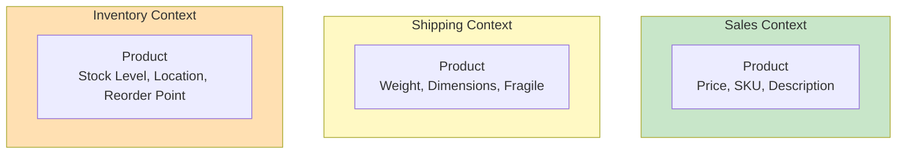
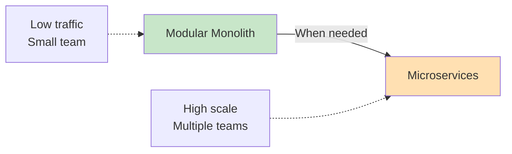
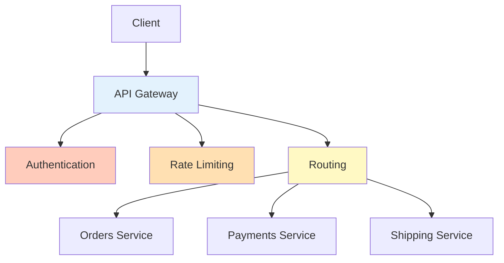

import SectionProgressToggle from "@/components/notes/SectionProgressToggle"
import Callout from "@/components/notes/Callout"
import GlossaryTip from "@/components/notes/GlossaryTip"
import DiagramBlock from "@/components/DiagramBlock"

# Service Design & Decomposition

<SectionProgressToggle courseId="software-architecture" levelId="intermediate" sectionId="soft-arch-intermediate-service-decomposition" />

Breaking a system into services is easy. Breaking it into the right services is hard. This module covers systematic approaches to service boundaries that reduce coupling and enable independent deployment.

<Callout variant="accreditation" type="info">
**Accreditation Alignment:**
- **iSAQB CPSA-A:** Service decomposition and design
- **Domain-Driven Design:** Bounded context patterns
- **Microservices patterns:** Service design principles
- **TOGAF:** Application architecture
</Callout>

---

## Domain-Driven Design fundamentals

<GlossaryTip term="Domain-Driven Design">Domain-Driven Design is an approach to software development that focuses on understanding and modelling the business domain</GlossaryTip> helps you find natural service boundaries.

### Bounded contexts

A <GlossaryTip term="bounded context">A bounded context is a boundary within which a domain model is defined and applicable</GlossaryTip> defines clear ownership and terminology.

<DiagramBlock title="Bounded contexts in e-commerce" subtitle="Same concept, different models">

</DiagramBlock>

**Key insight:** "Product" means different things in different contexts. Each context has its own model.

### Ubiquitous language

<GlossaryTip term="ubiquitous language">Ubiquitous language is a common vocabulary shared between developers and domain experts</GlossaryTip> reduces miscommunication.

**Example:**
- **Avoid:** "User submits form which creates record in table"
- **Use:** "Customer places order which creates confirmed order"

Match code to business language:
```javascript
// Good: Uses domain language
class Order {
  confirm() { /* ... */ }
  ship() { /* ... */ }
  cancel() { /* ... */ }
}

// Bad: Generic CRUD
class Order {
  update(status) { /* ... */ }
}
```

---

## Microservices vs modular monolith

The debate is not "microservices: yes or no?" It is "what are the trade-offs?"

### Modular monolith

<GlossaryTip term="modular monolith">A modular monolith is a single deployable system with clear internal module boundaries</GlossaryTip> gives structure without distribution.

**Strengths:**
- Simpler deployment
- Easier transactions
- Lower operational complexity
- Faster development initially

**Example structure:**
```
app/
├── modules/
│   ├── orders/
│   │   ├── service.js
│   │   ├── repository.js
│   │   └── models.js
│   ├── payments/
│   │   ├── service.js
│   │   ├── repository.js
│   │   └── models.js
│   └── shipping/
│       ├── service.js
│       ├── repository.js
│       └── models.js
└── shared/
    └── database.js
```

### Microservices

**Strengths:**
- Independent deployment
- Technology diversity
- Team autonomy
- Fine-grained scaling

**Challenges:**
- Distributed system complexity
- Network latency
- Harder to debug
- Data consistency challenges

<DiagramBlock title="Monolith to microservices evolution" subtitle="Start simple, split when needed">

</DiagramBlock>

### Decision framework

**Stay monolith when:**
- Team size < 10 people
- Deployment frequency acceptable
- Performance requirements met
- Business domain well understood

**Move to microservices when:**
- Different scaling needs per component
- Multiple teams need autonomy
- Technology constraints per service
- Deployment independence critical

---

## API gateway patterns

An <GlossaryTip term="API gateway">An API gateway is a single entry point that routes requests to appropriate backend services</GlossaryTip> simplifies client integration.

### API gateway responsibilities

<DiagramBlock title="API gateway pattern" subtitle="Single entry point for clients">

</DiagramBlock>

**Core functions:**
1. **Request routing** to appropriate service
2. **Authentication** and authorization
3. **Rate limiting** and throttling
4. **Response aggregation** from multiple services
5. **Protocol translation** (REST to gRPC)

### Backend for Frontend (BFF)

<GlossaryTip term="BFF pattern">Backend for Frontend creates separate API gateways optimised for each client type</GlossaryTip> tailors responses to client needs.

```javascript
// Mobile BFF: Minimal data
app.get('/mobile/products', async (req, res) => {
  const products = await productService.list();
  res.json(products.map(p => ({
    id: p.id,
    name: p.name,
    price: p.price,
    thumbnail: p.images[0],
  })));
});

// Web BFF: Full data
app.get('/web/products', async (req, res) => {
  const products = await productService.list();
  const categories = await categoryService.list();
  res.json({
    products,
    categories,
    filters: await filterService.available(),
  });
});
```

---

## Service mesh (revisited)

We covered service mesh basics in Cloud-Native Patterns. Here we focus on service decomposition implications.

### Service-to-service communication

Without service mesh:
```javascript
// Every service implements retry logic
async function callPaymentService(data) {
  let attempts = 0;
  while (attempts < 3) {
    try {
      return await http.post('http://payments:8080/charge', data);
    } catch (err) {
      attempts++;
      await sleep(1000 * attempts);
    }
  }
  throw new Error('Payment service unavailable');
}
```

With service mesh:
```javascript
// Service mesh handles retries automatically
async function callPaymentService(data) {
  return await http.post('http://payments:8080/charge', data);
  // Envoy sidecar handles retries, timeouts, circuit breaking
}
```

### Practice: Service decomposition

**Exercise (30 minutes):**

For an online marketplace (buyers, sellers, products, orders, payments):
1. Identify 3-5 bounded contexts
2. Decide: modular monolith or microservices?
3. Draw service boundaries
4. Identify shared concerns for API gateway

**Hint:** Consider transaction boundaries, data ownership, and team structure. Not everything needs to be a separate service.

---

## Summary and next steps

You have learned service design and decomposition including Domain-Driven Design with bounded contexts and ubiquitous language, microservices vs modular monolith trade-offs, API gateway patterns including BFF, and service mesh for communication.

**Next module:** Infrastructure as Code where we cover Terraform, Pulumi, GitOps, and policy as code.

---

**CPD Evidence:**
- Estimated time: 3.5 hours
- Learning objectives achieved:
  1. ✅ Apply Domain-Driven Design to find service boundaries
  2. ✅ Evaluate microservices vs modular monolith trade-offs
  3. ✅ Design API gateways with BFF pattern
  4. ✅ Understand service mesh implications for decomposition

**Accreditation mapping:** This module supports iSAQB CPSA-A service design, Domain-Driven Design patterns, microservices architecture principles, and TOGAF application architecture.
