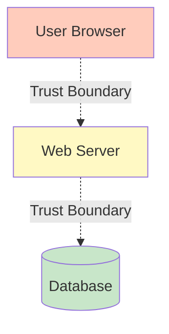

# Software Architecture Course Enhancement - Implementation Guide

## Overview

This document provides guidance for completing the comprehensive upgrade of the Software Architecture course from ~6 hours to 99 CPD hours with gold-standard accreditation.

## Project Scope

Transform the Software Architecture course to include:
- **Foundation Tier:** 24 CPD hours (8 modules)
- **Intermediate Tier:** 30 CPD hours (6 modules)
- **Advanced Tier:** 45 CPD hours (8 modules + capstone)
- **Total:** 99 CPD hours of professional development content

## Current Status (Phase 1 Complete)

### ✅ Completed
1. **Course Structure**
   - Updated `src/lib/softwareArchitectureSections.js` with new section IDs
   - Created subdirectory structure (`foundations/`, `intermediate/`, `advanced/`)
   - Created `foundations.mdx` overview page

2. **Foundation Content (34% Complete)**
   - ✅ `discovery-requirements.mdx` (2.4 hrs) - **FULLY COMPLETE**
   - ✅ `architecture-design.mdx` (2.8 hrs) - **FULLY COMPLETE**
   - ✅ `implementation.mdx` (3.0 hrs) - **FULLY COMPLETE**
   - 📝 `verification-testing.mdx` (3.5 hrs) - Stub created
   - 📝 `deployment-cicd.mdx` (2.5 hrs) - Stub created
   - 📝 `operations.mdx` (3.2 hrs) - Stub created
   - 📝 `osi-diagnostics.mdx` (1.8 hrs) - Stub created
   - 📝 `ilities-framework.mdx` (2.0 hrs) - Stub created

3. **Database Schema**
   - ✅ Assessment model (for storing assessment metadata)
   - ✅ Question model (for storing individual questions)
   - ✅ AssessmentAttempt model (for tracking user attempts)
   - ✅ Enhanced Certificate model (added CPD fields, blockchain hash, verification URL)
   - ✅ UserIdentity relations updated

4. **Build Validation**
   - ✅ All changes integrate with existing codebase
   - ✅ Prisma schema validates
   - ✅ Build completes successfully

## Content Quality Standards

### Three-Layer Voice Structure

Every module must follow this pattern:

**Layer 1: Personal/Conversational**
```markdown
Here's the thing: most systems don't fail because of bad code. They fail because we built the wrong thing.
```
- Start sections with "Here's the thing..." or relatable observations
- Use analogies (e.g., "Think of it like planning a route")
- Simple sentences, no em-dashes
- British English spelling

**Layer 2: Technical/Rigorous**
```markdown
<Callout variant="accreditation" type="info">
**Accreditation Alignment:**
- **iSAQB CPSA-F:** Methods for designing architectures
- **ISO/IEC/IEEE 42010:** Architecture description practices
</Callout>
```
- Formal definitions in reference boxes
- Explicit accreditation mapping
- Citations to frameworks (Microsoft SDL, NIST SSDF, OWASP ASVS)

**Layer 3: Practice/Application**
```markdown
**Exercise (20 minutes):**

Pick a system you know and draw a Context diagram showing:
1. The system (one box)
2. At least three types of users
3. At least two external systems

**Hint:** Keep it simple. If your diagram has more than 8 boxes, you're going too deep.
```
- Hands-on exercises with time limits
- Scaffolded hints
- Clear success criteria

### Technical Terms

Use `<GlossaryTip>` for all technical terms:

```markdown
<GlossaryTip term="threat modelling">
Threat modelling is the structured process of identifying, assessing, and mitigating security threats to a system
</GlossaryTip>
```

Definitions should be accessible to:
- Children (simple language)
- Non-technical professionals (no jargon)
- Experts (technically accurate)

### Diagrams

Use Mermaid for all diagrams:

```markdown
<DiagramBlock title="Trust boundaries in a web app" subtitle="Where validation is critical">

</DiagramBlock>
```

## Implementation Roadmap

### Phase 2: Complete Foundation Tier

**Remaining Modules (13 hours of content):**

1. **verification-testing.mdx (3.5 hrs)**
   - Expand the stub to include:
     - Test strategy pyramid (unit, integration, E2E) with examples
     - OWASP ASVS integration and how to use it
     - Accessibility testing with WCAG 2.2 (keyboard nav, screen readers, contrast)
     - Performance testing (load testing, bottleneck identification)
   - Include 3+ Mermaid diagrams
   - Add 3-4 practice exercises
   - Code examples for test automation

2. **deployment-cicd.mdx (2.5 hrs)**
   - CI/CD pipeline anatomy (lint → test → build → scan → deploy)
   - DevSecOps integration (SAST, DAST, secret scanning examples)
   - Deployment strategies (blue-green, canary, feature flags)
   - Infrastructure as Code basics (Terraform/Pulumi introduction)
   - Pipeline configuration examples
   - 3+ diagrams showing pipeline flows

3. **operations.mdx (3.2 hrs)**
   - Google SRE principles (error budgets, SLOs, toil reduction)
   - Four golden signals (latency, traffic, errors, saturation) with monitoring examples
   - Observability triad (logs, metrics, traces with OpenTelemetry)
   - Incident response (severity classification, blameless post-mortems)
   - Real-world examples and templates

4. **osi-diagnostics.mdx (1.8 hrs)**
   - OSI layers 1-7 with practical tools for each layer
   - Browser DevTools mastery (Network tab, Security tab, Application tab)
   - Command-line diagnostics (curl with timing, openssl, traceroute, dig)
   - TLS certificate inspection and troubleshooting
   - Hands-on exercises for each diagnostic tool

5. **ilities-framework.mdx (2.0 hrs)**
   - Security (defence in depth, threat modelling)
   - Privacy (GDPR compliance, data minimisation)
   - Accessibility (WCAG 2.2, neurodivergent-friendly design)
   - Performance (Core Web Vitals, optimization strategies)
   - Reliability (graceful degradation, circuit breakers)
   - Other "ilities": Scalability, Maintainability, Testability, Observability, Portability, Interoperability, Compliance, Cost Efficiency
   - Framework for evaluating trade-offs

**Foundation Interactive Tools:**

Create three new React/Next.js tools in `src/components/notes/tools/architecture/foundation/`:

1. **NetworkWaterfallExplainer.tsx**
   - File upload for HAR (HTTP Archive) files
   - Visual waterfall chart with annotations
   - Breakdown of DNS, TCP, TLS, TTFB, download phases
   - Optimization tips per phase
   - Before/after comparison capability

2. **TlsCertificateInspector.tsx**
   - Domain input field
   - Fetch and display certificate chain
   - Visualize certificate hierarchy
   - Show expiry dates with warnings
   - Link to Certificate Transparency logs
   - Display cipher suites and protocol versions

3. **C4DiagramBuilder.tsx**
   - Drag-and-drop interface for creating C4 diagrams
   - Four levels: Context, Container, Component, Code
   - Auto-layout algorithm for clean diagrams
   - Export to Mermaid syntax and PNG
   - Validation (e.g., warn about missing boundaries)

**Assessment System:**

Create 50 Foundation-level questions in the database:

```javascript
// Example question structure
{
  type: "MCQ", // or "MultiResponse", "Scenario", "Practical"
  bloomLevel: 2, // 1-6 (Bloom's Taxonomy)
  difficultyTarget: 0.65, // 65% of learners should get it right
  question: "Which STRIDE category applies when an attacker tries to log in as another user?",
  options: JSON.stringify([
    "Spoofing",
    "Tampering",
    "Repudiation",
    "Information disclosure"
  ]),
  correctAnswer: JSON.stringify("Spoofing"),
  explanation: "Spoofing attacks involve pretending to be someone else. When an attacker tries to log in as another user, they're spoofing that user's identity. Mitigation includes strong authentication, MFA, and proper session management.",
  tags: "security,stride,authentication,threats"
}
```

**Distribution:**
- 10 Easy (70-85% correct rate)
- 25 Medium (50-70% correct rate)
- 15 Hard (30-50% correct rate)

**Types:**
- 20 Multiple Choice (single answer) - Bloom's Levels 1-2
- 15 Multiple Response (select all) - Bloom's Levels 3-4
- 10 Scenario-based (case study) - Bloom's Levels 4-5
- 5 Practical (command/tool selection) - Bloom's Level 3

### Phase 3: Intermediate Tier (30 CPD Hours)

Create `intermediate/` subdirectory with 6 modules:

1. **advanced-security.mdx (4.5 hrs)**
   - STRIDE deep dive with real case studies
   - PASTA methodology (7-stage threat analysis)
   - Attack trees with probability scoring
   - Zero trust architecture principles
   - NIST Cybersecurity Framework integration

2. **cloud-native-patterns.mdx (5.0 hrs)**
   - Multi-region active-active architectures
   - Disaster recovery (RPO/RTO targets, strategies)
   - CAP theorem and eventual consistency patterns
   - Service mesh patterns (Istio, Linkerd)
   - Case study: Netflix resilience engineering

3. **performance-engineering.mdx (4.0 hrs)**
   - CPU profiling with flame graphs
   - N+1 query problem and solutions
   - Caching strategies and cache invalidation
   - Load balancing algorithms
   - Auto-scaling patterns and triggers

4. **data-architecture.mdx (4.5 hrs)**
   - SQL vs NoSQL trade-offs and decision framework
   - CQRS (Command Query Responsibility Segregation)
   - Event sourcing patterns and implementations
   - Database scaling (replication, sharding strategies)
   - Data governance and retention policies

5. **service-decomposition.mdx (3.5 hrs)**
   - Domain-Driven Design (bounded contexts, ubiquitous language)
   - Microservices vs modular monolith evaluation
   - API gateway patterns and implementations
   - Service mesh architecture
   - Inter-service communication patterns

6. **infrastructure-as-code.mdx (4.0 hrs)**
   - Terraform deep dive with practical examples
   - Pulumi multi-language support
   - GitOps with Flux/ArgoCD
   - Infrastructure testing (Terratest, Checkov)
   - Policy as code (Open Policy Agent)

**Intermediate Tools:**

Create in `src/components/notes/tools/architecture/intermediate/`:

1. **ThreatModellingCanvas.tsx**
   - React Flow for component placement
   - Auto-detect trust boundaries based on component types
   - Hover over components to see STRIDE threat suggestions
   - Mitigation library with cost/complexity ratings
   - Export to Markdown in ADR format

2. **SreGoldenSignalsDashboard.tsx**
   - Live demo API with instrumentation
   - Four golden signals visualization (latency, traffic, errors, saturation)
   - Failure injection controls (introduce latency, errors)
   - Error budget calculator
   - Incident pager simulation

3. **CloudCostSimulator.tsx**
   - AWS/Azure/GCP resource selection
   - On-demand vs reserved vs spot instance comparison
   - Cost projection graphs
   - Optimization recommendations with ROI calculations
   - Export cost analysis report

### Phase 4: Advanced Tier (45 CPD Hours)

Create `advanced/` subdirectory with 8 modules plus capstone:

1. **enterprise-frameworks.mdx (5.5 hrs)**
   - TOGAF ADM phases (Preliminary → Governance)
   - Zachman Framework 6x6 matrix
   - Architecture governance processes
   - Enterprise architecture patterns

2. **compliance-architectures.mdx (6.0 hrs)**
   - GDPR-compliant data processing architectures
   - PCI-DSS v4.0 payment flows
   - HIPAA safeguards for healthcare systems
   - SOC 2 Trust Services Criteria mapping

3. **finops.mdx (4.0 hrs)**
   - Showback and chargeback models
   - Reserved instances and spot pricing strategies
   - Cost-aware architecture design patterns
   - Case study: Lyft cost reduction initiatives

4. **chaos-engineering.mdx (5.0 hrs)**
   - Netflix Chaos Monkey principles
   - Failure injection patterns and tools
   - Resilience patterns (Hystrix, bulkheads, circuit breakers)
   - Game day exercises and planning

5. **governance.mdx (4.5 hrs)**
   - Governance models (centralised, federated, emergent)
   - Review board design and processes
   - Policy as code enforcement
   - Technical debt tracking and management

6. **multi-cloud.mdx (5.0 hrs)**
   - Multi-cloud architecture patterns
   - Abstraction layers for portability
   - Multi-cloud networking strategies
   - Trade-off analysis framework

7. **legacy-modernisation.mdx (4.5 hrs)**
   - Strangler Fig pattern implementation
   - Anti-corruption layers
   - Database migration strategies
   - Rewrite vs refactor decision framework

8. **capstone.mdx (8.0 hrs)**
   - Full lifecycle architecture design project
   - Requirements gathering through deployment
   - Security architecture integration
   - Operations and governance planning
   - Graded by rubric (200 points, 80% pass threshold)

**Advanced Tools:**

Create in `src/components/notes/tools/architecture/advanced/`:

1. **OwaspTop10Simulator.tsx**
   - Docker-based vulnerable environments (requires backend)
   - 10 separate environments for each OWASP Top 10 vulnerability
   - Interactive exploit tutorials
   - Fix validation mechanism
   - Scoring and leaderboard

2. **AccessibilityAuditPlayground.tsx**
   - Axe-core integration for automated testing
   - URL or HTML input
   - Violation report with severity levels
   - Keyboard navigation recorder
   - Colour contrast checker
   - Remediation suggestions

3. **ChaosEngineeringSandbox.tsx**
   - Microservices demo application
   - Failure injection controls (latency, errors, saturation)
   - Resilience pattern implementation testing
   - Blast radius measurement
   - Recovery time tracking

### Phase 5: Assessment and Certification

**AssessmentEngine Component:**

Create `src/components/course/AssessmentEngine.tsx`:

```tsx
interface AssessmentEngineProps {
  assessmentId: string;
  questionsCount: number;
  passThreshold: number; // percentage
  timeLimit?: number; // minutes
  onComplete: (score: number, passed: boolean) => void;
}

// Features:
// - Load questions from database
// - Randomize question order
// - Track time remaining
// - Validate answers
// - Calculate score
// - Show detailed feedback
// - Generate attempt record
```

**Certificate Generation:**

Create `src/utils/certificateGeneration.ts`:

```typescript
async function generateCertificate(
  userId: string,
  courseId: string,
  levelId: string,
  score: number,
  cpdHours: number
) {
  // 1. Create Certificate record in database
  // 2. Generate PDF with pdf-lib
  // 3. Upload PDF to storage (Vercel Blob)
  // 4. Generate blockchain hash (optional: use Ethereum or Polygon)
  // 5. Create verification URL
  // 6. Return certificate with QR code
}
```

**Blockchain Verification (Optional):**

If implementing blockchain verification:
- Use Ethereum testn or Polygon for cost efficiency
- Store hash of certificate data, not full certificate
- Create verification page that checks blockchain
- Include QR code on PDF linking to verification

**CPD Evidence Export:**

Create `src/components/course/CPDEvidenceExport.tsx`:

```tsx
// Generate comprehensive PDF including:
// - Detailed hour breakdown per module
// - Learning objectives achieved per module
// - Assessment scores and completion dates
// - Reflection logs from portfolio
// - Tool usage statistics
// - Formatted for CPD Standards Office submission
```

### Phase 6: Documentation

Create in `docs/`:

1. **accreditation-mapping-matrix.csv**
   ```csv
   Learning Outcome,Tier/Module,iSAQB CPSA-F,iSAQB CPSA-A,ISO 42010,TOGAF,ABET,BCS/IET,CPD Evidence,Assessment Method
   "Map user journeys",Foundations/Module 1,Methods for designing architectures,,,ADM Preliminary,Requirements Engineering,,Exercise submission,Practical question
   ...
   ```

2. **cpd-evidence-template.md**
   - Template for learners to document their CPD
   - Structured sections matching course modules
   - Reflection prompts
   - Evidence collection guidance

3. **instructor-qualifications.md**
   - Recommended qualifications for course facilitators
   - Required knowledge areas
   - Accreditation body requirements

## Quality Gates

Before considering the project complete, verify:

- [ ] All content uses three-layer voice (personal → technical → practice)
- [ ] No em-dashes in any content
- [ ] All technical terms have GlossaryTip definitions
- [ ] Each module has 3+ Mermaid diagrams
- [ ] Each tier has 50 assessment questions in database
- [ ] Assessment questions tagged with Bloom's level and difficulty
- [ ] All modules have explicit accreditation alignment callouts
- [ ] Time estimates follow formula: (words÷225×1.3) + (labs×1.5) + assessment
- [ ] WCAG 2.2 AA compliance verified with automated tools
- [ ] Dark mode implemented and tested
- [ ] Certificate system functional (PDF generation, storage, retrieval)
- [ ] CPD evidence export working with sample data
- [ ] All 13 interactive tools functional
- [ ] Build passes without errors
- [ ] Content-index.json includes all new pages
- [ ] All pages accessible via navigation

## Testing Strategy

1. **Content Testing:**
   - Peer review by subject matter experts
   - Readability testing with diverse audience
   - Accessibility testing with screen readers
   - Print testing of CPD evidence exports

2. **Technical Testing:**
   - Unit tests for assessment engine logic
   - Integration tests for certificate generation
   - E2E tests for complete learner journey
   - Performance testing for tool interactions

3. **Accreditation Validation:**
   - Map every learning objective to accreditation criteria
   - Verify assessment questions cover required competencies
   - Validate CPD hour calculations
   - Review with accreditation consultants if possible

## Rollout Strategy

1. **Phase 1 (Complete):** Foundation infrastructure and 3 modules
2. **Phase 2:** Complete remaining 5 foundation modules
3. **Phase 3:** Add foundation tools and assessment
4. **Phase 4:** Build intermediate tier
5. **Phase 5:** Build advanced tier
6. **Phase 6:** Complete documentation and final QA

## Success Metrics

The project succeeds when:

1. ✅ Foundation tier delivers 24 CPD hours of content
2. ✅ Intermediate tier delivers 30 CPD hours of content
3. ✅ Advanced tier delivers 45 CPD hours of content
4. ✅ Each tier has 50-question assessment with 80% pass threshold
5. ✅ At least 8 new interactive tools functional
6. ✅ Content accessible to children, non-technical, and experts
7. ✅ Explicit accreditation mapping throughout
8. ✅ Blockchain-verified certificates issued
9. ✅ Writing style consistently uses three-layer approach
10. ✅ All quality gates passed

## Estimated Effort

Based on the content created so far:

- **Fully developed module:** ~6-8 hours of development time per CPD hour
- **Interactive tool:** ~16-24 hours per tool
- **Assessment questions:** ~30 minutes per question (including testing)
- **Database integration:** ~8-16 hours for full system
- **Documentation:** ~8-16 hours

**Total remaining estimate:**
- Content: (91 - 8.2) CPD hours × 7 hours avg = ~580 hours
- Tools: 10 tools × 20 hours avg = 200 hours
- Assessment: 150 questions × 0.5 hours = 75 hours
- Integration & testing: 100 hours
- **Grand total:** ~955 hours

This is a substantial project requiring a dedicated team or extended timeline for a single developer.

## Recommendations

Given the scope:

1. **Prioritize incrementally:** Complete one tier fully before moving to the next
2. **Reuse patterns:** Use the three completed modules as templates
3. **Collaborate:** Consider involving subject matter experts for advanced topics
4. **Validate early:** Get learner feedback on foundation tier before building further
5. **Automate:** Use AI assistance for generating initial content drafts
6. **Focus on value:** Prioritize the most impactful interactive tools first
7. **Plan for maintenance:** This content will need regular updates as technologies evolve

## Conclusion

This enhancement transforms the Software Architecture course into a gold-standard professional development programme. The foundation established in Phase 1 provides a solid pattern for the remaining work. Success requires consistent application of quality standards, careful attention to accreditation requirements, and commitment to accessibility and multi-audience learning.

The completed course will be a significant asset, providing comprehensive, accredited software architecture education that spans the complete development lifecycle with systematic security integration.
